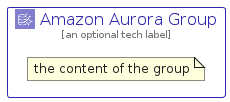

# AmazonAurora


```text
aws-q1-2025/Architecture/Database/AmazonAurora
```

```text
include('aws-q1-2025/Architecture/Database/AmazonAurora')
```


| Illustration | AmazonAurora | AmazonAuroraCard | AmazonAuroraGroup |
| :---: | :---: | :---: | :---: |
|  |  |  |  |


## Sprites
The item provides the following sriptes:

- `<$AmazonAuroraXs>`
- `<$AmazonAuroraSm>`
- `<$AmazonAuroraMd>`
- `<$AmazonAuroraLg>`


## AmazonAurora

### Load remotely
```plantuml
@startuml
' configures the library
!global $LIB_BASE_LOCATION="https://raw.githubusercontent.com/tmorin/plantuml-libs/master/distribution"

' loads the library's bootstrap
!include $LIB_BASE_LOCATION/bootstrap.puml

' loads the package bootstrap
include('aws-q1-2025/bootstrap')

' loads the Item which embeds the element AmazonAurora
include('aws-q1-2025/Architecture/Database/AmazonAurora')

' renders the element
AmazonAurora('AmazonAurora', 'Amazon Aurora', 'an optional tech label', 'an optional description')
@enduml
```

### Load locally
```plantuml
@startuml
' configures the library
!global $INCLUSION_MODE="local"
!global $LIB_BASE_LOCATION="../../.."

' loads the library's bootstrap
!include $LIB_BASE_LOCATION/bootstrap.puml

' loads the package bootstrap
include('aws-q1-2025/bootstrap')

' loads the Item which embeds the element AmazonAurora
include('aws-q1-2025/Architecture/Database/AmazonAurora')

' renders the element
AmazonAurora('AmazonAurora', 'Amazon Aurora', 'an optional tech label', 'an optional description')
@enduml
```

## AmazonAuroraCard

### Load remotely
```plantuml
@startuml
' configures the library
!global $LIB_BASE_LOCATION="https://raw.githubusercontent.com/tmorin/plantuml-libs/master/distribution"

' loads the library's bootstrap
!include $LIB_BASE_LOCATION/bootstrap.puml

' loads the package bootstrap
include('aws-q1-2025/bootstrap')

' loads the Item which embeds the element AmazonAuroraCard
include('aws-q1-2025/Architecture/Database/AmazonAurora')

' renders the element
AmazonAuroraCard('AmazonAuroraCard', 'Amazon Aurora Card', 'an optional description')
@enduml
```

### Load locally
```plantuml
@startuml
' configures the library
!global $INCLUSION_MODE="local"
!global $LIB_BASE_LOCATION="../../.."

' loads the library's bootstrap
!include $LIB_BASE_LOCATION/bootstrap.puml

' loads the package bootstrap
include('aws-q1-2025/bootstrap')

' loads the Item which embeds the element AmazonAuroraCard
include('aws-q1-2025/Architecture/Database/AmazonAurora')

' renders the element
AmazonAuroraCard('AmazonAuroraCard', 'Amazon Aurora Card', 'an optional description')
@enduml
```

## AmazonAuroraGroup

### Load remotely
```plantuml
@startuml
' configures the library
!global $LIB_BASE_LOCATION="https://raw.githubusercontent.com/tmorin/plantuml-libs/master/distribution"

' loads the library's bootstrap
!include $LIB_BASE_LOCATION/bootstrap.puml

' loads the package bootstrap
include('aws-q1-2025/bootstrap')

' loads the Item which embeds the element AmazonAuroraGroup
include('aws-q1-2025/Architecture/Database/AmazonAurora')

' renders the element
AmazonAuroraGroup('AmazonAuroraGroup', 'Amazon Aurora Group', 'an optional tech label') {
    note as note
        the content of the group
    end note
}
@enduml
```

### Load locally
```plantuml
@startuml
' configures the library
!global $INCLUSION_MODE="local"
!global $LIB_BASE_LOCATION="../../.."

' loads the library's bootstrap
!include $LIB_BASE_LOCATION/bootstrap.puml

' loads the package bootstrap
include('aws-q1-2025/bootstrap')

' loads the Item which embeds the element AmazonAuroraGroup
include('aws-q1-2025/Architecture/Database/AmazonAurora')

' renders the element
AmazonAuroraGroup('AmazonAuroraGroup', 'Amazon Aurora Group', 'an optional tech label') {
    note as note
        the content of the group
    end note
}
@enduml
```

