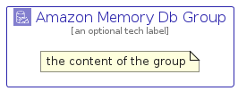

# AmazonMemoryDb


```text
aws-q1-2025/Architecture/Database/AmazonMemoryDb
```

```text
include('aws-q1-2025/Architecture/Database/AmazonMemoryDb')
```


| Illustration | AmazonMemoryDb | AmazonMemoryDbCard | AmazonMemoryDbGroup |
| :---: | :---: | :---: | :---: |
|  |  |  |  |


## Sprites
The item provides the following sriptes:

- `<$AmazonMemoryDbXs>`
- `<$AmazonMemoryDbSm>`
- `<$AmazonMemoryDbMd>`
- `<$AmazonMemoryDbLg>`


## AmazonMemoryDb

### Load remotely
```plantuml
@startuml
' configures the library
!global $LIB_BASE_LOCATION="https://raw.githubusercontent.com/tmorin/plantuml-libs/master/distribution"

' loads the library's bootstrap
!include $LIB_BASE_LOCATION/bootstrap.puml

' loads the package bootstrap
include('aws-q1-2025/bootstrap')

' loads the Item which embeds the element AmazonMemoryDb
include('aws-q1-2025/Architecture/Database/AmazonMemoryDb')

' renders the element
AmazonMemoryDb('AmazonMemoryDb', 'Amazon Memory Db', 'an optional tech label', 'an optional description')
@enduml
```

### Load locally
```plantuml
@startuml
' configures the library
!global $INCLUSION_MODE="local"
!global $LIB_BASE_LOCATION="../../.."

' loads the library's bootstrap
!include $LIB_BASE_LOCATION/bootstrap.puml

' loads the package bootstrap
include('aws-q1-2025/bootstrap')

' loads the Item which embeds the element AmazonMemoryDb
include('aws-q1-2025/Architecture/Database/AmazonMemoryDb')

' renders the element
AmazonMemoryDb('AmazonMemoryDb', 'Amazon Memory Db', 'an optional tech label', 'an optional description')
@enduml
```

## AmazonMemoryDbCard

### Load remotely
```plantuml
@startuml
' configures the library
!global $LIB_BASE_LOCATION="https://raw.githubusercontent.com/tmorin/plantuml-libs/master/distribution"

' loads the library's bootstrap
!include $LIB_BASE_LOCATION/bootstrap.puml

' loads the package bootstrap
include('aws-q1-2025/bootstrap')

' loads the Item which embeds the element AmazonMemoryDbCard
include('aws-q1-2025/Architecture/Database/AmazonMemoryDb')

' renders the element
AmazonMemoryDbCard('AmazonMemoryDbCard', 'Amazon Memory Db Card', 'an optional description')
@enduml
```

### Load locally
```plantuml
@startuml
' configures the library
!global $INCLUSION_MODE="local"
!global $LIB_BASE_LOCATION="../../.."

' loads the library's bootstrap
!include $LIB_BASE_LOCATION/bootstrap.puml

' loads the package bootstrap
include('aws-q1-2025/bootstrap')

' loads the Item which embeds the element AmazonMemoryDbCard
include('aws-q1-2025/Architecture/Database/AmazonMemoryDb')

' renders the element
AmazonMemoryDbCard('AmazonMemoryDbCard', 'Amazon Memory Db Card', 'an optional description')
@enduml
```

## AmazonMemoryDbGroup

### Load remotely
```plantuml
@startuml
' configures the library
!global $LIB_BASE_LOCATION="https://raw.githubusercontent.com/tmorin/plantuml-libs/master/distribution"

' loads the library's bootstrap
!include $LIB_BASE_LOCATION/bootstrap.puml

' loads the package bootstrap
include('aws-q1-2025/bootstrap')

' loads the Item which embeds the element AmazonMemoryDbGroup
include('aws-q1-2025/Architecture/Database/AmazonMemoryDb')

' renders the element
AmazonMemoryDbGroup('AmazonMemoryDbGroup', 'Amazon Memory Db Group', 'an optional tech label') {
    note as note
        the content of the group
    end note
}
@enduml
```

### Load locally
```plantuml
@startuml
' configures the library
!global $INCLUSION_MODE="local"
!global $LIB_BASE_LOCATION="../../.."

' loads the library's bootstrap
!include $LIB_BASE_LOCATION/bootstrap.puml

' loads the package bootstrap
include('aws-q1-2025/bootstrap')

' loads the Item which embeds the element AmazonMemoryDbGroup
include('aws-q1-2025/Architecture/Database/AmazonMemoryDb')

' renders the element
AmazonMemoryDbGroup('AmazonMemoryDbGroup', 'Amazon Memory Db Group', 'an optional tech label') {
    note as note
        the content of the group
    end note
}
@enduml
```

