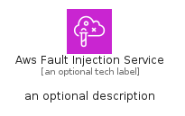
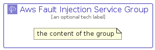

# AwsFaultInjectionService


```text
aws-q1-2025/Architecture/DeveloperTools/AwsFaultInjectionService
```

```text
include('aws-q1-2025/Architecture/DeveloperTools/AwsFaultInjectionService')
```


| Illustration | AwsFaultInjectionService | AwsFaultInjectionServiceCard | AwsFaultInjectionServiceGroup |
| :---: | :---: | :---: | :---: |
|  |  |  |  |


## Sprites
The item provides the following sriptes:

- `<$AwsFaultInjectionServiceXs>`
- `<$AwsFaultInjectionServiceSm>`
- `<$AwsFaultInjectionServiceMd>`
- `<$AwsFaultInjectionServiceLg>`


## AwsFaultInjectionService

### Load remotely
```plantuml
@startuml
' configures the library
!global $LIB_BASE_LOCATION="https://raw.githubusercontent.com/tmorin/plantuml-libs/master/distribution"

' loads the library's bootstrap
!include $LIB_BASE_LOCATION/bootstrap.puml

' loads the package bootstrap
include('aws-q1-2025/bootstrap')

' loads the Item which embeds the element AwsFaultInjectionService
include('aws-q1-2025/Architecture/DeveloperTools/AwsFaultInjectionService')

' renders the element
AwsFaultInjectionService('AwsFaultInjectionService', 'Aws Fault Injection Service', 'an optional tech label', 'an optional description')
@enduml
```

### Load locally
```plantuml
@startuml
' configures the library
!global $INCLUSION_MODE="local"
!global $LIB_BASE_LOCATION="../../.."

' loads the library's bootstrap
!include $LIB_BASE_LOCATION/bootstrap.puml

' loads the package bootstrap
include('aws-q1-2025/bootstrap')

' loads the Item which embeds the element AwsFaultInjectionService
include('aws-q1-2025/Architecture/DeveloperTools/AwsFaultInjectionService')

' renders the element
AwsFaultInjectionService('AwsFaultInjectionService', 'Aws Fault Injection Service', 'an optional tech label', 'an optional description')
@enduml
```

## AwsFaultInjectionServiceCard

### Load remotely
```plantuml
@startuml
' configures the library
!global $LIB_BASE_LOCATION="https://raw.githubusercontent.com/tmorin/plantuml-libs/master/distribution"

' loads the library's bootstrap
!include $LIB_BASE_LOCATION/bootstrap.puml

' loads the package bootstrap
include('aws-q1-2025/bootstrap')

' loads the Item which embeds the element AwsFaultInjectionServiceCard
include('aws-q1-2025/Architecture/DeveloperTools/AwsFaultInjectionService')

' renders the element
AwsFaultInjectionServiceCard('AwsFaultInjectionServiceCard', 'Aws Fault Injection Service Card', 'an optional description')
@enduml
```

### Load locally
```plantuml
@startuml
' configures the library
!global $INCLUSION_MODE="local"
!global $LIB_BASE_LOCATION="../../.."

' loads the library's bootstrap
!include $LIB_BASE_LOCATION/bootstrap.puml

' loads the package bootstrap
include('aws-q1-2025/bootstrap')

' loads the Item which embeds the element AwsFaultInjectionServiceCard
include('aws-q1-2025/Architecture/DeveloperTools/AwsFaultInjectionService')

' renders the element
AwsFaultInjectionServiceCard('AwsFaultInjectionServiceCard', 'Aws Fault Injection Service Card', 'an optional description')
@enduml
```

## AwsFaultInjectionServiceGroup

### Load remotely
```plantuml
@startuml
' configures the library
!global $LIB_BASE_LOCATION="https://raw.githubusercontent.com/tmorin/plantuml-libs/master/distribution"

' loads the library's bootstrap
!include $LIB_BASE_LOCATION/bootstrap.puml

' loads the package bootstrap
include('aws-q1-2025/bootstrap')

' loads the Item which embeds the element AwsFaultInjectionServiceGroup
include('aws-q1-2025/Architecture/DeveloperTools/AwsFaultInjectionService')

' renders the element
AwsFaultInjectionServiceGroup('AwsFaultInjectionServiceGroup', 'Aws Fault Injection Service Group', 'an optional tech label') {
    note as note
        the content of the group
    end note
}
@enduml
```

### Load locally
```plantuml
@startuml
' configures the library
!global $INCLUSION_MODE="local"
!global $LIB_BASE_LOCATION="../../.."

' loads the library's bootstrap
!include $LIB_BASE_LOCATION/bootstrap.puml

' loads the package bootstrap
include('aws-q1-2025/bootstrap')

' loads the Item which embeds the element AwsFaultInjectionServiceGroup
include('aws-q1-2025/Architecture/DeveloperTools/AwsFaultInjectionService')

' renders the element
AwsFaultInjectionServiceGroup('AwsFaultInjectionServiceGroup', 'Aws Fault Injection Service Group', 'an optional tech label') {
    note as note
        the content of the group
    end note
}
@enduml
```

