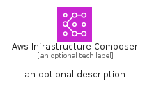
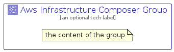

# AwsInfrastructureComposer


```text
aws-q1-2025/Architecture/DeveloperTools/AwsInfrastructureComposer
```

```text
include('aws-q1-2025/Architecture/DeveloperTools/AwsInfrastructureComposer')
```


| Illustration | AwsInfrastructureComposer | AwsInfrastructureComposerCard | AwsInfrastructureComposerGroup |
| :---: | :---: | :---: | :---: |
|  |  |  |  |


## Sprites
The item provides the following sriptes:

- `<$AwsInfrastructureComposerXs>`
- `<$AwsInfrastructureComposerSm>`
- `<$AwsInfrastructureComposerMd>`
- `<$AwsInfrastructureComposerLg>`


## AwsInfrastructureComposer

### Load remotely
```plantuml
@startuml
' configures the library
!global $LIB_BASE_LOCATION="https://raw.githubusercontent.com/tmorin/plantuml-libs/master/distribution"

' loads the library's bootstrap
!include $LIB_BASE_LOCATION/bootstrap.puml

' loads the package bootstrap
include('aws-q1-2025/bootstrap')

' loads the Item which embeds the element AwsInfrastructureComposer
include('aws-q1-2025/Architecture/DeveloperTools/AwsInfrastructureComposer')

' renders the element
AwsInfrastructureComposer('AwsInfrastructureComposer', 'Aws Infrastructure Composer', 'an optional tech label', 'an optional description')
@enduml
```

### Load locally
```plantuml
@startuml
' configures the library
!global $INCLUSION_MODE="local"
!global $LIB_BASE_LOCATION="../../.."

' loads the library's bootstrap
!include $LIB_BASE_LOCATION/bootstrap.puml

' loads the package bootstrap
include('aws-q1-2025/bootstrap')

' loads the Item which embeds the element AwsInfrastructureComposer
include('aws-q1-2025/Architecture/DeveloperTools/AwsInfrastructureComposer')

' renders the element
AwsInfrastructureComposer('AwsInfrastructureComposer', 'Aws Infrastructure Composer', 'an optional tech label', 'an optional description')
@enduml
```

## AwsInfrastructureComposerCard

### Load remotely
```plantuml
@startuml
' configures the library
!global $LIB_BASE_LOCATION="https://raw.githubusercontent.com/tmorin/plantuml-libs/master/distribution"

' loads the library's bootstrap
!include $LIB_BASE_LOCATION/bootstrap.puml

' loads the package bootstrap
include('aws-q1-2025/bootstrap')

' loads the Item which embeds the element AwsInfrastructureComposerCard
include('aws-q1-2025/Architecture/DeveloperTools/AwsInfrastructureComposer')

' renders the element
AwsInfrastructureComposerCard('AwsInfrastructureComposerCard', 'Aws Infrastructure Composer Card', 'an optional description')
@enduml
```

### Load locally
```plantuml
@startuml
' configures the library
!global $INCLUSION_MODE="local"
!global $LIB_BASE_LOCATION="../../.."

' loads the library's bootstrap
!include $LIB_BASE_LOCATION/bootstrap.puml

' loads the package bootstrap
include('aws-q1-2025/bootstrap')

' loads the Item which embeds the element AwsInfrastructureComposerCard
include('aws-q1-2025/Architecture/DeveloperTools/AwsInfrastructureComposer')

' renders the element
AwsInfrastructureComposerCard('AwsInfrastructureComposerCard', 'Aws Infrastructure Composer Card', 'an optional description')
@enduml
```

## AwsInfrastructureComposerGroup

### Load remotely
```plantuml
@startuml
' configures the library
!global $LIB_BASE_LOCATION="https://raw.githubusercontent.com/tmorin/plantuml-libs/master/distribution"

' loads the library's bootstrap
!include $LIB_BASE_LOCATION/bootstrap.puml

' loads the package bootstrap
include('aws-q1-2025/bootstrap')

' loads the Item which embeds the element AwsInfrastructureComposerGroup
include('aws-q1-2025/Architecture/DeveloperTools/AwsInfrastructureComposer')

' renders the element
AwsInfrastructureComposerGroup('AwsInfrastructureComposerGroup', 'Aws Infrastructure Composer Group', 'an optional tech label') {
    note as note
        the content of the group
    end note
}
@enduml
```

### Load locally
```plantuml
@startuml
' configures the library
!global $INCLUSION_MODE="local"
!global $LIB_BASE_LOCATION="../../.."

' loads the library's bootstrap
!include $LIB_BASE_LOCATION/bootstrap.puml

' loads the package bootstrap
include('aws-q1-2025/bootstrap')

' loads the Item which embeds the element AwsInfrastructureComposerGroup
include('aws-q1-2025/Architecture/DeveloperTools/AwsInfrastructureComposer')

' renders the element
AwsInfrastructureComposerGroup('AwsInfrastructureComposerGroup', 'Aws Infrastructure Composer Group', 'an optional tech label') {
    note as note
        the content of the group
    end note
}
@enduml
```

