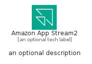

# AmazonAppStream2


```text
aws-q1-2025/Architecture/EndUserComputing/AmazonAppStream2
```

```text
include('aws-q1-2025/Architecture/EndUserComputing/AmazonAppStream2')
```


| Illustration | AmazonAppStream2 | AmazonAppStream2Card | AmazonAppStream2Group |
| :---: | :---: | :---: | :---: |
|  |  |  |  |


## Sprites
The item provides the following sriptes:

- `<$AmazonAppStream2Xs>`
- `<$AmazonAppStream2Sm>`
- `<$AmazonAppStream2Md>`
- `<$AmazonAppStream2Lg>`


## AmazonAppStream2

### Load remotely
```plantuml
@startuml
' configures the library
!global $LIB_BASE_LOCATION="https://raw.githubusercontent.com/tmorin/plantuml-libs/master/distribution"

' loads the library's bootstrap
!include $LIB_BASE_LOCATION/bootstrap.puml

' loads the package bootstrap
include('aws-q1-2025/bootstrap')

' loads the Item which embeds the element AmazonAppStream2
include('aws-q1-2025/Architecture/EndUserComputing/AmazonAppStream2')

' renders the element
AmazonAppStream2('AmazonAppStream2', 'Amazon App Stream2', 'an optional tech label', 'an optional description')
@enduml
```

### Load locally
```plantuml
@startuml
' configures the library
!global $INCLUSION_MODE="local"
!global $LIB_BASE_LOCATION="../../.."

' loads the library's bootstrap
!include $LIB_BASE_LOCATION/bootstrap.puml

' loads the package bootstrap
include('aws-q1-2025/bootstrap')

' loads the Item which embeds the element AmazonAppStream2
include('aws-q1-2025/Architecture/EndUserComputing/AmazonAppStream2')

' renders the element
AmazonAppStream2('AmazonAppStream2', 'Amazon App Stream2', 'an optional tech label', 'an optional description')
@enduml
```

## AmazonAppStream2Card

### Load remotely
```plantuml
@startuml
' configures the library
!global $LIB_BASE_LOCATION="https://raw.githubusercontent.com/tmorin/plantuml-libs/master/distribution"

' loads the library's bootstrap
!include $LIB_BASE_LOCATION/bootstrap.puml

' loads the package bootstrap
include('aws-q1-2025/bootstrap')

' loads the Item which embeds the element AmazonAppStream2Card
include('aws-q1-2025/Architecture/EndUserComputing/AmazonAppStream2')

' renders the element
AmazonAppStream2Card('AmazonAppStream2Card', 'Amazon App Stream2 Card', 'an optional description')
@enduml
```

### Load locally
```plantuml
@startuml
' configures the library
!global $INCLUSION_MODE="local"
!global $LIB_BASE_LOCATION="../../.."

' loads the library's bootstrap
!include $LIB_BASE_LOCATION/bootstrap.puml

' loads the package bootstrap
include('aws-q1-2025/bootstrap')

' loads the Item which embeds the element AmazonAppStream2Card
include('aws-q1-2025/Architecture/EndUserComputing/AmazonAppStream2')

' renders the element
AmazonAppStream2Card('AmazonAppStream2Card', 'Amazon App Stream2 Card', 'an optional description')
@enduml
```

## AmazonAppStream2Group

### Load remotely
```plantuml
@startuml
' configures the library
!global $LIB_BASE_LOCATION="https://raw.githubusercontent.com/tmorin/plantuml-libs/master/distribution"

' loads the library's bootstrap
!include $LIB_BASE_LOCATION/bootstrap.puml

' loads the package bootstrap
include('aws-q1-2025/bootstrap')

' loads the Item which embeds the element AmazonAppStream2Group
include('aws-q1-2025/Architecture/EndUserComputing/AmazonAppStream2')

' renders the element
AmazonAppStream2Group('AmazonAppStream2Group', 'Amazon App Stream2 Group', 'an optional tech label') {
    note as note
        the content of the group
    end note
}
@enduml
```

### Load locally
```plantuml
@startuml
' configures the library
!global $INCLUSION_MODE="local"
!global $LIB_BASE_LOCATION="../../.."

' loads the library's bootstrap
!include $LIB_BASE_LOCATION/bootstrap.puml

' loads the package bootstrap
include('aws-q1-2025/bootstrap')

' loads the Item which embeds the element AmazonAppStream2Group
include('aws-q1-2025/Architecture/EndUserComputing/AmazonAppStream2')

' renders the element
AmazonAppStream2Group('AmazonAppStream2Group', 'Amazon App Stream2 Group', 'an optional tech label') {
    note as note
        the content of the group
    end note
}
@enduml
```

