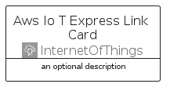

# AwsIoTExpressLink


```text
aws-q1-2025/Architecture/InternetOfThings/AwsIoTExpressLink
```

```text
include('aws-q1-2025/Architecture/InternetOfThings/AwsIoTExpressLink')
```


| Illustration | AwsIoTExpressLink | AwsIoTExpressLinkCard | AwsIoTExpressLinkGroup |
| :---: | :---: | :---: | :---: |
|  |  |  |  |


## Sprites
The item provides the following sriptes:

- `<$AwsIoTExpressLinkXs>`
- `<$AwsIoTExpressLinkSm>`
- `<$AwsIoTExpressLinkMd>`
- `<$AwsIoTExpressLinkLg>`


## AwsIoTExpressLink

### Load remotely
```plantuml
@startuml
' configures the library
!global $LIB_BASE_LOCATION="https://raw.githubusercontent.com/tmorin/plantuml-libs/master/distribution"

' loads the library's bootstrap
!include $LIB_BASE_LOCATION/bootstrap.puml

' loads the package bootstrap
include('aws-q1-2025/bootstrap')

' loads the Item which embeds the element AwsIoTExpressLink
include('aws-q1-2025/Architecture/InternetOfThings/AwsIoTExpressLink')

' renders the element
AwsIoTExpressLink('AwsIoTExpressLink', 'Aws Io T Express Link', 'an optional tech label', 'an optional description')
@enduml
```

### Load locally
```plantuml
@startuml
' configures the library
!global $INCLUSION_MODE="local"
!global $LIB_BASE_LOCATION="../../.."

' loads the library's bootstrap
!include $LIB_BASE_LOCATION/bootstrap.puml

' loads the package bootstrap
include('aws-q1-2025/bootstrap')

' loads the Item which embeds the element AwsIoTExpressLink
include('aws-q1-2025/Architecture/InternetOfThings/AwsIoTExpressLink')

' renders the element
AwsIoTExpressLink('AwsIoTExpressLink', 'Aws Io T Express Link', 'an optional tech label', 'an optional description')
@enduml
```

## AwsIoTExpressLinkCard

### Load remotely
```plantuml
@startuml
' configures the library
!global $LIB_BASE_LOCATION="https://raw.githubusercontent.com/tmorin/plantuml-libs/master/distribution"

' loads the library's bootstrap
!include $LIB_BASE_LOCATION/bootstrap.puml

' loads the package bootstrap
include('aws-q1-2025/bootstrap')

' loads the Item which embeds the element AwsIoTExpressLinkCard
include('aws-q1-2025/Architecture/InternetOfThings/AwsIoTExpressLink')

' renders the element
AwsIoTExpressLinkCard('AwsIoTExpressLinkCard', 'Aws Io T Express Link Card', 'an optional description')
@enduml
```

### Load locally
```plantuml
@startuml
' configures the library
!global $INCLUSION_MODE="local"
!global $LIB_BASE_LOCATION="../../.."

' loads the library's bootstrap
!include $LIB_BASE_LOCATION/bootstrap.puml

' loads the package bootstrap
include('aws-q1-2025/bootstrap')

' loads the Item which embeds the element AwsIoTExpressLinkCard
include('aws-q1-2025/Architecture/InternetOfThings/AwsIoTExpressLink')

' renders the element
AwsIoTExpressLinkCard('AwsIoTExpressLinkCard', 'Aws Io T Express Link Card', 'an optional description')
@enduml
```

## AwsIoTExpressLinkGroup

### Load remotely
```plantuml
@startuml
' configures the library
!global $LIB_BASE_LOCATION="https://raw.githubusercontent.com/tmorin/plantuml-libs/master/distribution"

' loads the library's bootstrap
!include $LIB_BASE_LOCATION/bootstrap.puml

' loads the package bootstrap
include('aws-q1-2025/bootstrap')

' loads the Item which embeds the element AwsIoTExpressLinkGroup
include('aws-q1-2025/Architecture/InternetOfThings/AwsIoTExpressLink')

' renders the element
AwsIoTExpressLinkGroup('AwsIoTExpressLinkGroup', 'Aws Io T Express Link Group', 'an optional tech label') {
    note as note
        the content of the group
    end note
}
@enduml
```

### Load locally
```plantuml
@startuml
' configures the library
!global $INCLUSION_MODE="local"
!global $LIB_BASE_LOCATION="../../.."

' loads the library's bootstrap
!include $LIB_BASE_LOCATION/bootstrap.puml

' loads the package bootstrap
include('aws-q1-2025/bootstrap')

' loads the Item which embeds the element AwsIoTExpressLinkGroup
include('aws-q1-2025/Architecture/InternetOfThings/AwsIoTExpressLink')

' renders the element
AwsIoTExpressLinkGroup('AwsIoTExpressLinkGroup', 'Aws Io T Express Link Group', 'an optional tech label') {
    note as note
        the content of the group
    end note
}
@enduml
```

