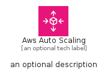

# AwsAutoScaling


```text
aws-q1-2025/Architecture/ManagementGovernance/AwsAutoScaling
```

```text
include('aws-q1-2025/Architecture/ManagementGovernance/AwsAutoScaling')
```


| Illustration | AwsAutoScaling | AwsAutoScalingCard | AwsAutoScalingGroup |
| :---: | :---: | :---: | :---: |
|  |  |  |  |


## Sprites
The item provides the following sriptes:

- `<$AwsAutoScalingXs>`
- `<$AwsAutoScalingSm>`
- `<$AwsAutoScalingMd>`
- `<$AwsAutoScalingLg>`


## AwsAutoScaling

### Load remotely
```plantuml
@startuml
' configures the library
!global $LIB_BASE_LOCATION="https://raw.githubusercontent.com/tmorin/plantuml-libs/master/distribution"

' loads the library's bootstrap
!include $LIB_BASE_LOCATION/bootstrap.puml

' loads the package bootstrap
include('aws-q1-2025/bootstrap')

' loads the Item which embeds the element AwsAutoScaling
include('aws-q1-2025/Architecture/ManagementGovernance/AwsAutoScaling')

' renders the element
AwsAutoScaling('AwsAutoScaling', 'Aws Auto Scaling', 'an optional tech label', 'an optional description')
@enduml
```

### Load locally
```plantuml
@startuml
' configures the library
!global $INCLUSION_MODE="local"
!global $LIB_BASE_LOCATION="../../.."

' loads the library's bootstrap
!include $LIB_BASE_LOCATION/bootstrap.puml

' loads the package bootstrap
include('aws-q1-2025/bootstrap')

' loads the Item which embeds the element AwsAutoScaling
include('aws-q1-2025/Architecture/ManagementGovernance/AwsAutoScaling')

' renders the element
AwsAutoScaling('AwsAutoScaling', 'Aws Auto Scaling', 'an optional tech label', 'an optional description')
@enduml
```

## AwsAutoScalingCard

### Load remotely
```plantuml
@startuml
' configures the library
!global $LIB_BASE_LOCATION="https://raw.githubusercontent.com/tmorin/plantuml-libs/master/distribution"

' loads the library's bootstrap
!include $LIB_BASE_LOCATION/bootstrap.puml

' loads the package bootstrap
include('aws-q1-2025/bootstrap')

' loads the Item which embeds the element AwsAutoScalingCard
include('aws-q1-2025/Architecture/ManagementGovernance/AwsAutoScaling')

' renders the element
AwsAutoScalingCard('AwsAutoScalingCard', 'Aws Auto Scaling Card', 'an optional description')
@enduml
```

### Load locally
```plantuml
@startuml
' configures the library
!global $INCLUSION_MODE="local"
!global $LIB_BASE_LOCATION="../../.."

' loads the library's bootstrap
!include $LIB_BASE_LOCATION/bootstrap.puml

' loads the package bootstrap
include('aws-q1-2025/bootstrap')

' loads the Item which embeds the element AwsAutoScalingCard
include('aws-q1-2025/Architecture/ManagementGovernance/AwsAutoScaling')

' renders the element
AwsAutoScalingCard('AwsAutoScalingCard', 'Aws Auto Scaling Card', 'an optional description')
@enduml
```

## AwsAutoScalingGroup

### Load remotely
```plantuml
@startuml
' configures the library
!global $LIB_BASE_LOCATION="https://raw.githubusercontent.com/tmorin/plantuml-libs/master/distribution"

' loads the library's bootstrap
!include $LIB_BASE_LOCATION/bootstrap.puml

' loads the package bootstrap
include('aws-q1-2025/bootstrap')

' loads the Item which embeds the element AwsAutoScalingGroup
include('aws-q1-2025/Architecture/ManagementGovernance/AwsAutoScaling')

' renders the element
AwsAutoScalingGroup('AwsAutoScalingGroup', 'Aws Auto Scaling Group', 'an optional tech label') {
    note as note
        the content of the group
    end note
}
@enduml
```

### Load locally
```plantuml
@startuml
' configures the library
!global $INCLUSION_MODE="local"
!global $LIB_BASE_LOCATION="../../.."

' loads the library's bootstrap
!include $LIB_BASE_LOCATION/bootstrap.puml

' loads the package bootstrap
include('aws-q1-2025/bootstrap')

' loads the Item which embeds the element AwsAutoScalingGroup
include('aws-q1-2025/Architecture/ManagementGovernance/AwsAutoScaling')

' renders the element
AwsAutoScalingGroup('AwsAutoScalingGroup', 'Aws Auto Scaling Group', 'an optional tech label') {
    note as note
        the content of the group
    end note
}
@enduml
```

