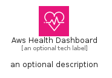
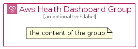

# AwsHealthDashboard


```text
aws-q1-2025/Architecture/ManagementGovernance/AwsHealthDashboard
```

```text
include('aws-q1-2025/Architecture/ManagementGovernance/AwsHealthDashboard')
```


| Illustration | AwsHealthDashboard | AwsHealthDashboardCard | AwsHealthDashboardGroup |
| :---: | :---: | :---: | :---: |
|  |  |  |  |


## Sprites
The item provides the following sriptes:

- `<$AwsHealthDashboardXs>`
- `<$AwsHealthDashboardSm>`
- `<$AwsHealthDashboardMd>`
- `<$AwsHealthDashboardLg>`


## AwsHealthDashboard

### Load remotely
```plantuml
@startuml
' configures the library
!global $LIB_BASE_LOCATION="https://raw.githubusercontent.com/tmorin/plantuml-libs/master/distribution"

' loads the library's bootstrap
!include $LIB_BASE_LOCATION/bootstrap.puml

' loads the package bootstrap
include('aws-q1-2025/bootstrap')

' loads the Item which embeds the element AwsHealthDashboard
include('aws-q1-2025/Architecture/ManagementGovernance/AwsHealthDashboard')

' renders the element
AwsHealthDashboard('AwsHealthDashboard', 'Aws Health Dashboard', 'an optional tech label', 'an optional description')
@enduml
```

### Load locally
```plantuml
@startuml
' configures the library
!global $INCLUSION_MODE="local"
!global $LIB_BASE_LOCATION="../../.."

' loads the library's bootstrap
!include $LIB_BASE_LOCATION/bootstrap.puml

' loads the package bootstrap
include('aws-q1-2025/bootstrap')

' loads the Item which embeds the element AwsHealthDashboard
include('aws-q1-2025/Architecture/ManagementGovernance/AwsHealthDashboard')

' renders the element
AwsHealthDashboard('AwsHealthDashboard', 'Aws Health Dashboard', 'an optional tech label', 'an optional description')
@enduml
```

## AwsHealthDashboardCard

### Load remotely
```plantuml
@startuml
' configures the library
!global $LIB_BASE_LOCATION="https://raw.githubusercontent.com/tmorin/plantuml-libs/master/distribution"

' loads the library's bootstrap
!include $LIB_BASE_LOCATION/bootstrap.puml

' loads the package bootstrap
include('aws-q1-2025/bootstrap')

' loads the Item which embeds the element AwsHealthDashboardCard
include('aws-q1-2025/Architecture/ManagementGovernance/AwsHealthDashboard')

' renders the element
AwsHealthDashboardCard('AwsHealthDashboardCard', 'Aws Health Dashboard Card', 'an optional description')
@enduml
```

### Load locally
```plantuml
@startuml
' configures the library
!global $INCLUSION_MODE="local"
!global $LIB_BASE_LOCATION="../../.."

' loads the library's bootstrap
!include $LIB_BASE_LOCATION/bootstrap.puml

' loads the package bootstrap
include('aws-q1-2025/bootstrap')

' loads the Item which embeds the element AwsHealthDashboardCard
include('aws-q1-2025/Architecture/ManagementGovernance/AwsHealthDashboard')

' renders the element
AwsHealthDashboardCard('AwsHealthDashboardCard', 'Aws Health Dashboard Card', 'an optional description')
@enduml
```

## AwsHealthDashboardGroup

### Load remotely
```plantuml
@startuml
' configures the library
!global $LIB_BASE_LOCATION="https://raw.githubusercontent.com/tmorin/plantuml-libs/master/distribution"

' loads the library's bootstrap
!include $LIB_BASE_LOCATION/bootstrap.puml

' loads the package bootstrap
include('aws-q1-2025/bootstrap')

' loads the Item which embeds the element AwsHealthDashboardGroup
include('aws-q1-2025/Architecture/ManagementGovernance/AwsHealthDashboard')

' renders the element
AwsHealthDashboardGroup('AwsHealthDashboardGroup', 'Aws Health Dashboard Group', 'an optional tech label') {
    note as note
        the content of the group
    end note
}
@enduml
```

### Load locally
```plantuml
@startuml
' configures the library
!global $INCLUSION_MODE="local"
!global $LIB_BASE_LOCATION="../../.."

' loads the library's bootstrap
!include $LIB_BASE_LOCATION/bootstrap.puml

' loads the package bootstrap
include('aws-q1-2025/bootstrap')

' loads the Item which embeds the element AwsHealthDashboardGroup
include('aws-q1-2025/Architecture/ManagementGovernance/AwsHealthDashboard')

' renders the element
AwsHealthDashboardGroup('AwsHealthDashboardGroup', 'Aws Health Dashboard Group', 'an optional tech label') {
    note as note
        the content of the group
    end note
}
@enduml
```

