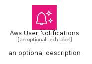

# AwsUserNotifications


```text
aws-q1-2025/Architecture/ManagementGovernance/AwsUserNotifications
```

```text
include('aws-q1-2025/Architecture/ManagementGovernance/AwsUserNotifications')
```


| Illustration | AwsUserNotifications | AwsUserNotificationsCard | AwsUserNotificationsGroup |
| :---: | :---: | :---: | :---: |
|  |  |  |  |


## Sprites
The item provides the following sriptes:

- `<$AwsUserNotificationsXs>`
- `<$AwsUserNotificationsSm>`
- `<$AwsUserNotificationsMd>`
- `<$AwsUserNotificationsLg>`


## AwsUserNotifications

### Load remotely
```plantuml
@startuml
' configures the library
!global $LIB_BASE_LOCATION="https://raw.githubusercontent.com/tmorin/plantuml-libs/master/distribution"

' loads the library's bootstrap
!include $LIB_BASE_LOCATION/bootstrap.puml

' loads the package bootstrap
include('aws-q1-2025/bootstrap')

' loads the Item which embeds the element AwsUserNotifications
include('aws-q1-2025/Architecture/ManagementGovernance/AwsUserNotifications')

' renders the element
AwsUserNotifications('AwsUserNotifications', 'Aws User Notifications', 'an optional tech label', 'an optional description')
@enduml
```

### Load locally
```plantuml
@startuml
' configures the library
!global $INCLUSION_MODE="local"
!global $LIB_BASE_LOCATION="../../.."

' loads the library's bootstrap
!include $LIB_BASE_LOCATION/bootstrap.puml

' loads the package bootstrap
include('aws-q1-2025/bootstrap')

' loads the Item which embeds the element AwsUserNotifications
include('aws-q1-2025/Architecture/ManagementGovernance/AwsUserNotifications')

' renders the element
AwsUserNotifications('AwsUserNotifications', 'Aws User Notifications', 'an optional tech label', 'an optional description')
@enduml
```

## AwsUserNotificationsCard

### Load remotely
```plantuml
@startuml
' configures the library
!global $LIB_BASE_LOCATION="https://raw.githubusercontent.com/tmorin/plantuml-libs/master/distribution"

' loads the library's bootstrap
!include $LIB_BASE_LOCATION/bootstrap.puml

' loads the package bootstrap
include('aws-q1-2025/bootstrap')

' loads the Item which embeds the element AwsUserNotificationsCard
include('aws-q1-2025/Architecture/ManagementGovernance/AwsUserNotifications')

' renders the element
AwsUserNotificationsCard('AwsUserNotificationsCard', 'Aws User Notifications Card', 'an optional description')
@enduml
```

### Load locally
```plantuml
@startuml
' configures the library
!global $INCLUSION_MODE="local"
!global $LIB_BASE_LOCATION="../../.."

' loads the library's bootstrap
!include $LIB_BASE_LOCATION/bootstrap.puml

' loads the package bootstrap
include('aws-q1-2025/bootstrap')

' loads the Item which embeds the element AwsUserNotificationsCard
include('aws-q1-2025/Architecture/ManagementGovernance/AwsUserNotifications')

' renders the element
AwsUserNotificationsCard('AwsUserNotificationsCard', 'Aws User Notifications Card', 'an optional description')
@enduml
```

## AwsUserNotificationsGroup

### Load remotely
```plantuml
@startuml
' configures the library
!global $LIB_BASE_LOCATION="https://raw.githubusercontent.com/tmorin/plantuml-libs/master/distribution"

' loads the library's bootstrap
!include $LIB_BASE_LOCATION/bootstrap.puml

' loads the package bootstrap
include('aws-q1-2025/bootstrap')

' loads the Item which embeds the element AwsUserNotificationsGroup
include('aws-q1-2025/Architecture/ManagementGovernance/AwsUserNotifications')

' renders the element
AwsUserNotificationsGroup('AwsUserNotificationsGroup', 'Aws User Notifications Group', 'an optional tech label') {
    note as note
        the content of the group
    end note
}
@enduml
```

### Load locally
```plantuml
@startuml
' configures the library
!global $INCLUSION_MODE="local"
!global $LIB_BASE_LOCATION="../../.."

' loads the library's bootstrap
!include $LIB_BASE_LOCATION/bootstrap.puml

' loads the package bootstrap
include('aws-q1-2025/bootstrap')

' loads the Item which embeds the element AwsUserNotificationsGroup
include('aws-q1-2025/Architecture/ManagementGovernance/AwsUserNotifications')

' renders the element
AwsUserNotificationsGroup('AwsUserNotificationsGroup', 'Aws User Notifications Group', 'an optional tech label') {
    note as note
        the content of the group
    end note
}
@enduml
```

