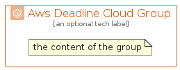

# AwsDeadlineCloud


```text
aws-q1-2025/Architecture/MediaServices/AwsDeadlineCloud
```

```text
include('aws-q1-2025/Architecture/MediaServices/AwsDeadlineCloud')
```


| Illustration | AwsDeadlineCloud | AwsDeadlineCloudCard | AwsDeadlineCloudGroup |
| :---: | :---: | :---: | :---: |
|  |  |  |  |


## Sprites
The item provides the following sriptes:

- `<$AwsDeadlineCloudXs>`
- `<$AwsDeadlineCloudSm>`
- `<$AwsDeadlineCloudMd>`
- `<$AwsDeadlineCloudLg>`


## AwsDeadlineCloud

### Load remotely
```plantuml
@startuml
' configures the library
!global $LIB_BASE_LOCATION="https://raw.githubusercontent.com/tmorin/plantuml-libs/master/distribution"

' loads the library's bootstrap
!include $LIB_BASE_LOCATION/bootstrap.puml

' loads the package bootstrap
include('aws-q1-2025/bootstrap')

' loads the Item which embeds the element AwsDeadlineCloud
include('aws-q1-2025/Architecture/MediaServices/AwsDeadlineCloud')

' renders the element
AwsDeadlineCloud('AwsDeadlineCloud', 'Aws Deadline Cloud', 'an optional tech label', 'an optional description')
@enduml
```

### Load locally
```plantuml
@startuml
' configures the library
!global $INCLUSION_MODE="local"
!global $LIB_BASE_LOCATION="../../.."

' loads the library's bootstrap
!include $LIB_BASE_LOCATION/bootstrap.puml

' loads the package bootstrap
include('aws-q1-2025/bootstrap')

' loads the Item which embeds the element AwsDeadlineCloud
include('aws-q1-2025/Architecture/MediaServices/AwsDeadlineCloud')

' renders the element
AwsDeadlineCloud('AwsDeadlineCloud', 'Aws Deadline Cloud', 'an optional tech label', 'an optional description')
@enduml
```

## AwsDeadlineCloudCard

### Load remotely
```plantuml
@startuml
' configures the library
!global $LIB_BASE_LOCATION="https://raw.githubusercontent.com/tmorin/plantuml-libs/master/distribution"

' loads the library's bootstrap
!include $LIB_BASE_LOCATION/bootstrap.puml

' loads the package bootstrap
include('aws-q1-2025/bootstrap')

' loads the Item which embeds the element AwsDeadlineCloudCard
include('aws-q1-2025/Architecture/MediaServices/AwsDeadlineCloud')

' renders the element
AwsDeadlineCloudCard('AwsDeadlineCloudCard', 'Aws Deadline Cloud Card', 'an optional description')
@enduml
```

### Load locally
```plantuml
@startuml
' configures the library
!global $INCLUSION_MODE="local"
!global $LIB_BASE_LOCATION="../../.."

' loads the library's bootstrap
!include $LIB_BASE_LOCATION/bootstrap.puml

' loads the package bootstrap
include('aws-q1-2025/bootstrap')

' loads the Item which embeds the element AwsDeadlineCloudCard
include('aws-q1-2025/Architecture/MediaServices/AwsDeadlineCloud')

' renders the element
AwsDeadlineCloudCard('AwsDeadlineCloudCard', 'Aws Deadline Cloud Card', 'an optional description')
@enduml
```

## AwsDeadlineCloudGroup

### Load remotely
```plantuml
@startuml
' configures the library
!global $LIB_BASE_LOCATION="https://raw.githubusercontent.com/tmorin/plantuml-libs/master/distribution"

' loads the library's bootstrap
!include $LIB_BASE_LOCATION/bootstrap.puml

' loads the package bootstrap
include('aws-q1-2025/bootstrap')

' loads the Item which embeds the element AwsDeadlineCloudGroup
include('aws-q1-2025/Architecture/MediaServices/AwsDeadlineCloud')

' renders the element
AwsDeadlineCloudGroup('AwsDeadlineCloudGroup', 'Aws Deadline Cloud Group', 'an optional tech label') {
    note as note
        the content of the group
    end note
}
@enduml
```

### Load locally
```plantuml
@startuml
' configures the library
!global $INCLUSION_MODE="local"
!global $LIB_BASE_LOCATION="../../.."

' loads the library's bootstrap
!include $LIB_BASE_LOCATION/bootstrap.puml

' loads the package bootstrap
include('aws-q1-2025/bootstrap')

' loads the Item which embeds the element AwsDeadlineCloudGroup
include('aws-q1-2025/Architecture/MediaServices/AwsDeadlineCloud')

' renders the element
AwsDeadlineCloudGroup('AwsDeadlineCloudGroup', 'Aws Deadline Cloud Group', 'an optional tech label') {
    note as note
        the content of the group
    end note
}
@enduml
```

