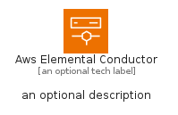

# AwsElementalConductor


```text
aws-q1-2025/Architecture/MediaServices/AwsElementalConductor
```

```text
include('aws-q1-2025/Architecture/MediaServices/AwsElementalConductor')
```


| Illustration | AwsElementalConductor | AwsElementalConductorCard | AwsElementalConductorGroup |
| :---: | :---: | :---: | :---: |
|  |  |  |  |


## Sprites
The item provides the following sriptes:

- `<$AwsElementalConductorXs>`
- `<$AwsElementalConductorSm>`
- `<$AwsElementalConductorMd>`
- `<$AwsElementalConductorLg>`


## AwsElementalConductor

### Load remotely
```plantuml
@startuml
' configures the library
!global $LIB_BASE_LOCATION="https://raw.githubusercontent.com/tmorin/plantuml-libs/master/distribution"

' loads the library's bootstrap
!include $LIB_BASE_LOCATION/bootstrap.puml

' loads the package bootstrap
include('aws-q1-2025/bootstrap')

' loads the Item which embeds the element AwsElementalConductor
include('aws-q1-2025/Architecture/MediaServices/AwsElementalConductor')

' renders the element
AwsElementalConductor('AwsElementalConductor', 'Aws Elemental Conductor', 'an optional tech label', 'an optional description')
@enduml
```

### Load locally
```plantuml
@startuml
' configures the library
!global $INCLUSION_MODE="local"
!global $LIB_BASE_LOCATION="../../.."

' loads the library's bootstrap
!include $LIB_BASE_LOCATION/bootstrap.puml

' loads the package bootstrap
include('aws-q1-2025/bootstrap')

' loads the Item which embeds the element AwsElementalConductor
include('aws-q1-2025/Architecture/MediaServices/AwsElementalConductor')

' renders the element
AwsElementalConductor('AwsElementalConductor', 'Aws Elemental Conductor', 'an optional tech label', 'an optional description')
@enduml
```

## AwsElementalConductorCard

### Load remotely
```plantuml
@startuml
' configures the library
!global $LIB_BASE_LOCATION="https://raw.githubusercontent.com/tmorin/plantuml-libs/master/distribution"

' loads the library's bootstrap
!include $LIB_BASE_LOCATION/bootstrap.puml

' loads the package bootstrap
include('aws-q1-2025/bootstrap')

' loads the Item which embeds the element AwsElementalConductorCard
include('aws-q1-2025/Architecture/MediaServices/AwsElementalConductor')

' renders the element
AwsElementalConductorCard('AwsElementalConductorCard', 'Aws Elemental Conductor Card', 'an optional description')
@enduml
```

### Load locally
```plantuml
@startuml
' configures the library
!global $INCLUSION_MODE="local"
!global $LIB_BASE_LOCATION="../../.."

' loads the library's bootstrap
!include $LIB_BASE_LOCATION/bootstrap.puml

' loads the package bootstrap
include('aws-q1-2025/bootstrap')

' loads the Item which embeds the element AwsElementalConductorCard
include('aws-q1-2025/Architecture/MediaServices/AwsElementalConductor')

' renders the element
AwsElementalConductorCard('AwsElementalConductorCard', 'Aws Elemental Conductor Card', 'an optional description')
@enduml
```

## AwsElementalConductorGroup

### Load remotely
```plantuml
@startuml
' configures the library
!global $LIB_BASE_LOCATION="https://raw.githubusercontent.com/tmorin/plantuml-libs/master/distribution"

' loads the library's bootstrap
!include $LIB_BASE_LOCATION/bootstrap.puml

' loads the package bootstrap
include('aws-q1-2025/bootstrap')

' loads the Item which embeds the element AwsElementalConductorGroup
include('aws-q1-2025/Architecture/MediaServices/AwsElementalConductor')

' renders the element
AwsElementalConductorGroup('AwsElementalConductorGroup', 'Aws Elemental Conductor Group', 'an optional tech label') {
    note as note
        the content of the group
    end note
}
@enduml
```

### Load locally
```plantuml
@startuml
' configures the library
!global $INCLUSION_MODE="local"
!global $LIB_BASE_LOCATION="../../.."

' loads the library's bootstrap
!include $LIB_BASE_LOCATION/bootstrap.puml

' loads the package bootstrap
include('aws-q1-2025/bootstrap')

' loads the Item which embeds the element AwsElementalConductorGroup
include('aws-q1-2025/Architecture/MediaServices/AwsElementalConductor')

' renders the element
AwsElementalConductorGroup('AwsElementalConductorGroup', 'Aws Elemental Conductor Group', 'an optional tech label') {
    note as note
        the content of the group
    end note
}
@enduml
```

