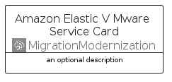

# AmazonElasticVMwareService


```text
aws-q1-2025/Architecture/MigrationModernization/AmazonElasticVMwareService
```

```text
include('aws-q1-2025/Architecture/MigrationModernization/AmazonElasticVMwareService')
```


| Illustration | AmazonElasticVMwareService | AmazonElasticVMwareServiceCard | AmazonElasticVMwareServiceGroup |
| :---: | :---: | :---: | :---: |
|  |  |  |  |


## Sprites
The item provides the following sriptes:

- `<$AmazonElasticVMwareServiceXs>`
- `<$AmazonElasticVMwareServiceSm>`
- `<$AmazonElasticVMwareServiceMd>`
- `<$AmazonElasticVMwareServiceLg>`


## AmazonElasticVMwareService

### Load remotely
```plantuml
@startuml
' configures the library
!global $LIB_BASE_LOCATION="https://raw.githubusercontent.com/tmorin/plantuml-libs/master/distribution"

' loads the library's bootstrap
!include $LIB_BASE_LOCATION/bootstrap.puml

' loads the package bootstrap
include('aws-q1-2025/bootstrap')

' loads the Item which embeds the element AmazonElasticVMwareService
include('aws-q1-2025/Architecture/MigrationModernization/AmazonElasticVMwareService')

' renders the element
AmazonElasticVMwareService('AmazonElasticVMwareService', 'Amazon Elastic V Mware Service', 'an optional tech label', 'an optional description')
@enduml
```

### Load locally
```plantuml
@startuml
' configures the library
!global $INCLUSION_MODE="local"
!global $LIB_BASE_LOCATION="../../.."

' loads the library's bootstrap
!include $LIB_BASE_LOCATION/bootstrap.puml

' loads the package bootstrap
include('aws-q1-2025/bootstrap')

' loads the Item which embeds the element AmazonElasticVMwareService
include('aws-q1-2025/Architecture/MigrationModernization/AmazonElasticVMwareService')

' renders the element
AmazonElasticVMwareService('AmazonElasticVMwareService', 'Amazon Elastic V Mware Service', 'an optional tech label', 'an optional description')
@enduml
```

## AmazonElasticVMwareServiceCard

### Load remotely
```plantuml
@startuml
' configures the library
!global $LIB_BASE_LOCATION="https://raw.githubusercontent.com/tmorin/plantuml-libs/master/distribution"

' loads the library's bootstrap
!include $LIB_BASE_LOCATION/bootstrap.puml

' loads the package bootstrap
include('aws-q1-2025/bootstrap')

' loads the Item which embeds the element AmazonElasticVMwareServiceCard
include('aws-q1-2025/Architecture/MigrationModernization/AmazonElasticVMwareService')

' renders the element
AmazonElasticVMwareServiceCard('AmazonElasticVMwareServiceCard', 'Amazon Elastic V Mware Service Card', 'an optional description')
@enduml
```

### Load locally
```plantuml
@startuml
' configures the library
!global $INCLUSION_MODE="local"
!global $LIB_BASE_LOCATION="../../.."

' loads the library's bootstrap
!include $LIB_BASE_LOCATION/bootstrap.puml

' loads the package bootstrap
include('aws-q1-2025/bootstrap')

' loads the Item which embeds the element AmazonElasticVMwareServiceCard
include('aws-q1-2025/Architecture/MigrationModernization/AmazonElasticVMwareService')

' renders the element
AmazonElasticVMwareServiceCard('AmazonElasticVMwareServiceCard', 'Amazon Elastic V Mware Service Card', 'an optional description')
@enduml
```

## AmazonElasticVMwareServiceGroup

### Load remotely
```plantuml
@startuml
' configures the library
!global $LIB_BASE_LOCATION="https://raw.githubusercontent.com/tmorin/plantuml-libs/master/distribution"

' loads the library's bootstrap
!include $LIB_BASE_LOCATION/bootstrap.puml

' loads the package bootstrap
include('aws-q1-2025/bootstrap')

' loads the Item which embeds the element AmazonElasticVMwareServiceGroup
include('aws-q1-2025/Architecture/MigrationModernization/AmazonElasticVMwareService')

' renders the element
AmazonElasticVMwareServiceGroup('AmazonElasticVMwareServiceGroup', 'Amazon Elastic V Mware Service Group', 'an optional tech label') {
    note as note
        the content of the group
    end note
}
@enduml
```

### Load locally
```plantuml
@startuml
' configures the library
!global $INCLUSION_MODE="local"
!global $LIB_BASE_LOCATION="../../.."

' loads the library's bootstrap
!include $LIB_BASE_LOCATION/bootstrap.puml

' loads the package bootstrap
include('aws-q1-2025/bootstrap')

' loads the Item which embeds the element AmazonElasticVMwareServiceGroup
include('aws-q1-2025/Architecture/MigrationModernization/AmazonElasticVMwareService')

' renders the element
AmazonElasticVMwareServiceGroup('AmazonElasticVMwareServiceGroup', 'Amazon Elastic V Mware Service Group', 'an optional tech label') {
    note as note
        the content of the group
    end note
}
@enduml
```

