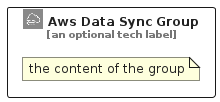

# AwsDataSync


```text
aws-q1-2025/Architecture/MigrationModernization/AwsDataSync
```

```text
include('aws-q1-2025/Architecture/MigrationModernization/AwsDataSync')
```


| Illustration | AwsDataSync | AwsDataSyncCard | AwsDataSyncGroup |
| :---: | :---: | :---: | :---: |
|  |  |  |  |


## Sprites
The item provides the following sriptes:

- `<$AwsDataSyncXs>`
- `<$AwsDataSyncSm>`
- `<$AwsDataSyncMd>`
- `<$AwsDataSyncLg>`


## AwsDataSync

### Load remotely
```plantuml
@startuml
' configures the library
!global $LIB_BASE_LOCATION="https://raw.githubusercontent.com/tmorin/plantuml-libs/master/distribution"

' loads the library's bootstrap
!include $LIB_BASE_LOCATION/bootstrap.puml

' loads the package bootstrap
include('aws-q1-2025/bootstrap')

' loads the Item which embeds the element AwsDataSync
include('aws-q1-2025/Architecture/MigrationModernization/AwsDataSync')

' renders the element
AwsDataSync('AwsDataSync', 'Aws Data Sync', 'an optional tech label', 'an optional description')
@enduml
```

### Load locally
```plantuml
@startuml
' configures the library
!global $INCLUSION_MODE="local"
!global $LIB_BASE_LOCATION="../../.."

' loads the library's bootstrap
!include $LIB_BASE_LOCATION/bootstrap.puml

' loads the package bootstrap
include('aws-q1-2025/bootstrap')

' loads the Item which embeds the element AwsDataSync
include('aws-q1-2025/Architecture/MigrationModernization/AwsDataSync')

' renders the element
AwsDataSync('AwsDataSync', 'Aws Data Sync', 'an optional tech label', 'an optional description')
@enduml
```

## AwsDataSyncCard

### Load remotely
```plantuml
@startuml
' configures the library
!global $LIB_BASE_LOCATION="https://raw.githubusercontent.com/tmorin/plantuml-libs/master/distribution"

' loads the library's bootstrap
!include $LIB_BASE_LOCATION/bootstrap.puml

' loads the package bootstrap
include('aws-q1-2025/bootstrap')

' loads the Item which embeds the element AwsDataSyncCard
include('aws-q1-2025/Architecture/MigrationModernization/AwsDataSync')

' renders the element
AwsDataSyncCard('AwsDataSyncCard', 'Aws Data Sync Card', 'an optional description')
@enduml
```

### Load locally
```plantuml
@startuml
' configures the library
!global $INCLUSION_MODE="local"
!global $LIB_BASE_LOCATION="../../.."

' loads the library's bootstrap
!include $LIB_BASE_LOCATION/bootstrap.puml

' loads the package bootstrap
include('aws-q1-2025/bootstrap')

' loads the Item which embeds the element AwsDataSyncCard
include('aws-q1-2025/Architecture/MigrationModernization/AwsDataSync')

' renders the element
AwsDataSyncCard('AwsDataSyncCard', 'Aws Data Sync Card', 'an optional description')
@enduml
```

## AwsDataSyncGroup

### Load remotely
```plantuml
@startuml
' configures the library
!global $LIB_BASE_LOCATION="https://raw.githubusercontent.com/tmorin/plantuml-libs/master/distribution"

' loads the library's bootstrap
!include $LIB_BASE_LOCATION/bootstrap.puml

' loads the package bootstrap
include('aws-q1-2025/bootstrap')

' loads the Item which embeds the element AwsDataSyncGroup
include('aws-q1-2025/Architecture/MigrationModernization/AwsDataSync')

' renders the element
AwsDataSyncGroup('AwsDataSyncGroup', 'Aws Data Sync Group', 'an optional tech label') {
    note as note
        the content of the group
    end note
}
@enduml
```

### Load locally
```plantuml
@startuml
' configures the library
!global $INCLUSION_MODE="local"
!global $LIB_BASE_LOCATION="../../.."

' loads the library's bootstrap
!include $LIB_BASE_LOCATION/bootstrap.puml

' loads the package bootstrap
include('aws-q1-2025/bootstrap')

' loads the Item which embeds the element AwsDataSyncGroup
include('aws-q1-2025/Architecture/MigrationModernization/AwsDataSync')

' renders the element
AwsDataSyncGroup('AwsDataSyncGroup', 'Aws Data Sync Group', 'an optional tech label') {
    note as note
        the content of the group
    end note
}
@enduml
```

