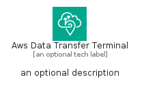
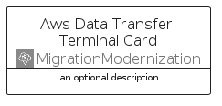
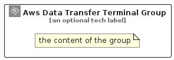

# AwsDataTransferTerminal


```text
aws-q1-2025/Architecture/MigrationModernization/AwsDataTransferTerminal
```

```text
include('aws-q1-2025/Architecture/MigrationModernization/AwsDataTransferTerminal')
```


| Illustration | AwsDataTransferTerminal | AwsDataTransferTerminalCard | AwsDataTransferTerminalGroup |
| :---: | :---: | :---: | :---: |
|  |  |  |  |


## Sprites
The item provides the following sriptes:

- `<$AwsDataTransferTerminalXs>`
- `<$AwsDataTransferTerminalSm>`
- `<$AwsDataTransferTerminalMd>`
- `<$AwsDataTransferTerminalLg>`


## AwsDataTransferTerminal

### Load remotely
```plantuml
@startuml
' configures the library
!global $LIB_BASE_LOCATION="https://raw.githubusercontent.com/tmorin/plantuml-libs/master/distribution"

' loads the library's bootstrap
!include $LIB_BASE_LOCATION/bootstrap.puml

' loads the package bootstrap
include('aws-q1-2025/bootstrap')

' loads the Item which embeds the element AwsDataTransferTerminal
include('aws-q1-2025/Architecture/MigrationModernization/AwsDataTransferTerminal')

' renders the element
AwsDataTransferTerminal('AwsDataTransferTerminal', 'Aws Data Transfer Terminal', 'an optional tech label', 'an optional description')
@enduml
```

### Load locally
```plantuml
@startuml
' configures the library
!global $INCLUSION_MODE="local"
!global $LIB_BASE_LOCATION="../../.."

' loads the library's bootstrap
!include $LIB_BASE_LOCATION/bootstrap.puml

' loads the package bootstrap
include('aws-q1-2025/bootstrap')

' loads the Item which embeds the element AwsDataTransferTerminal
include('aws-q1-2025/Architecture/MigrationModernization/AwsDataTransferTerminal')

' renders the element
AwsDataTransferTerminal('AwsDataTransferTerminal', 'Aws Data Transfer Terminal', 'an optional tech label', 'an optional description')
@enduml
```

## AwsDataTransferTerminalCard

### Load remotely
```plantuml
@startuml
' configures the library
!global $LIB_BASE_LOCATION="https://raw.githubusercontent.com/tmorin/plantuml-libs/master/distribution"

' loads the library's bootstrap
!include $LIB_BASE_LOCATION/bootstrap.puml

' loads the package bootstrap
include('aws-q1-2025/bootstrap')

' loads the Item which embeds the element AwsDataTransferTerminalCard
include('aws-q1-2025/Architecture/MigrationModernization/AwsDataTransferTerminal')

' renders the element
AwsDataTransferTerminalCard('AwsDataTransferTerminalCard', 'Aws Data Transfer Terminal Card', 'an optional description')
@enduml
```

### Load locally
```plantuml
@startuml
' configures the library
!global $INCLUSION_MODE="local"
!global $LIB_BASE_LOCATION="../../.."

' loads the library's bootstrap
!include $LIB_BASE_LOCATION/bootstrap.puml

' loads the package bootstrap
include('aws-q1-2025/bootstrap')

' loads the Item which embeds the element AwsDataTransferTerminalCard
include('aws-q1-2025/Architecture/MigrationModernization/AwsDataTransferTerminal')

' renders the element
AwsDataTransferTerminalCard('AwsDataTransferTerminalCard', 'Aws Data Transfer Terminal Card', 'an optional description')
@enduml
```

## AwsDataTransferTerminalGroup

### Load remotely
```plantuml
@startuml
' configures the library
!global $LIB_BASE_LOCATION="https://raw.githubusercontent.com/tmorin/plantuml-libs/master/distribution"

' loads the library's bootstrap
!include $LIB_BASE_LOCATION/bootstrap.puml

' loads the package bootstrap
include('aws-q1-2025/bootstrap')

' loads the Item which embeds the element AwsDataTransferTerminalGroup
include('aws-q1-2025/Architecture/MigrationModernization/AwsDataTransferTerminal')

' renders the element
AwsDataTransferTerminalGroup('AwsDataTransferTerminalGroup', 'Aws Data Transfer Terminal Group', 'an optional tech label') {
    note as note
        the content of the group
    end note
}
@enduml
```

### Load locally
```plantuml
@startuml
' configures the library
!global $INCLUSION_MODE="local"
!global $LIB_BASE_LOCATION="../../.."

' loads the library's bootstrap
!include $LIB_BASE_LOCATION/bootstrap.puml

' loads the package bootstrap
include('aws-q1-2025/bootstrap')

' loads the Item which embeds the element AwsDataTransferTerminalGroup
include('aws-q1-2025/Architecture/MigrationModernization/AwsDataTransferTerminal')

' renders the element
AwsDataTransferTerminalGroup('AwsDataTransferTerminalGroup', 'Aws Data Transfer Terminal Group', 'an optional tech label') {
    note as note
        the content of the group
    end note
}
@enduml
```

