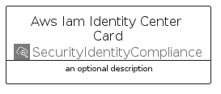
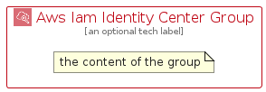

# AwsIamIdentityCenter


```text
aws-q1-2025/Architecture/SecurityIdentityCompliance/AwsIamIdentityCenter
```

```text
include('aws-q1-2025/Architecture/SecurityIdentityCompliance/AwsIamIdentityCenter')
```


| Illustration | AwsIamIdentityCenter | AwsIamIdentityCenterCard | AwsIamIdentityCenterGroup |
| :---: | :---: | :---: | :---: |
|  |  |  |  |


## Sprites
The item provides the following sriptes:

- `<$AwsIamIdentityCenterXs>`
- `<$AwsIamIdentityCenterSm>`
- `<$AwsIamIdentityCenterMd>`
- `<$AwsIamIdentityCenterLg>`


## AwsIamIdentityCenter

### Load remotely
```plantuml
@startuml
' configures the library
!global $LIB_BASE_LOCATION="https://raw.githubusercontent.com/tmorin/plantuml-libs/master/distribution"

' loads the library's bootstrap
!include $LIB_BASE_LOCATION/bootstrap.puml

' loads the package bootstrap
include('aws-q1-2025/bootstrap')

' loads the Item which embeds the element AwsIamIdentityCenter
include('aws-q1-2025/Architecture/SecurityIdentityCompliance/AwsIamIdentityCenter')

' renders the element
AwsIamIdentityCenter('AwsIamIdentityCenter', 'Aws Iam Identity Center', 'an optional tech label', 'an optional description')
@enduml
```

### Load locally
```plantuml
@startuml
' configures the library
!global $INCLUSION_MODE="local"
!global $LIB_BASE_LOCATION="../../.."

' loads the library's bootstrap
!include $LIB_BASE_LOCATION/bootstrap.puml

' loads the package bootstrap
include('aws-q1-2025/bootstrap')

' loads the Item which embeds the element AwsIamIdentityCenter
include('aws-q1-2025/Architecture/SecurityIdentityCompliance/AwsIamIdentityCenter')

' renders the element
AwsIamIdentityCenter('AwsIamIdentityCenter', 'Aws Iam Identity Center', 'an optional tech label', 'an optional description')
@enduml
```

## AwsIamIdentityCenterCard

### Load remotely
```plantuml
@startuml
' configures the library
!global $LIB_BASE_LOCATION="https://raw.githubusercontent.com/tmorin/plantuml-libs/master/distribution"

' loads the library's bootstrap
!include $LIB_BASE_LOCATION/bootstrap.puml

' loads the package bootstrap
include('aws-q1-2025/bootstrap')

' loads the Item which embeds the element AwsIamIdentityCenterCard
include('aws-q1-2025/Architecture/SecurityIdentityCompliance/AwsIamIdentityCenter')

' renders the element
AwsIamIdentityCenterCard('AwsIamIdentityCenterCard', 'Aws Iam Identity Center Card', 'an optional description')
@enduml
```

### Load locally
```plantuml
@startuml
' configures the library
!global $INCLUSION_MODE="local"
!global $LIB_BASE_LOCATION="../../.."

' loads the library's bootstrap
!include $LIB_BASE_LOCATION/bootstrap.puml

' loads the package bootstrap
include('aws-q1-2025/bootstrap')

' loads the Item which embeds the element AwsIamIdentityCenterCard
include('aws-q1-2025/Architecture/SecurityIdentityCompliance/AwsIamIdentityCenter')

' renders the element
AwsIamIdentityCenterCard('AwsIamIdentityCenterCard', 'Aws Iam Identity Center Card', 'an optional description')
@enduml
```

## AwsIamIdentityCenterGroup

### Load remotely
```plantuml
@startuml
' configures the library
!global $LIB_BASE_LOCATION="https://raw.githubusercontent.com/tmorin/plantuml-libs/master/distribution"

' loads the library's bootstrap
!include $LIB_BASE_LOCATION/bootstrap.puml

' loads the package bootstrap
include('aws-q1-2025/bootstrap')

' loads the Item which embeds the element AwsIamIdentityCenterGroup
include('aws-q1-2025/Architecture/SecurityIdentityCompliance/AwsIamIdentityCenter')

' renders the element
AwsIamIdentityCenterGroup('AwsIamIdentityCenterGroup', 'Aws Iam Identity Center Group', 'an optional tech label') {
    note as note
        the content of the group
    end note
}
@enduml
```

### Load locally
```plantuml
@startuml
' configures the library
!global $INCLUSION_MODE="local"
!global $LIB_BASE_LOCATION="../../.."

' loads the library's bootstrap
!include $LIB_BASE_LOCATION/bootstrap.puml

' loads the package bootstrap
include('aws-q1-2025/bootstrap')

' loads the Item which embeds the element AwsIamIdentityCenterGroup
include('aws-q1-2025/Architecture/SecurityIdentityCompliance/AwsIamIdentityCenter')

' renders the element
AwsIamIdentityCenterGroup('AwsIamIdentityCenterGroup', 'Aws Iam Identity Center Group', 'an optional tech label') {
    note as note
        the content of the group
    end note
}
@enduml
```

