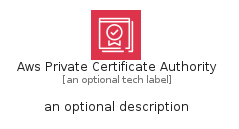
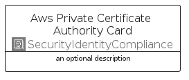

# AwsPrivateCertificateAuthority


```text
aws-q1-2025/Architecture/SecurityIdentityCompliance/AwsPrivateCertificateAuthority
```

```text
include('aws-q1-2025/Architecture/SecurityIdentityCompliance/AwsPrivateCertificateAuthority')
```


| Illustration | AwsPrivateCertificateAuthority | AwsPrivateCertificateAuthorityCard | AwsPrivateCertificateAuthorityGroup |
| :---: | :---: | :---: | :---: |
|  |  |  |  |


## Sprites
The item provides the following sriptes:

- `<$AwsPrivateCertificateAuthorityXs>`
- `<$AwsPrivateCertificateAuthoritySm>`
- `<$AwsPrivateCertificateAuthorityMd>`
- `<$AwsPrivateCertificateAuthorityLg>`


## AwsPrivateCertificateAuthority

### Load remotely
```plantuml
@startuml
' configures the library
!global $LIB_BASE_LOCATION="https://raw.githubusercontent.com/tmorin/plantuml-libs/master/distribution"

' loads the library's bootstrap
!include $LIB_BASE_LOCATION/bootstrap.puml

' loads the package bootstrap
include('aws-q1-2025/bootstrap')

' loads the Item which embeds the element AwsPrivateCertificateAuthority
include('aws-q1-2025/Architecture/SecurityIdentityCompliance/AwsPrivateCertificateAuthority')

' renders the element
AwsPrivateCertificateAuthority('AwsPrivateCertificateAuthority', 'Aws Private Certificate Authority', 'an optional tech label', 'an optional description')
@enduml
```

### Load locally
```plantuml
@startuml
' configures the library
!global $INCLUSION_MODE="local"
!global $LIB_BASE_LOCATION="../../.."

' loads the library's bootstrap
!include $LIB_BASE_LOCATION/bootstrap.puml

' loads the package bootstrap
include('aws-q1-2025/bootstrap')

' loads the Item which embeds the element AwsPrivateCertificateAuthority
include('aws-q1-2025/Architecture/SecurityIdentityCompliance/AwsPrivateCertificateAuthority')

' renders the element
AwsPrivateCertificateAuthority('AwsPrivateCertificateAuthority', 'Aws Private Certificate Authority', 'an optional tech label', 'an optional description')
@enduml
```

## AwsPrivateCertificateAuthorityCard

### Load remotely
```plantuml
@startuml
' configures the library
!global $LIB_BASE_LOCATION="https://raw.githubusercontent.com/tmorin/plantuml-libs/master/distribution"

' loads the library's bootstrap
!include $LIB_BASE_LOCATION/bootstrap.puml

' loads the package bootstrap
include('aws-q1-2025/bootstrap')

' loads the Item which embeds the element AwsPrivateCertificateAuthorityCard
include('aws-q1-2025/Architecture/SecurityIdentityCompliance/AwsPrivateCertificateAuthority')

' renders the element
AwsPrivateCertificateAuthorityCard('AwsPrivateCertificateAuthorityCard', 'Aws Private Certificate Authority Card', 'an optional description')
@enduml
```

### Load locally
```plantuml
@startuml
' configures the library
!global $INCLUSION_MODE="local"
!global $LIB_BASE_LOCATION="../../.."

' loads the library's bootstrap
!include $LIB_BASE_LOCATION/bootstrap.puml

' loads the package bootstrap
include('aws-q1-2025/bootstrap')

' loads the Item which embeds the element AwsPrivateCertificateAuthorityCard
include('aws-q1-2025/Architecture/SecurityIdentityCompliance/AwsPrivateCertificateAuthority')

' renders the element
AwsPrivateCertificateAuthorityCard('AwsPrivateCertificateAuthorityCard', 'Aws Private Certificate Authority Card', 'an optional description')
@enduml
```

## AwsPrivateCertificateAuthorityGroup

### Load remotely
```plantuml
@startuml
' configures the library
!global $LIB_BASE_LOCATION="https://raw.githubusercontent.com/tmorin/plantuml-libs/master/distribution"

' loads the library's bootstrap
!include $LIB_BASE_LOCATION/bootstrap.puml

' loads the package bootstrap
include('aws-q1-2025/bootstrap')

' loads the Item which embeds the element AwsPrivateCertificateAuthorityGroup
include('aws-q1-2025/Architecture/SecurityIdentityCompliance/AwsPrivateCertificateAuthority')

' renders the element
AwsPrivateCertificateAuthorityGroup('AwsPrivateCertificateAuthorityGroup', 'Aws Private Certificate Authority Group', 'an optional tech label') {
    note as note
        the content of the group
    end note
}
@enduml
```

### Load locally
```plantuml
@startuml
' configures the library
!global $INCLUSION_MODE="local"
!global $LIB_BASE_LOCATION="../../.."

' loads the library's bootstrap
!include $LIB_BASE_LOCATION/bootstrap.puml

' loads the package bootstrap
include('aws-q1-2025/bootstrap')

' loads the Item which embeds the element AwsPrivateCertificateAuthorityGroup
include('aws-q1-2025/Architecture/SecurityIdentityCompliance/AwsPrivateCertificateAuthority')

' renders the element
AwsPrivateCertificateAuthorityGroup('AwsPrivateCertificateAuthorityGroup', 'Aws Private Certificate Authority Group', 'an optional tech label') {
    note as note
        the content of the group
    end note
}
@enduml
```

