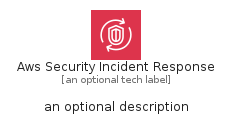
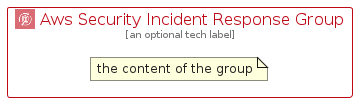

# AwsSecurityIncidentResponse


```text
aws-q1-2025/Architecture/SecurityIdentityCompliance/AwsSecurityIncidentResponse
```

```text
include('aws-q1-2025/Architecture/SecurityIdentityCompliance/AwsSecurityIncidentResponse')
```


| Illustration | AwsSecurityIncidentResponse | AwsSecurityIncidentResponseCard | AwsSecurityIncidentResponseGroup |
| :---: | :---: | :---: | :---: |
|  |  |  |  |


## Sprites
The item provides the following sriptes:

- `<$AwsSecurityIncidentResponseXs>`
- `<$AwsSecurityIncidentResponseSm>`
- `<$AwsSecurityIncidentResponseMd>`
- `<$AwsSecurityIncidentResponseLg>`


## AwsSecurityIncidentResponse

### Load remotely
```plantuml
@startuml
' configures the library
!global $LIB_BASE_LOCATION="https://raw.githubusercontent.com/tmorin/plantuml-libs/master/distribution"

' loads the library's bootstrap
!include $LIB_BASE_LOCATION/bootstrap.puml

' loads the package bootstrap
include('aws-q1-2025/bootstrap')

' loads the Item which embeds the element AwsSecurityIncidentResponse
include('aws-q1-2025/Architecture/SecurityIdentityCompliance/AwsSecurityIncidentResponse')

' renders the element
AwsSecurityIncidentResponse('AwsSecurityIncidentResponse', 'Aws Security Incident Response', 'an optional tech label', 'an optional description')
@enduml
```

### Load locally
```plantuml
@startuml
' configures the library
!global $INCLUSION_MODE="local"
!global $LIB_BASE_LOCATION="../../.."

' loads the library's bootstrap
!include $LIB_BASE_LOCATION/bootstrap.puml

' loads the package bootstrap
include('aws-q1-2025/bootstrap')

' loads the Item which embeds the element AwsSecurityIncidentResponse
include('aws-q1-2025/Architecture/SecurityIdentityCompliance/AwsSecurityIncidentResponse')

' renders the element
AwsSecurityIncidentResponse('AwsSecurityIncidentResponse', 'Aws Security Incident Response', 'an optional tech label', 'an optional description')
@enduml
```

## AwsSecurityIncidentResponseCard

### Load remotely
```plantuml
@startuml
' configures the library
!global $LIB_BASE_LOCATION="https://raw.githubusercontent.com/tmorin/plantuml-libs/master/distribution"

' loads the library's bootstrap
!include $LIB_BASE_LOCATION/bootstrap.puml

' loads the package bootstrap
include('aws-q1-2025/bootstrap')

' loads the Item which embeds the element AwsSecurityIncidentResponseCard
include('aws-q1-2025/Architecture/SecurityIdentityCompliance/AwsSecurityIncidentResponse')

' renders the element
AwsSecurityIncidentResponseCard('AwsSecurityIncidentResponseCard', 'Aws Security Incident Response Card', 'an optional description')
@enduml
```

### Load locally
```plantuml
@startuml
' configures the library
!global $INCLUSION_MODE="local"
!global $LIB_BASE_LOCATION="../../.."

' loads the library's bootstrap
!include $LIB_BASE_LOCATION/bootstrap.puml

' loads the package bootstrap
include('aws-q1-2025/bootstrap')

' loads the Item which embeds the element AwsSecurityIncidentResponseCard
include('aws-q1-2025/Architecture/SecurityIdentityCompliance/AwsSecurityIncidentResponse')

' renders the element
AwsSecurityIncidentResponseCard('AwsSecurityIncidentResponseCard', 'Aws Security Incident Response Card', 'an optional description')
@enduml
```

## AwsSecurityIncidentResponseGroup

### Load remotely
```plantuml
@startuml
' configures the library
!global $LIB_BASE_LOCATION="https://raw.githubusercontent.com/tmorin/plantuml-libs/master/distribution"

' loads the library's bootstrap
!include $LIB_BASE_LOCATION/bootstrap.puml

' loads the package bootstrap
include('aws-q1-2025/bootstrap')

' loads the Item which embeds the element AwsSecurityIncidentResponseGroup
include('aws-q1-2025/Architecture/SecurityIdentityCompliance/AwsSecurityIncidentResponse')

' renders the element
AwsSecurityIncidentResponseGroup('AwsSecurityIncidentResponseGroup', 'Aws Security Incident Response Group', 'an optional tech label') {
    note as note
        the content of the group
    end note
}
@enduml
```

### Load locally
```plantuml
@startuml
' configures the library
!global $INCLUSION_MODE="local"
!global $LIB_BASE_LOCATION="../../.."

' loads the library's bootstrap
!include $LIB_BASE_LOCATION/bootstrap.puml

' loads the package bootstrap
include('aws-q1-2025/bootstrap')

' loads the Item which embeds the element AwsSecurityIncidentResponseGroup
include('aws-q1-2025/Architecture/SecurityIdentityCompliance/AwsSecurityIncidentResponse')

' renders the element
AwsSecurityIncidentResponseGroup('AwsSecurityIncidentResponseGroup', 'Aws Security Incident Response Group', 'an optional tech label') {
    note as note
        the content of the group
    end note
}
@enduml
```

