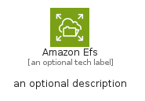
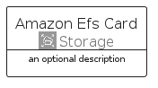

# AmazonEfs


```text
aws-q1-2025/Architecture/Storage/AmazonEfs
```

```text
include('aws-q1-2025/Architecture/Storage/AmazonEfs')
```


| Illustration | AmazonEfs | AmazonEfsCard | AmazonEfsGroup |
| :---: | :---: | :---: | :---: |
|  |  |  |  |


## Sprites
The item provides the following sriptes:

- `<$AmazonEfsXs>`
- `<$AmazonEfsSm>`
- `<$AmazonEfsMd>`
- `<$AmazonEfsLg>`


## AmazonEfs

### Load remotely
```plantuml
@startuml
' configures the library
!global $LIB_BASE_LOCATION="https://raw.githubusercontent.com/tmorin/plantuml-libs/master/distribution"

' loads the library's bootstrap
!include $LIB_BASE_LOCATION/bootstrap.puml

' loads the package bootstrap
include('aws-q1-2025/bootstrap')

' loads the Item which embeds the element AmazonEfs
include('aws-q1-2025/Architecture/Storage/AmazonEfs')

' renders the element
AmazonEfs('AmazonEfs', 'Amazon Efs', 'an optional tech label', 'an optional description')
@enduml
```

### Load locally
```plantuml
@startuml
' configures the library
!global $INCLUSION_MODE="local"
!global $LIB_BASE_LOCATION="../../.."

' loads the library's bootstrap
!include $LIB_BASE_LOCATION/bootstrap.puml

' loads the package bootstrap
include('aws-q1-2025/bootstrap')

' loads the Item which embeds the element AmazonEfs
include('aws-q1-2025/Architecture/Storage/AmazonEfs')

' renders the element
AmazonEfs('AmazonEfs', 'Amazon Efs', 'an optional tech label', 'an optional description')
@enduml
```

## AmazonEfsCard

### Load remotely
```plantuml
@startuml
' configures the library
!global $LIB_BASE_LOCATION="https://raw.githubusercontent.com/tmorin/plantuml-libs/master/distribution"

' loads the library's bootstrap
!include $LIB_BASE_LOCATION/bootstrap.puml

' loads the package bootstrap
include('aws-q1-2025/bootstrap')

' loads the Item which embeds the element AmazonEfsCard
include('aws-q1-2025/Architecture/Storage/AmazonEfs')

' renders the element
AmazonEfsCard('AmazonEfsCard', 'Amazon Efs Card', 'an optional description')
@enduml
```

### Load locally
```plantuml
@startuml
' configures the library
!global $INCLUSION_MODE="local"
!global $LIB_BASE_LOCATION="../../.."

' loads the library's bootstrap
!include $LIB_BASE_LOCATION/bootstrap.puml

' loads the package bootstrap
include('aws-q1-2025/bootstrap')

' loads the Item which embeds the element AmazonEfsCard
include('aws-q1-2025/Architecture/Storage/AmazonEfs')

' renders the element
AmazonEfsCard('AmazonEfsCard', 'Amazon Efs Card', 'an optional description')
@enduml
```

## AmazonEfsGroup

### Load remotely
```plantuml
@startuml
' configures the library
!global $LIB_BASE_LOCATION="https://raw.githubusercontent.com/tmorin/plantuml-libs/master/distribution"

' loads the library's bootstrap
!include $LIB_BASE_LOCATION/bootstrap.puml

' loads the package bootstrap
include('aws-q1-2025/bootstrap')

' loads the Item which embeds the element AmazonEfsGroup
include('aws-q1-2025/Architecture/Storage/AmazonEfs')

' renders the element
AmazonEfsGroup('AmazonEfsGroup', 'Amazon Efs Group', 'an optional tech label') {
    note as note
        the content of the group
    end note
}
@enduml
```

### Load locally
```plantuml
@startuml
' configures the library
!global $INCLUSION_MODE="local"
!global $LIB_BASE_LOCATION="../../.."

' loads the library's bootstrap
!include $LIB_BASE_LOCATION/bootstrap.puml

' loads the package bootstrap
include('aws-q1-2025/bootstrap')

' loads the Item which embeds the element AmazonEfsGroup
include('aws-q1-2025/Architecture/Storage/AmazonEfs')

' renders the element
AmazonEfsGroup('AmazonEfsGroup', 'Amazon Efs Group', 'an optional tech label') {
    note as note
        the content of the group
    end note
}
@enduml
```

