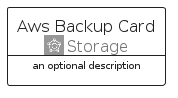
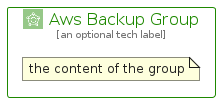

# AwsBackup


```text
aws-q1-2025/Architecture/Storage/AwsBackup
```

```text
include('aws-q1-2025/Architecture/Storage/AwsBackup')
```


| Illustration | AwsBackup | AwsBackupCard | AwsBackupGroup |
| :---: | :---: | :---: | :---: |
|  |  |  |  |


## Sprites
The item provides the following sriptes:

- `<$AwsBackupXs>`
- `<$AwsBackupSm>`
- `<$AwsBackupMd>`
- `<$AwsBackupLg>`


## AwsBackup

### Load remotely
```plantuml
@startuml
' configures the library
!global $LIB_BASE_LOCATION="https://raw.githubusercontent.com/tmorin/plantuml-libs/master/distribution"

' loads the library's bootstrap
!include $LIB_BASE_LOCATION/bootstrap.puml

' loads the package bootstrap
include('aws-q1-2025/bootstrap')

' loads the Item which embeds the element AwsBackup
include('aws-q1-2025/Architecture/Storage/AwsBackup')

' renders the element
AwsBackup('AwsBackup', 'Aws Backup', 'an optional tech label', 'an optional description')
@enduml
```

### Load locally
```plantuml
@startuml
' configures the library
!global $INCLUSION_MODE="local"
!global $LIB_BASE_LOCATION="../../.."

' loads the library's bootstrap
!include $LIB_BASE_LOCATION/bootstrap.puml

' loads the package bootstrap
include('aws-q1-2025/bootstrap')

' loads the Item which embeds the element AwsBackup
include('aws-q1-2025/Architecture/Storage/AwsBackup')

' renders the element
AwsBackup('AwsBackup', 'Aws Backup', 'an optional tech label', 'an optional description')
@enduml
```

## AwsBackupCard

### Load remotely
```plantuml
@startuml
' configures the library
!global $LIB_BASE_LOCATION="https://raw.githubusercontent.com/tmorin/plantuml-libs/master/distribution"

' loads the library's bootstrap
!include $LIB_BASE_LOCATION/bootstrap.puml

' loads the package bootstrap
include('aws-q1-2025/bootstrap')

' loads the Item which embeds the element AwsBackupCard
include('aws-q1-2025/Architecture/Storage/AwsBackup')

' renders the element
AwsBackupCard('AwsBackupCard', 'Aws Backup Card', 'an optional description')
@enduml
```

### Load locally
```plantuml
@startuml
' configures the library
!global $INCLUSION_MODE="local"
!global $LIB_BASE_LOCATION="../../.."

' loads the library's bootstrap
!include $LIB_BASE_LOCATION/bootstrap.puml

' loads the package bootstrap
include('aws-q1-2025/bootstrap')

' loads the Item which embeds the element AwsBackupCard
include('aws-q1-2025/Architecture/Storage/AwsBackup')

' renders the element
AwsBackupCard('AwsBackupCard', 'Aws Backup Card', 'an optional description')
@enduml
```

## AwsBackupGroup

### Load remotely
```plantuml
@startuml
' configures the library
!global $LIB_BASE_LOCATION="https://raw.githubusercontent.com/tmorin/plantuml-libs/master/distribution"

' loads the library's bootstrap
!include $LIB_BASE_LOCATION/bootstrap.puml

' loads the package bootstrap
include('aws-q1-2025/bootstrap')

' loads the Item which embeds the element AwsBackupGroup
include('aws-q1-2025/Architecture/Storage/AwsBackup')

' renders the element
AwsBackupGroup('AwsBackupGroup', 'Aws Backup Group', 'an optional tech label') {
    note as note
        the content of the group
    end note
}
@enduml
```

### Load locally
```plantuml
@startuml
' configures the library
!global $INCLUSION_MODE="local"
!global $LIB_BASE_LOCATION="../../.."

' loads the library's bootstrap
!include $LIB_BASE_LOCATION/bootstrap.puml

' loads the package bootstrap
include('aws-q1-2025/bootstrap')

' loads the Item which embeds the element AwsBackupGroup
include('aws-q1-2025/Architecture/Storage/AwsBackup')

' renders the element
AwsBackupGroup('AwsBackupGroup', 'Aws Backup Group', 'an optional tech label') {
    note as note
        the content of the group
    end note
}
@enduml
```

