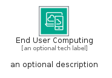
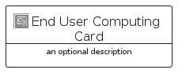

# EndUserComputing


```text
aws-q1-2025/Category/EndUserComputing
```

```text
include('aws-q1-2025/Category/EndUserComputing')
```


| Illustration | EndUserComputing | EndUserComputingCard | EndUserComputingGroup |
| :---: | :---: | :---: | :---: |
|  |  |  |  |


## Sprites
The item provides the following sriptes:

- `<$EndUserComputingXs>`
- `<$EndUserComputingSm>`
- `<$EndUserComputingMd>`
- `<$EndUserComputingLg>`


## EndUserComputing

### Load remotely
```plantuml
@startuml
' configures the library
!global $LIB_BASE_LOCATION="https://raw.githubusercontent.com/tmorin/plantuml-libs/master/distribution"

' loads the library's bootstrap
!include $LIB_BASE_LOCATION/bootstrap.puml

' loads the package bootstrap
include('aws-q1-2025/bootstrap')

' loads the Item which embeds the element EndUserComputing
include('aws-q1-2025/Category/EndUserComputing')

' renders the element
EndUserComputing('EndUserComputing', 'End User Computing', 'an optional tech label', 'an optional description')
@enduml
```

### Load locally
```plantuml
@startuml
' configures the library
!global $INCLUSION_MODE="local"
!global $LIB_BASE_LOCATION="../.."

' loads the library's bootstrap
!include $LIB_BASE_LOCATION/bootstrap.puml

' loads the package bootstrap
include('aws-q1-2025/bootstrap')

' loads the Item which embeds the element EndUserComputing
include('aws-q1-2025/Category/EndUserComputing')

' renders the element
EndUserComputing('EndUserComputing', 'End User Computing', 'an optional tech label', 'an optional description')
@enduml
```

## EndUserComputingCard

### Load remotely
```plantuml
@startuml
' configures the library
!global $LIB_BASE_LOCATION="https://raw.githubusercontent.com/tmorin/plantuml-libs/master/distribution"

' loads the library's bootstrap
!include $LIB_BASE_LOCATION/bootstrap.puml

' loads the package bootstrap
include('aws-q1-2025/bootstrap')

' loads the Item which embeds the element EndUserComputingCard
include('aws-q1-2025/Category/EndUserComputing')

' renders the element
EndUserComputingCard('EndUserComputingCard', 'End User Computing Card', 'an optional description')
@enduml
```

### Load locally
```plantuml
@startuml
' configures the library
!global $INCLUSION_MODE="local"
!global $LIB_BASE_LOCATION="../.."

' loads the library's bootstrap
!include $LIB_BASE_LOCATION/bootstrap.puml

' loads the package bootstrap
include('aws-q1-2025/bootstrap')

' loads the Item which embeds the element EndUserComputingCard
include('aws-q1-2025/Category/EndUserComputing')

' renders the element
EndUserComputingCard('EndUserComputingCard', 'End User Computing Card', 'an optional description')
@enduml
```

## EndUserComputingGroup

### Load remotely
```plantuml
@startuml
' configures the library
!global $LIB_BASE_LOCATION="https://raw.githubusercontent.com/tmorin/plantuml-libs/master/distribution"

' loads the library's bootstrap
!include $LIB_BASE_LOCATION/bootstrap.puml

' loads the package bootstrap
include('aws-q1-2025/bootstrap')

' loads the Item which embeds the element EndUserComputingGroup
include('aws-q1-2025/Category/EndUserComputing')

' renders the element
EndUserComputingGroup('EndUserComputingGroup', 'End User Computing Group', 'an optional tech label') {
    note as note
        the content of the group
    end note
}
@enduml
```

### Load locally
```plantuml
@startuml
' configures the library
!global $INCLUSION_MODE="local"
!global $LIB_BASE_LOCATION="../.."

' loads the library's bootstrap
!include $LIB_BASE_LOCATION/bootstrap.puml

' loads the package bootstrap
include('aws-q1-2025/bootstrap')

' loads the Item which embeds the element EndUserComputingGroup
include('aws-q1-2025/Category/EndUserComputing')

' renders the element
EndUserComputingGroup('EndUserComputingGroup', 'End User Computing Group', 'an optional tech label') {
    note as note
        the content of the group
    end note
}
@enduml
```

