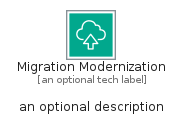

# MigrationModernization


```text
aws-q1-2025/Category/MigrationModernization
```

```text
include('aws-q1-2025/Category/MigrationModernization')
```


| Illustration | MigrationModernization | MigrationModernizationCard | MigrationModernizationGroup |
| :---: | :---: | :---: | :---: |
|  |  |  |  |


## Sprites
The item provides the following sriptes:

- `<$MigrationModernizationXs>`
- `<$MigrationModernizationSm>`
- `<$MigrationModernizationMd>`
- `<$MigrationModernizationLg>`


## MigrationModernization

### Load remotely
```plantuml
@startuml
' configures the library
!global $LIB_BASE_LOCATION="https://raw.githubusercontent.com/tmorin/plantuml-libs/master/distribution"

' loads the library's bootstrap
!include $LIB_BASE_LOCATION/bootstrap.puml

' loads the package bootstrap
include('aws-q1-2025/bootstrap')

' loads the Item which embeds the element MigrationModernization
include('aws-q1-2025/Category/MigrationModernization')

' renders the element
MigrationModernization('MigrationModernization', 'Migration Modernization', 'an optional tech label', 'an optional description')
@enduml
```

### Load locally
```plantuml
@startuml
' configures the library
!global $INCLUSION_MODE="local"
!global $LIB_BASE_LOCATION="../.."

' loads the library's bootstrap
!include $LIB_BASE_LOCATION/bootstrap.puml

' loads the package bootstrap
include('aws-q1-2025/bootstrap')

' loads the Item which embeds the element MigrationModernization
include('aws-q1-2025/Category/MigrationModernization')

' renders the element
MigrationModernization('MigrationModernization', 'Migration Modernization', 'an optional tech label', 'an optional description')
@enduml
```

## MigrationModernizationCard

### Load remotely
```plantuml
@startuml
' configures the library
!global $LIB_BASE_LOCATION="https://raw.githubusercontent.com/tmorin/plantuml-libs/master/distribution"

' loads the library's bootstrap
!include $LIB_BASE_LOCATION/bootstrap.puml

' loads the package bootstrap
include('aws-q1-2025/bootstrap')

' loads the Item which embeds the element MigrationModernizationCard
include('aws-q1-2025/Category/MigrationModernization')

' renders the element
MigrationModernizationCard('MigrationModernizationCard', 'Migration Modernization Card', 'an optional description')
@enduml
```

### Load locally
```plantuml
@startuml
' configures the library
!global $INCLUSION_MODE="local"
!global $LIB_BASE_LOCATION="../.."

' loads the library's bootstrap
!include $LIB_BASE_LOCATION/bootstrap.puml

' loads the package bootstrap
include('aws-q1-2025/bootstrap')

' loads the Item which embeds the element MigrationModernizationCard
include('aws-q1-2025/Category/MigrationModernization')

' renders the element
MigrationModernizationCard('MigrationModernizationCard', 'Migration Modernization Card', 'an optional description')
@enduml
```

## MigrationModernizationGroup

### Load remotely
```plantuml
@startuml
' configures the library
!global $LIB_BASE_LOCATION="https://raw.githubusercontent.com/tmorin/plantuml-libs/master/distribution"

' loads the library's bootstrap
!include $LIB_BASE_LOCATION/bootstrap.puml

' loads the package bootstrap
include('aws-q1-2025/bootstrap')

' loads the Item which embeds the element MigrationModernizationGroup
include('aws-q1-2025/Category/MigrationModernization')

' renders the element
MigrationModernizationGroup('MigrationModernizationGroup', 'Migration Modernization Group', 'an optional tech label') {
    note as note
        the content of the group
    end note
}
@enduml
```

### Load locally
```plantuml
@startuml
' configures the library
!global $INCLUSION_MODE="local"
!global $LIB_BASE_LOCATION="../.."

' loads the library's bootstrap
!include $LIB_BASE_LOCATION/bootstrap.puml

' loads the package bootstrap
include('aws-q1-2025/bootstrap')

' loads the Item which embeds the element MigrationModernizationGroup
include('aws-q1-2025/Category/MigrationModernization')

' renders the element
MigrationModernizationGroup('MigrationModernizationGroup', 'Migration Modernization Group', 'an optional tech label') {
    note as note
        the content of the group
    end note
}
@enduml
```

