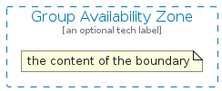
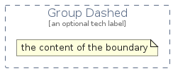
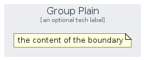

# Group

The module contains 17 items.

| |Name|
|:---:|---|
|  | [aws-q1-2025/Group/GroupAutoScaling](../../aws-q1-2025/Group/GroupAutoScaling.md) |
|  | [aws-q1-2025/Group/GroupAvailabilityZone](../../aws-q1-2025/Group/GroupAvailabilityZone.md) |
|  | [aws-q1-2025/Group/GroupAwsCloud](../../aws-q1-2025/Group/GroupAwsCloud.md) |
|  | [aws-q1-2025/Group/GroupAwsStepFunctionsWorkflow](../../aws-q1-2025/Group/GroupAwsStepFunctionsWorkflow.md) |
|  | [aws-q1-2025/Group/GroupCloud](../../aws-q1-2025/Group/GroupCloud.md) |
|  | [aws-q1-2025/Group/GroupCorporateDataCenter](../../aws-q1-2025/Group/GroupCorporateDataCenter.md) |
|  | [aws-q1-2025/Group/GroupDashed](../../aws-q1-2025/Group/GroupDashed.md) |
|  | [aws-q1-2025/Group/GroupEc2InstanceContents](../../aws-q1-2025/Group/GroupEc2InstanceContents.md) |
|  | [aws-q1-2025/Group/GroupElasticBeanstalkContainer](../../aws-q1-2025/Group/GroupElasticBeanstalkContainer.md) |
|  | [aws-q1-2025/Group/GroupPlain](../../aws-q1-2025/Group/GroupPlain.md) |
|  | [aws-q1-2025/Group/GroupPrivateSubnet](../../aws-q1-2025/Group/GroupPrivateSubnet.md) |
|  | [aws-q1-2025/Group/GroupPublicSubnet](../../aws-q1-2025/Group/GroupPublicSubnet.md) |
|  | [aws-q1-2025/Group/GroupRegion](../../aws-q1-2025/Group/GroupRegion.md) |
|  | [aws-q1-2025/Group/GroupSecurity](../../aws-q1-2025/Group/GroupSecurity.md) |
|  | [aws-q1-2025/Group/GroupServerContents](../../aws-q1-2025/Group/GroupServerContents.md) |
|  | [aws-q1-2025/Group/GroupSpotFleet](../../aws-q1-2025/Group/GroupSpotFleet.md) |
|  | [aws-q1-2025/Group/GroupVpc](../../aws-q1-2025/Group/GroupVpc.md) |

