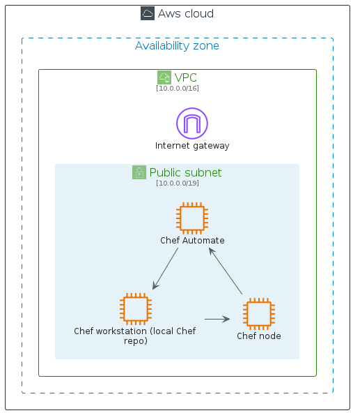

# aws-q1-2025

## Usage

### Bootstrap

The bootstrap may provide PlantUML artifacts like constants, procedures or style statements.

```plantuml
' loads the aws-q1-2025 bootstrap
include('aws-q1-2025/bootstrap')
```


# Modules

The package provides 4 modules.

- [aws-q1-2025/Architecture](../aws-q1-2025/Architecture/README.md) with 309 items
- [aws-q1-2025/Category](../aws-q1-2025/Category/README.md) with 26 items
- [aws-q1-2025/Group](../aws-q1-2025/Group/README.md) with 17 items
- [aws-q1-2025/Resource](../aws-q1-2025/Resource/README.md) with 496 items


# Examples

The package provides 2 examples.

## Chef Automate Architecture on AWS

<br>
[The source file.](../aws-q1-2025/chef_automate_architecture_on_aws.puml)

## Git to S3 Webhooks

<br>
[The source file.](../aws-q1-2025/git_to_s3_webhooks.puml)


