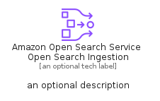
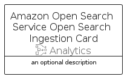

# AmazonOpenSearchServiceOpenSearchIngestion


```text
aws-q1-2025/Resource/Analytics/AmazonOpenSearchServiceOpenSearchIngestion
```

```text
include('aws-q1-2025/Resource/Analytics/AmazonOpenSearchServiceOpenSearchIngestion')
```


| Illustration | AmazonOpenSearchServiceOpenSearchIngestion | AmazonOpenSearchServiceOpenSearchIngestionCard | AmazonOpenSearchServiceOpenSearchIngestionGroup |
| :---: | :---: | :---: | :---: |
|  |  |  |  |


## Sprites
The item provides the following sriptes:

- `<$AmazonOpenSearchServiceOpenSearchIngestionXs>`
- `<$AmazonOpenSearchServiceOpenSearchIngestionSm>`
- `<$AmazonOpenSearchServiceOpenSearchIngestionMd>`
- `<$AmazonOpenSearchServiceOpenSearchIngestionLg>`


## AmazonOpenSearchServiceOpenSearchIngestion

### Load remotely
```plantuml
@startuml
' configures the library
!global $LIB_BASE_LOCATION="https://raw.githubusercontent.com/tmorin/plantuml-libs/master/distribution"

' loads the library's bootstrap
!include $LIB_BASE_LOCATION/bootstrap.puml

' loads the package bootstrap
include('aws-q1-2025/bootstrap')

' loads the Item which embeds the element AmazonOpenSearchServiceOpenSearchIngestion
include('aws-q1-2025/Resource/Analytics/AmazonOpenSearchServiceOpenSearchIngestion')

' renders the element
AmazonOpenSearchServiceOpenSearchIngestion('AmazonOpenSearchServiceOpenSearchIngestion', 'Amazon Open Search Service Open Search Ingestion', 'an optional tech label', 'an optional description')
@enduml
```

### Load locally
```plantuml
@startuml
' configures the library
!global $INCLUSION_MODE="local"
!global $LIB_BASE_LOCATION="../../.."

' loads the library's bootstrap
!include $LIB_BASE_LOCATION/bootstrap.puml

' loads the package bootstrap
include('aws-q1-2025/bootstrap')

' loads the Item which embeds the element AmazonOpenSearchServiceOpenSearchIngestion
include('aws-q1-2025/Resource/Analytics/AmazonOpenSearchServiceOpenSearchIngestion')

' renders the element
AmazonOpenSearchServiceOpenSearchIngestion('AmazonOpenSearchServiceOpenSearchIngestion', 'Amazon Open Search Service Open Search Ingestion', 'an optional tech label', 'an optional description')
@enduml
```

## AmazonOpenSearchServiceOpenSearchIngestionCard

### Load remotely
```plantuml
@startuml
' configures the library
!global $LIB_BASE_LOCATION="https://raw.githubusercontent.com/tmorin/plantuml-libs/master/distribution"

' loads the library's bootstrap
!include $LIB_BASE_LOCATION/bootstrap.puml

' loads the package bootstrap
include('aws-q1-2025/bootstrap')

' loads the Item which embeds the element AmazonOpenSearchServiceOpenSearchIngestionCard
include('aws-q1-2025/Resource/Analytics/AmazonOpenSearchServiceOpenSearchIngestion')

' renders the element
AmazonOpenSearchServiceOpenSearchIngestionCard('AmazonOpenSearchServiceOpenSearchIngestionCard', 'Amazon Open Search Service Open Search Ingestion Card', 'an optional description')
@enduml
```

### Load locally
```plantuml
@startuml
' configures the library
!global $INCLUSION_MODE="local"
!global $LIB_BASE_LOCATION="../../.."

' loads the library's bootstrap
!include $LIB_BASE_LOCATION/bootstrap.puml

' loads the package bootstrap
include('aws-q1-2025/bootstrap')

' loads the Item which embeds the element AmazonOpenSearchServiceOpenSearchIngestionCard
include('aws-q1-2025/Resource/Analytics/AmazonOpenSearchServiceOpenSearchIngestion')

' renders the element
AmazonOpenSearchServiceOpenSearchIngestionCard('AmazonOpenSearchServiceOpenSearchIngestionCard', 'Amazon Open Search Service Open Search Ingestion Card', 'an optional description')
@enduml
```

## AmazonOpenSearchServiceOpenSearchIngestionGroup

### Load remotely
```plantuml
@startuml
' configures the library
!global $LIB_BASE_LOCATION="https://raw.githubusercontent.com/tmorin/plantuml-libs/master/distribution"

' loads the library's bootstrap
!include $LIB_BASE_LOCATION/bootstrap.puml

' loads the package bootstrap
include('aws-q1-2025/bootstrap')

' loads the Item which embeds the element AmazonOpenSearchServiceOpenSearchIngestionGroup
include('aws-q1-2025/Resource/Analytics/AmazonOpenSearchServiceOpenSearchIngestion')

' renders the element
AmazonOpenSearchServiceOpenSearchIngestionGroup('AmazonOpenSearchServiceOpenSearchIngestionGroup', 'Amazon Open Search Service Open Search Ingestion Group', 'an optional tech label') {
    note as note
        the content of the group
    end note
}
@enduml
```

### Load locally
```plantuml
@startuml
' configures the library
!global $INCLUSION_MODE="local"
!global $LIB_BASE_LOCATION="../../.."

' loads the library's bootstrap
!include $LIB_BASE_LOCATION/bootstrap.puml

' loads the package bootstrap
include('aws-q1-2025/bootstrap')

' loads the Item which embeds the element AmazonOpenSearchServiceOpenSearchIngestionGroup
include('aws-q1-2025/Resource/Analytics/AmazonOpenSearchServiceOpenSearchIngestion')

' renders the element
AmazonOpenSearchServiceOpenSearchIngestionGroup('AmazonOpenSearchServiceOpenSearchIngestionGroup', 'Amazon Open Search Service Open Search Ingestion Group', 'an optional tech label') {
    note as note
        the content of the group
    end note
}
@enduml
```

