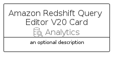
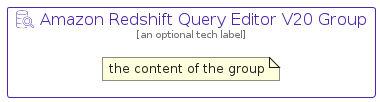

# AmazonRedshiftQueryEditorV20


```text
aws-q1-2025/Resource/Analytics/AmazonRedshiftQueryEditorV20
```

```text
include('aws-q1-2025/Resource/Analytics/AmazonRedshiftQueryEditorV20')
```


| Illustration | AmazonRedshiftQueryEditorV20 | AmazonRedshiftQueryEditorV20Card | AmazonRedshiftQueryEditorV20Group |
| :---: | :---: | :---: | :---: |
|  |  |  |  |


## Sprites
The item provides the following sriptes:

- `<$AmazonRedshiftQueryEditorV20Xs>`
- `<$AmazonRedshiftQueryEditorV20Sm>`
- `<$AmazonRedshiftQueryEditorV20Md>`
- `<$AmazonRedshiftQueryEditorV20Lg>`


## AmazonRedshiftQueryEditorV20

### Load remotely
```plantuml
@startuml
' configures the library
!global $LIB_BASE_LOCATION="https://raw.githubusercontent.com/tmorin/plantuml-libs/master/distribution"

' loads the library's bootstrap
!include $LIB_BASE_LOCATION/bootstrap.puml

' loads the package bootstrap
include('aws-q1-2025/bootstrap')

' loads the Item which embeds the element AmazonRedshiftQueryEditorV20
include('aws-q1-2025/Resource/Analytics/AmazonRedshiftQueryEditorV20')

' renders the element
AmazonRedshiftQueryEditorV20('AmazonRedshiftQueryEditorV20', 'Amazon Redshift Query Editor V20', 'an optional tech label', 'an optional description')
@enduml
```

### Load locally
```plantuml
@startuml
' configures the library
!global $INCLUSION_MODE="local"
!global $LIB_BASE_LOCATION="../../.."

' loads the library's bootstrap
!include $LIB_BASE_LOCATION/bootstrap.puml

' loads the package bootstrap
include('aws-q1-2025/bootstrap')

' loads the Item which embeds the element AmazonRedshiftQueryEditorV20
include('aws-q1-2025/Resource/Analytics/AmazonRedshiftQueryEditorV20')

' renders the element
AmazonRedshiftQueryEditorV20('AmazonRedshiftQueryEditorV20', 'Amazon Redshift Query Editor V20', 'an optional tech label', 'an optional description')
@enduml
```

## AmazonRedshiftQueryEditorV20Card

### Load remotely
```plantuml
@startuml
' configures the library
!global $LIB_BASE_LOCATION="https://raw.githubusercontent.com/tmorin/plantuml-libs/master/distribution"

' loads the library's bootstrap
!include $LIB_BASE_LOCATION/bootstrap.puml

' loads the package bootstrap
include('aws-q1-2025/bootstrap')

' loads the Item which embeds the element AmazonRedshiftQueryEditorV20Card
include('aws-q1-2025/Resource/Analytics/AmazonRedshiftQueryEditorV20')

' renders the element
AmazonRedshiftQueryEditorV20Card('AmazonRedshiftQueryEditorV20Card', 'Amazon Redshift Query Editor V20 Card', 'an optional description')
@enduml
```

### Load locally
```plantuml
@startuml
' configures the library
!global $INCLUSION_MODE="local"
!global $LIB_BASE_LOCATION="../../.."

' loads the library's bootstrap
!include $LIB_BASE_LOCATION/bootstrap.puml

' loads the package bootstrap
include('aws-q1-2025/bootstrap')

' loads the Item which embeds the element AmazonRedshiftQueryEditorV20Card
include('aws-q1-2025/Resource/Analytics/AmazonRedshiftQueryEditorV20')

' renders the element
AmazonRedshiftQueryEditorV20Card('AmazonRedshiftQueryEditorV20Card', 'Amazon Redshift Query Editor V20 Card', 'an optional description')
@enduml
```

## AmazonRedshiftQueryEditorV20Group

### Load remotely
```plantuml
@startuml
' configures the library
!global $LIB_BASE_LOCATION="https://raw.githubusercontent.com/tmorin/plantuml-libs/master/distribution"

' loads the library's bootstrap
!include $LIB_BASE_LOCATION/bootstrap.puml

' loads the package bootstrap
include('aws-q1-2025/bootstrap')

' loads the Item which embeds the element AmazonRedshiftQueryEditorV20Group
include('aws-q1-2025/Resource/Analytics/AmazonRedshiftQueryEditorV20')

' renders the element
AmazonRedshiftQueryEditorV20Group('AmazonRedshiftQueryEditorV20Group', 'Amazon Redshift Query Editor V20 Group', 'an optional tech label') {
    note as note
        the content of the group
    end note
}
@enduml
```

### Load locally
```plantuml
@startuml
' configures the library
!global $INCLUSION_MODE="local"
!global $LIB_BASE_LOCATION="../../.."

' loads the library's bootstrap
!include $LIB_BASE_LOCATION/bootstrap.puml

' loads the package bootstrap
include('aws-q1-2025/bootstrap')

' loads the Item which embeds the element AmazonRedshiftQueryEditorV20Group
include('aws-q1-2025/Resource/Analytics/AmazonRedshiftQueryEditorV20')

' renders the element
AmazonRedshiftQueryEditorV20Group('AmazonRedshiftQueryEditorV20Group', 'Amazon Redshift Query Editor V20 Group', 'an optional tech label') {
    note as note
        the content of the group
    end note
}
@enduml
```

