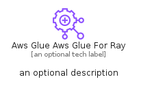

# AwsGlueAwsGlueForRay


```text
aws-q1-2025/Resource/Analytics/AwsGlueAwsGlueForRay
```

```text
include('aws-q1-2025/Resource/Analytics/AwsGlueAwsGlueForRay')
```


| Illustration | AwsGlueAwsGlueForRay | AwsGlueAwsGlueForRayCard | AwsGlueAwsGlueForRayGroup |
| :---: | :---: | :---: | :---: |
|  |  |  |  |


## Sprites
The item provides the following sriptes:

- `<$AwsGlueAwsGlueForRayXs>`
- `<$AwsGlueAwsGlueForRaySm>`
- `<$AwsGlueAwsGlueForRayMd>`
- `<$AwsGlueAwsGlueForRayLg>`


## AwsGlueAwsGlueForRay

### Load remotely
```plantuml
@startuml
' configures the library
!global $LIB_BASE_LOCATION="https://raw.githubusercontent.com/tmorin/plantuml-libs/master/distribution"

' loads the library's bootstrap
!include $LIB_BASE_LOCATION/bootstrap.puml

' loads the package bootstrap
include('aws-q1-2025/bootstrap')

' loads the Item which embeds the element AwsGlueAwsGlueForRay
include('aws-q1-2025/Resource/Analytics/AwsGlueAwsGlueForRay')

' renders the element
AwsGlueAwsGlueForRay('AwsGlueAwsGlueForRay', 'Aws Glue Aws Glue For Ray', 'an optional tech label', 'an optional description')
@enduml
```

### Load locally
```plantuml
@startuml
' configures the library
!global $INCLUSION_MODE="local"
!global $LIB_BASE_LOCATION="../../.."

' loads the library's bootstrap
!include $LIB_BASE_LOCATION/bootstrap.puml

' loads the package bootstrap
include('aws-q1-2025/bootstrap')

' loads the Item which embeds the element AwsGlueAwsGlueForRay
include('aws-q1-2025/Resource/Analytics/AwsGlueAwsGlueForRay')

' renders the element
AwsGlueAwsGlueForRay('AwsGlueAwsGlueForRay', 'Aws Glue Aws Glue For Ray', 'an optional tech label', 'an optional description')
@enduml
```

## AwsGlueAwsGlueForRayCard

### Load remotely
```plantuml
@startuml
' configures the library
!global $LIB_BASE_LOCATION="https://raw.githubusercontent.com/tmorin/plantuml-libs/master/distribution"

' loads the library's bootstrap
!include $LIB_BASE_LOCATION/bootstrap.puml

' loads the package bootstrap
include('aws-q1-2025/bootstrap')

' loads the Item which embeds the element AwsGlueAwsGlueForRayCard
include('aws-q1-2025/Resource/Analytics/AwsGlueAwsGlueForRay')

' renders the element
AwsGlueAwsGlueForRayCard('AwsGlueAwsGlueForRayCard', 'Aws Glue Aws Glue For Ray Card', 'an optional description')
@enduml
```

### Load locally
```plantuml
@startuml
' configures the library
!global $INCLUSION_MODE="local"
!global $LIB_BASE_LOCATION="../../.."

' loads the library's bootstrap
!include $LIB_BASE_LOCATION/bootstrap.puml

' loads the package bootstrap
include('aws-q1-2025/bootstrap')

' loads the Item which embeds the element AwsGlueAwsGlueForRayCard
include('aws-q1-2025/Resource/Analytics/AwsGlueAwsGlueForRay')

' renders the element
AwsGlueAwsGlueForRayCard('AwsGlueAwsGlueForRayCard', 'Aws Glue Aws Glue For Ray Card', 'an optional description')
@enduml
```

## AwsGlueAwsGlueForRayGroup

### Load remotely
```plantuml
@startuml
' configures the library
!global $LIB_BASE_LOCATION="https://raw.githubusercontent.com/tmorin/plantuml-libs/master/distribution"

' loads the library's bootstrap
!include $LIB_BASE_LOCATION/bootstrap.puml

' loads the package bootstrap
include('aws-q1-2025/bootstrap')

' loads the Item which embeds the element AwsGlueAwsGlueForRayGroup
include('aws-q1-2025/Resource/Analytics/AwsGlueAwsGlueForRay')

' renders the element
AwsGlueAwsGlueForRayGroup('AwsGlueAwsGlueForRayGroup', 'Aws Glue Aws Glue For Ray Group', 'an optional tech label') {
    note as note
        the content of the group
    end note
}
@enduml
```

### Load locally
```plantuml
@startuml
' configures the library
!global $INCLUSION_MODE="local"
!global $LIB_BASE_LOCATION="../../.."

' loads the library's bootstrap
!include $LIB_BASE_LOCATION/bootstrap.puml

' loads the package bootstrap
include('aws-q1-2025/bootstrap')

' loads the Item which embeds the element AwsGlueAwsGlueForRayGroup
include('aws-q1-2025/Resource/Analytics/AwsGlueAwsGlueForRay')

' renders the element
AwsGlueAwsGlueForRayGroup('AwsGlueAwsGlueForRayGroup', 'Aws Glue Aws Glue For Ray Group', 'an optional tech label') {
    note as note
        the content of the group
    end note
}
@enduml
```

