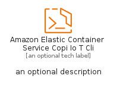
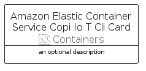

# AmazonElasticContainerServiceCopiIoTCli


```text
aws-q1-2025/Resource/Containers/AmazonElasticContainerServiceCopiIoTCli
```

```text
include('aws-q1-2025/Resource/Containers/AmazonElasticContainerServiceCopiIoTCli')
```


| Illustration | AmazonElasticContainerServiceCopiIoTCli | AmazonElasticContainerServiceCopiIoTCliCard | AmazonElasticContainerServiceCopiIoTCliGroup |
| :---: | :---: | :---: | :---: |
|  |  |  |  |


## Sprites
The item provides the following sriptes:

- `<$AmazonElasticContainerServiceCopiIoTCliXs>`
- `<$AmazonElasticContainerServiceCopiIoTCliSm>`
- `<$AmazonElasticContainerServiceCopiIoTCliMd>`
- `<$AmazonElasticContainerServiceCopiIoTCliLg>`


## AmazonElasticContainerServiceCopiIoTCli

### Load remotely
```plantuml
@startuml
' configures the library
!global $LIB_BASE_LOCATION="https://raw.githubusercontent.com/tmorin/plantuml-libs/master/distribution"

' loads the library's bootstrap
!include $LIB_BASE_LOCATION/bootstrap.puml

' loads the package bootstrap
include('aws-q1-2025/bootstrap')

' loads the Item which embeds the element AmazonElasticContainerServiceCopiIoTCli
include('aws-q1-2025/Resource/Containers/AmazonElasticContainerServiceCopiIoTCli')

' renders the element
AmazonElasticContainerServiceCopiIoTCli('AmazonElasticContainerServiceCopiIoTCli', 'Amazon Elastic Container Service Copi Io T Cli', 'an optional tech label', 'an optional description')
@enduml
```

### Load locally
```plantuml
@startuml
' configures the library
!global $INCLUSION_MODE="local"
!global $LIB_BASE_LOCATION="../../.."

' loads the library's bootstrap
!include $LIB_BASE_LOCATION/bootstrap.puml

' loads the package bootstrap
include('aws-q1-2025/bootstrap')

' loads the Item which embeds the element AmazonElasticContainerServiceCopiIoTCli
include('aws-q1-2025/Resource/Containers/AmazonElasticContainerServiceCopiIoTCli')

' renders the element
AmazonElasticContainerServiceCopiIoTCli('AmazonElasticContainerServiceCopiIoTCli', 'Amazon Elastic Container Service Copi Io T Cli', 'an optional tech label', 'an optional description')
@enduml
```

## AmazonElasticContainerServiceCopiIoTCliCard

### Load remotely
```plantuml
@startuml
' configures the library
!global $LIB_BASE_LOCATION="https://raw.githubusercontent.com/tmorin/plantuml-libs/master/distribution"

' loads the library's bootstrap
!include $LIB_BASE_LOCATION/bootstrap.puml

' loads the package bootstrap
include('aws-q1-2025/bootstrap')

' loads the Item which embeds the element AmazonElasticContainerServiceCopiIoTCliCard
include('aws-q1-2025/Resource/Containers/AmazonElasticContainerServiceCopiIoTCli')

' renders the element
AmazonElasticContainerServiceCopiIoTCliCard('AmazonElasticContainerServiceCopiIoTCliCard', 'Amazon Elastic Container Service Copi Io T Cli Card', 'an optional description')
@enduml
```

### Load locally
```plantuml
@startuml
' configures the library
!global $INCLUSION_MODE="local"
!global $LIB_BASE_LOCATION="../../.."

' loads the library's bootstrap
!include $LIB_BASE_LOCATION/bootstrap.puml

' loads the package bootstrap
include('aws-q1-2025/bootstrap')

' loads the Item which embeds the element AmazonElasticContainerServiceCopiIoTCliCard
include('aws-q1-2025/Resource/Containers/AmazonElasticContainerServiceCopiIoTCli')

' renders the element
AmazonElasticContainerServiceCopiIoTCliCard('AmazonElasticContainerServiceCopiIoTCliCard', 'Amazon Elastic Container Service Copi Io T Cli Card', 'an optional description')
@enduml
```

## AmazonElasticContainerServiceCopiIoTCliGroup

### Load remotely
```plantuml
@startuml
' configures the library
!global $LIB_BASE_LOCATION="https://raw.githubusercontent.com/tmorin/plantuml-libs/master/distribution"

' loads the library's bootstrap
!include $LIB_BASE_LOCATION/bootstrap.puml

' loads the package bootstrap
include('aws-q1-2025/bootstrap')

' loads the Item which embeds the element AmazonElasticContainerServiceCopiIoTCliGroup
include('aws-q1-2025/Resource/Containers/AmazonElasticContainerServiceCopiIoTCli')

' renders the element
AmazonElasticContainerServiceCopiIoTCliGroup('AmazonElasticContainerServiceCopiIoTCliGroup', 'Amazon Elastic Container Service Copi Io T Cli Group', 'an optional tech label') {
    note as note
        the content of the group
    end note
}
@enduml
```

### Load locally
```plantuml
@startuml
' configures the library
!global $INCLUSION_MODE="local"
!global $LIB_BASE_LOCATION="../../.."

' loads the library's bootstrap
!include $LIB_BASE_LOCATION/bootstrap.puml

' loads the package bootstrap
include('aws-q1-2025/bootstrap')

' loads the Item which embeds the element AmazonElasticContainerServiceCopiIoTCliGroup
include('aws-q1-2025/Resource/Containers/AmazonElasticContainerServiceCopiIoTCli')

' renders the element
AmazonElasticContainerServiceCopiIoTCliGroup('AmazonElasticContainerServiceCopiIoTCliGroup', 'Amazon Elastic Container Service Copi Io T Cli Group', 'an optional tech label') {
    note as note
        the content of the group
    end note
}
@enduml
```

