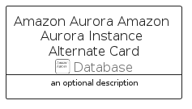

# AmazonAuroraAmazonAuroraInstanceAlternate


```text
aws-q1-2025/Resource/Database/AmazonAuroraAmazonAuroraInstanceAlternate
```

```text
include('aws-q1-2025/Resource/Database/AmazonAuroraAmazonAuroraInstanceAlternate')
```


| Illustration | AmazonAuroraAmazonAuroraInstanceAlternate | AmazonAuroraAmazonAuroraInstanceAlternateCard | AmazonAuroraAmazonAuroraInstanceAlternateGroup |
| :---: | :---: | :---: | :---: |
|  |  |  |  |


## Sprites
The item provides the following sriptes:

- `<$AmazonAuroraAmazonAuroraInstanceAlternateXs>`
- `<$AmazonAuroraAmazonAuroraInstanceAlternateSm>`
- `<$AmazonAuroraAmazonAuroraInstanceAlternateMd>`
- `<$AmazonAuroraAmazonAuroraInstanceAlternateLg>`


## AmazonAuroraAmazonAuroraInstanceAlternate

### Load remotely
```plantuml
@startuml
' configures the library
!global $LIB_BASE_LOCATION="https://raw.githubusercontent.com/tmorin/plantuml-libs/master/distribution"

' loads the library's bootstrap
!include $LIB_BASE_LOCATION/bootstrap.puml

' loads the package bootstrap
include('aws-q1-2025/bootstrap')

' loads the Item which embeds the element AmazonAuroraAmazonAuroraInstanceAlternate
include('aws-q1-2025/Resource/Database/AmazonAuroraAmazonAuroraInstanceAlternate')

' renders the element
AmazonAuroraAmazonAuroraInstanceAlternate('AmazonAuroraAmazonAuroraInstanceAlternate', 'Amazon Aurora Amazon Aurora Instance Alternate', 'an optional tech label', 'an optional description')
@enduml
```

### Load locally
```plantuml
@startuml
' configures the library
!global $INCLUSION_MODE="local"
!global $LIB_BASE_LOCATION="../../.."

' loads the library's bootstrap
!include $LIB_BASE_LOCATION/bootstrap.puml

' loads the package bootstrap
include('aws-q1-2025/bootstrap')

' loads the Item which embeds the element AmazonAuroraAmazonAuroraInstanceAlternate
include('aws-q1-2025/Resource/Database/AmazonAuroraAmazonAuroraInstanceAlternate')

' renders the element
AmazonAuroraAmazonAuroraInstanceAlternate('AmazonAuroraAmazonAuroraInstanceAlternate', 'Amazon Aurora Amazon Aurora Instance Alternate', 'an optional tech label', 'an optional description')
@enduml
```

## AmazonAuroraAmazonAuroraInstanceAlternateCard

### Load remotely
```plantuml
@startuml
' configures the library
!global $LIB_BASE_LOCATION="https://raw.githubusercontent.com/tmorin/plantuml-libs/master/distribution"

' loads the library's bootstrap
!include $LIB_BASE_LOCATION/bootstrap.puml

' loads the package bootstrap
include('aws-q1-2025/bootstrap')

' loads the Item which embeds the element AmazonAuroraAmazonAuroraInstanceAlternateCard
include('aws-q1-2025/Resource/Database/AmazonAuroraAmazonAuroraInstanceAlternate')

' renders the element
AmazonAuroraAmazonAuroraInstanceAlternateCard('AmazonAuroraAmazonAuroraInstanceAlternateCard', 'Amazon Aurora Amazon Aurora Instance Alternate Card', 'an optional description')
@enduml
```

### Load locally
```plantuml
@startuml
' configures the library
!global $INCLUSION_MODE="local"
!global $LIB_BASE_LOCATION="../../.."

' loads the library's bootstrap
!include $LIB_BASE_LOCATION/bootstrap.puml

' loads the package bootstrap
include('aws-q1-2025/bootstrap')

' loads the Item which embeds the element AmazonAuroraAmazonAuroraInstanceAlternateCard
include('aws-q1-2025/Resource/Database/AmazonAuroraAmazonAuroraInstanceAlternate')

' renders the element
AmazonAuroraAmazonAuroraInstanceAlternateCard('AmazonAuroraAmazonAuroraInstanceAlternateCard', 'Amazon Aurora Amazon Aurora Instance Alternate Card', 'an optional description')
@enduml
```

## AmazonAuroraAmazonAuroraInstanceAlternateGroup

### Load remotely
```plantuml
@startuml
' configures the library
!global $LIB_BASE_LOCATION="https://raw.githubusercontent.com/tmorin/plantuml-libs/master/distribution"

' loads the library's bootstrap
!include $LIB_BASE_LOCATION/bootstrap.puml

' loads the package bootstrap
include('aws-q1-2025/bootstrap')

' loads the Item which embeds the element AmazonAuroraAmazonAuroraInstanceAlternateGroup
include('aws-q1-2025/Resource/Database/AmazonAuroraAmazonAuroraInstanceAlternate')

' renders the element
AmazonAuroraAmazonAuroraInstanceAlternateGroup('AmazonAuroraAmazonAuroraInstanceAlternateGroup', 'Amazon Aurora Amazon Aurora Instance Alternate Group', 'an optional tech label') {
    note as note
        the content of the group
    end note
}
@enduml
```

### Load locally
```plantuml
@startuml
' configures the library
!global $INCLUSION_MODE="local"
!global $LIB_BASE_LOCATION="../../.."

' loads the library's bootstrap
!include $LIB_BASE_LOCATION/bootstrap.puml

' loads the package bootstrap
include('aws-q1-2025/bootstrap')

' loads the Item which embeds the element AmazonAuroraAmazonAuroraInstanceAlternateGroup
include('aws-q1-2025/Resource/Database/AmazonAuroraAmazonAuroraInstanceAlternate')

' renders the element
AmazonAuroraAmazonAuroraInstanceAlternateGroup('AmazonAuroraAmazonAuroraInstanceAlternateGroup', 'Amazon Aurora Amazon Aurora Instance Alternate Group', 'an optional tech label') {
    note as note
        the content of the group
    end note
}
@enduml
```

