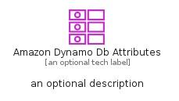
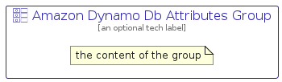

# AmazonDynamoDbAttributes


```text
aws-q1-2025/Resource/Database/AmazonDynamoDbAttributes
```

```text
include('aws-q1-2025/Resource/Database/AmazonDynamoDbAttributes')
```


| Illustration | AmazonDynamoDbAttributes | AmazonDynamoDbAttributesCard | AmazonDynamoDbAttributesGroup |
| :---: | :---: | :---: | :---: |
|  |  |  |  |


## Sprites
The item provides the following sriptes:

- `<$AmazonDynamoDbAttributesXs>`
- `<$AmazonDynamoDbAttributesSm>`
- `<$AmazonDynamoDbAttributesMd>`
- `<$AmazonDynamoDbAttributesLg>`


## AmazonDynamoDbAttributes

### Load remotely
```plantuml
@startuml
' configures the library
!global $LIB_BASE_LOCATION="https://raw.githubusercontent.com/tmorin/plantuml-libs/master/distribution"

' loads the library's bootstrap
!include $LIB_BASE_LOCATION/bootstrap.puml

' loads the package bootstrap
include('aws-q1-2025/bootstrap')

' loads the Item which embeds the element AmazonDynamoDbAttributes
include('aws-q1-2025/Resource/Database/AmazonDynamoDbAttributes')

' renders the element
AmazonDynamoDbAttributes('AmazonDynamoDbAttributes', 'Amazon Dynamo Db Attributes', 'an optional tech label', 'an optional description')
@enduml
```

### Load locally
```plantuml
@startuml
' configures the library
!global $INCLUSION_MODE="local"
!global $LIB_BASE_LOCATION="../../.."

' loads the library's bootstrap
!include $LIB_BASE_LOCATION/bootstrap.puml

' loads the package bootstrap
include('aws-q1-2025/bootstrap')

' loads the Item which embeds the element AmazonDynamoDbAttributes
include('aws-q1-2025/Resource/Database/AmazonDynamoDbAttributes')

' renders the element
AmazonDynamoDbAttributes('AmazonDynamoDbAttributes', 'Amazon Dynamo Db Attributes', 'an optional tech label', 'an optional description')
@enduml
```

## AmazonDynamoDbAttributesCard

### Load remotely
```plantuml
@startuml
' configures the library
!global $LIB_BASE_LOCATION="https://raw.githubusercontent.com/tmorin/plantuml-libs/master/distribution"

' loads the library's bootstrap
!include $LIB_BASE_LOCATION/bootstrap.puml

' loads the package bootstrap
include('aws-q1-2025/bootstrap')

' loads the Item which embeds the element AmazonDynamoDbAttributesCard
include('aws-q1-2025/Resource/Database/AmazonDynamoDbAttributes')

' renders the element
AmazonDynamoDbAttributesCard('AmazonDynamoDbAttributesCard', 'Amazon Dynamo Db Attributes Card', 'an optional description')
@enduml
```

### Load locally
```plantuml
@startuml
' configures the library
!global $INCLUSION_MODE="local"
!global $LIB_BASE_LOCATION="../../.."

' loads the library's bootstrap
!include $LIB_BASE_LOCATION/bootstrap.puml

' loads the package bootstrap
include('aws-q1-2025/bootstrap')

' loads the Item which embeds the element AmazonDynamoDbAttributesCard
include('aws-q1-2025/Resource/Database/AmazonDynamoDbAttributes')

' renders the element
AmazonDynamoDbAttributesCard('AmazonDynamoDbAttributesCard', 'Amazon Dynamo Db Attributes Card', 'an optional description')
@enduml
```

## AmazonDynamoDbAttributesGroup

### Load remotely
```plantuml
@startuml
' configures the library
!global $LIB_BASE_LOCATION="https://raw.githubusercontent.com/tmorin/plantuml-libs/master/distribution"

' loads the library's bootstrap
!include $LIB_BASE_LOCATION/bootstrap.puml

' loads the package bootstrap
include('aws-q1-2025/bootstrap')

' loads the Item which embeds the element AmazonDynamoDbAttributesGroup
include('aws-q1-2025/Resource/Database/AmazonDynamoDbAttributes')

' renders the element
AmazonDynamoDbAttributesGroup('AmazonDynamoDbAttributesGroup', 'Amazon Dynamo Db Attributes Group', 'an optional tech label') {
    note as note
        the content of the group
    end note
}
@enduml
```

### Load locally
```plantuml
@startuml
' configures the library
!global $INCLUSION_MODE="local"
!global $LIB_BASE_LOCATION="../../.."

' loads the library's bootstrap
!include $LIB_BASE_LOCATION/bootstrap.puml

' loads the package bootstrap
include('aws-q1-2025/bootstrap')

' loads the Item which embeds the element AmazonDynamoDbAttributesGroup
include('aws-q1-2025/Resource/Database/AmazonDynamoDbAttributes')

' renders the element
AmazonDynamoDbAttributesGroup('AmazonDynamoDbAttributesGroup', 'Amazon Dynamo Db Attributes Group', 'an optional tech label') {
    note as note
        the content of the group
    end note
}
@enduml
```

