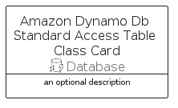

# AmazonDynamoDbStandardAccessTableClass


```text
aws-q1-2025/Resource/Database/AmazonDynamoDbStandardAccessTableClass
```

```text
include('aws-q1-2025/Resource/Database/AmazonDynamoDbStandardAccessTableClass')
```


| Illustration | AmazonDynamoDbStandardAccessTableClass | AmazonDynamoDbStandardAccessTableClassCard | AmazonDynamoDbStandardAccessTableClassGroup |
| :---: | :---: | :---: | :---: |
|  |  |  |  |


## Sprites
The item provides the following sriptes:

- `<$AmazonDynamoDbStandardAccessTableClassXs>`
- `<$AmazonDynamoDbStandardAccessTableClassSm>`
- `<$AmazonDynamoDbStandardAccessTableClassMd>`
- `<$AmazonDynamoDbStandardAccessTableClassLg>`


## AmazonDynamoDbStandardAccessTableClass

### Load remotely
```plantuml
@startuml
' configures the library
!global $LIB_BASE_LOCATION="https://raw.githubusercontent.com/tmorin/plantuml-libs/master/distribution"

' loads the library's bootstrap
!include $LIB_BASE_LOCATION/bootstrap.puml

' loads the package bootstrap
include('aws-q1-2025/bootstrap')

' loads the Item which embeds the element AmazonDynamoDbStandardAccessTableClass
include('aws-q1-2025/Resource/Database/AmazonDynamoDbStandardAccessTableClass')

' renders the element
AmazonDynamoDbStandardAccessTableClass('AmazonDynamoDbStandardAccessTableClass', 'Amazon Dynamo Db Standard Access Table Class', 'an optional tech label', 'an optional description')
@enduml
```

### Load locally
```plantuml
@startuml
' configures the library
!global $INCLUSION_MODE="local"
!global $LIB_BASE_LOCATION="../../.."

' loads the library's bootstrap
!include $LIB_BASE_LOCATION/bootstrap.puml

' loads the package bootstrap
include('aws-q1-2025/bootstrap')

' loads the Item which embeds the element AmazonDynamoDbStandardAccessTableClass
include('aws-q1-2025/Resource/Database/AmazonDynamoDbStandardAccessTableClass')

' renders the element
AmazonDynamoDbStandardAccessTableClass('AmazonDynamoDbStandardAccessTableClass', 'Amazon Dynamo Db Standard Access Table Class', 'an optional tech label', 'an optional description')
@enduml
```

## AmazonDynamoDbStandardAccessTableClassCard

### Load remotely
```plantuml
@startuml
' configures the library
!global $LIB_BASE_LOCATION="https://raw.githubusercontent.com/tmorin/plantuml-libs/master/distribution"

' loads the library's bootstrap
!include $LIB_BASE_LOCATION/bootstrap.puml

' loads the package bootstrap
include('aws-q1-2025/bootstrap')

' loads the Item which embeds the element AmazonDynamoDbStandardAccessTableClassCard
include('aws-q1-2025/Resource/Database/AmazonDynamoDbStandardAccessTableClass')

' renders the element
AmazonDynamoDbStandardAccessTableClassCard('AmazonDynamoDbStandardAccessTableClassCard', 'Amazon Dynamo Db Standard Access Table Class Card', 'an optional description')
@enduml
```

### Load locally
```plantuml
@startuml
' configures the library
!global $INCLUSION_MODE="local"
!global $LIB_BASE_LOCATION="../../.."

' loads the library's bootstrap
!include $LIB_BASE_LOCATION/bootstrap.puml

' loads the package bootstrap
include('aws-q1-2025/bootstrap')

' loads the Item which embeds the element AmazonDynamoDbStandardAccessTableClassCard
include('aws-q1-2025/Resource/Database/AmazonDynamoDbStandardAccessTableClass')

' renders the element
AmazonDynamoDbStandardAccessTableClassCard('AmazonDynamoDbStandardAccessTableClassCard', 'Amazon Dynamo Db Standard Access Table Class Card', 'an optional description')
@enduml
```

## AmazonDynamoDbStandardAccessTableClassGroup

### Load remotely
```plantuml
@startuml
' configures the library
!global $LIB_BASE_LOCATION="https://raw.githubusercontent.com/tmorin/plantuml-libs/master/distribution"

' loads the library's bootstrap
!include $LIB_BASE_LOCATION/bootstrap.puml

' loads the package bootstrap
include('aws-q1-2025/bootstrap')

' loads the Item which embeds the element AmazonDynamoDbStandardAccessTableClassGroup
include('aws-q1-2025/Resource/Database/AmazonDynamoDbStandardAccessTableClass')

' renders the element
AmazonDynamoDbStandardAccessTableClassGroup('AmazonDynamoDbStandardAccessTableClassGroup', 'Amazon Dynamo Db Standard Access Table Class Group', 'an optional tech label') {
    note as note
        the content of the group
    end note
}
@enduml
```

### Load locally
```plantuml
@startuml
' configures the library
!global $INCLUSION_MODE="local"
!global $LIB_BASE_LOCATION="../../.."

' loads the library's bootstrap
!include $LIB_BASE_LOCATION/bootstrap.puml

' loads the package bootstrap
include('aws-q1-2025/bootstrap')

' loads the Item which embeds the element AmazonDynamoDbStandardAccessTableClassGroup
include('aws-q1-2025/Resource/Database/AmazonDynamoDbStandardAccessTableClass')

' renders the element
AmazonDynamoDbStandardAccessTableClassGroup('AmazonDynamoDbStandardAccessTableClassGroup', 'Amazon Dynamo Db Standard Access Table Class Group', 'an optional tech label') {
    note as note
        the content of the group
    end note
}
@enduml
```

