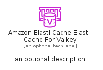

# AmazonElastiCacheElastiCacheForValkey


```text
aws-q1-2025/Resource/Database/AmazonElastiCacheElastiCacheForValkey
```

```text
include('aws-q1-2025/Resource/Database/AmazonElastiCacheElastiCacheForValkey')
```


| Illustration | AmazonElastiCacheElastiCacheForValkey | AmazonElastiCacheElastiCacheForValkeyCard | AmazonElastiCacheElastiCacheForValkeyGroup |
| :---: | :---: | :---: | :---: |
|  |  |  |  |


## Sprites
The item provides the following sriptes:

- `<$AmazonElastiCacheElastiCacheForValkeyXs>`
- `<$AmazonElastiCacheElastiCacheForValkeySm>`
- `<$AmazonElastiCacheElastiCacheForValkeyMd>`
- `<$AmazonElastiCacheElastiCacheForValkeyLg>`


## AmazonElastiCacheElastiCacheForValkey

### Load remotely
```plantuml
@startuml
' configures the library
!global $LIB_BASE_LOCATION="https://raw.githubusercontent.com/tmorin/plantuml-libs/master/distribution"

' loads the library's bootstrap
!include $LIB_BASE_LOCATION/bootstrap.puml

' loads the package bootstrap
include('aws-q1-2025/bootstrap')

' loads the Item which embeds the element AmazonElastiCacheElastiCacheForValkey
include('aws-q1-2025/Resource/Database/AmazonElastiCacheElastiCacheForValkey')

' renders the element
AmazonElastiCacheElastiCacheForValkey('AmazonElastiCacheElastiCacheForValkey', 'Amazon Elasti Cache Elasti Cache For Valkey', 'an optional tech label', 'an optional description')
@enduml
```

### Load locally
```plantuml
@startuml
' configures the library
!global $INCLUSION_MODE="local"
!global $LIB_BASE_LOCATION="../../.."

' loads the library's bootstrap
!include $LIB_BASE_LOCATION/bootstrap.puml

' loads the package bootstrap
include('aws-q1-2025/bootstrap')

' loads the Item which embeds the element AmazonElastiCacheElastiCacheForValkey
include('aws-q1-2025/Resource/Database/AmazonElastiCacheElastiCacheForValkey')

' renders the element
AmazonElastiCacheElastiCacheForValkey('AmazonElastiCacheElastiCacheForValkey', 'Amazon Elasti Cache Elasti Cache For Valkey', 'an optional tech label', 'an optional description')
@enduml
```

## AmazonElastiCacheElastiCacheForValkeyCard

### Load remotely
```plantuml
@startuml
' configures the library
!global $LIB_BASE_LOCATION="https://raw.githubusercontent.com/tmorin/plantuml-libs/master/distribution"

' loads the library's bootstrap
!include $LIB_BASE_LOCATION/bootstrap.puml

' loads the package bootstrap
include('aws-q1-2025/bootstrap')

' loads the Item which embeds the element AmazonElastiCacheElastiCacheForValkeyCard
include('aws-q1-2025/Resource/Database/AmazonElastiCacheElastiCacheForValkey')

' renders the element
AmazonElastiCacheElastiCacheForValkeyCard('AmazonElastiCacheElastiCacheForValkeyCard', 'Amazon Elasti Cache Elasti Cache For Valkey Card', 'an optional description')
@enduml
```

### Load locally
```plantuml
@startuml
' configures the library
!global $INCLUSION_MODE="local"
!global $LIB_BASE_LOCATION="../../.."

' loads the library's bootstrap
!include $LIB_BASE_LOCATION/bootstrap.puml

' loads the package bootstrap
include('aws-q1-2025/bootstrap')

' loads the Item which embeds the element AmazonElastiCacheElastiCacheForValkeyCard
include('aws-q1-2025/Resource/Database/AmazonElastiCacheElastiCacheForValkey')

' renders the element
AmazonElastiCacheElastiCacheForValkeyCard('AmazonElastiCacheElastiCacheForValkeyCard', 'Amazon Elasti Cache Elasti Cache For Valkey Card', 'an optional description')
@enduml
```

## AmazonElastiCacheElastiCacheForValkeyGroup

### Load remotely
```plantuml
@startuml
' configures the library
!global $LIB_BASE_LOCATION="https://raw.githubusercontent.com/tmorin/plantuml-libs/master/distribution"

' loads the library's bootstrap
!include $LIB_BASE_LOCATION/bootstrap.puml

' loads the package bootstrap
include('aws-q1-2025/bootstrap')

' loads the Item which embeds the element AmazonElastiCacheElastiCacheForValkeyGroup
include('aws-q1-2025/Resource/Database/AmazonElastiCacheElastiCacheForValkey')

' renders the element
AmazonElastiCacheElastiCacheForValkeyGroup('AmazonElastiCacheElastiCacheForValkeyGroup', 'Amazon Elasti Cache Elasti Cache For Valkey Group', 'an optional tech label') {
    note as note
        the content of the group
    end note
}
@enduml
```

### Load locally
```plantuml
@startuml
' configures the library
!global $INCLUSION_MODE="local"
!global $LIB_BASE_LOCATION="../../.."

' loads the library's bootstrap
!include $LIB_BASE_LOCATION/bootstrap.puml

' loads the package bootstrap
include('aws-q1-2025/bootstrap')

' loads the Item which embeds the element AmazonElastiCacheElastiCacheForValkeyGroup
include('aws-q1-2025/Resource/Database/AmazonElastiCacheElastiCacheForValkey')

' renders the element
AmazonElastiCacheElastiCacheForValkeyGroup('AmazonElastiCacheElastiCacheForValkeyGroup', 'Amazon Elasti Cache Elasti Cache For Valkey Group', 'an optional tech label') {
    note as note
        the content of the group
    end note
}
@enduml
```

