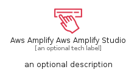
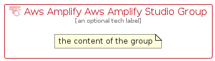

# AwsAmplifyAwsAmplifyStudio


```text
aws-q1-2025/Resource/FrontEndWebMobile/AwsAmplifyAwsAmplifyStudio
```

```text
include('aws-q1-2025/Resource/FrontEndWebMobile/AwsAmplifyAwsAmplifyStudio')
```


| Illustration | AwsAmplifyAwsAmplifyStudio | AwsAmplifyAwsAmplifyStudioCard | AwsAmplifyAwsAmplifyStudioGroup |
| :---: | :---: | :---: | :---: |
|  |  |  |  |


## Sprites
The item provides the following sriptes:

- `<$AwsAmplifyAwsAmplifyStudioXs>`
- `<$AwsAmplifyAwsAmplifyStudioSm>`
- `<$AwsAmplifyAwsAmplifyStudioMd>`
- `<$AwsAmplifyAwsAmplifyStudioLg>`


## AwsAmplifyAwsAmplifyStudio

### Load remotely
```plantuml
@startuml
' configures the library
!global $LIB_BASE_LOCATION="https://raw.githubusercontent.com/tmorin/plantuml-libs/master/distribution"

' loads the library's bootstrap
!include $LIB_BASE_LOCATION/bootstrap.puml

' loads the package bootstrap
include('aws-q1-2025/bootstrap')

' loads the Item which embeds the element AwsAmplifyAwsAmplifyStudio
include('aws-q1-2025/Resource/FrontEndWebMobile/AwsAmplifyAwsAmplifyStudio')

' renders the element
AwsAmplifyAwsAmplifyStudio('AwsAmplifyAwsAmplifyStudio', 'Aws Amplify Aws Amplify Studio', 'an optional tech label', 'an optional description')
@enduml
```

### Load locally
```plantuml
@startuml
' configures the library
!global $INCLUSION_MODE="local"
!global $LIB_BASE_LOCATION="../../.."

' loads the library's bootstrap
!include $LIB_BASE_LOCATION/bootstrap.puml

' loads the package bootstrap
include('aws-q1-2025/bootstrap')

' loads the Item which embeds the element AwsAmplifyAwsAmplifyStudio
include('aws-q1-2025/Resource/FrontEndWebMobile/AwsAmplifyAwsAmplifyStudio')

' renders the element
AwsAmplifyAwsAmplifyStudio('AwsAmplifyAwsAmplifyStudio', 'Aws Amplify Aws Amplify Studio', 'an optional tech label', 'an optional description')
@enduml
```

## AwsAmplifyAwsAmplifyStudioCard

### Load remotely
```plantuml
@startuml
' configures the library
!global $LIB_BASE_LOCATION="https://raw.githubusercontent.com/tmorin/plantuml-libs/master/distribution"

' loads the library's bootstrap
!include $LIB_BASE_LOCATION/bootstrap.puml

' loads the package bootstrap
include('aws-q1-2025/bootstrap')

' loads the Item which embeds the element AwsAmplifyAwsAmplifyStudioCard
include('aws-q1-2025/Resource/FrontEndWebMobile/AwsAmplifyAwsAmplifyStudio')

' renders the element
AwsAmplifyAwsAmplifyStudioCard('AwsAmplifyAwsAmplifyStudioCard', 'Aws Amplify Aws Amplify Studio Card', 'an optional description')
@enduml
```

### Load locally
```plantuml
@startuml
' configures the library
!global $INCLUSION_MODE="local"
!global $LIB_BASE_LOCATION="../../.."

' loads the library's bootstrap
!include $LIB_BASE_LOCATION/bootstrap.puml

' loads the package bootstrap
include('aws-q1-2025/bootstrap')

' loads the Item which embeds the element AwsAmplifyAwsAmplifyStudioCard
include('aws-q1-2025/Resource/FrontEndWebMobile/AwsAmplifyAwsAmplifyStudio')

' renders the element
AwsAmplifyAwsAmplifyStudioCard('AwsAmplifyAwsAmplifyStudioCard', 'Aws Amplify Aws Amplify Studio Card', 'an optional description')
@enduml
```

## AwsAmplifyAwsAmplifyStudioGroup

### Load remotely
```plantuml
@startuml
' configures the library
!global $LIB_BASE_LOCATION="https://raw.githubusercontent.com/tmorin/plantuml-libs/master/distribution"

' loads the library's bootstrap
!include $LIB_BASE_LOCATION/bootstrap.puml

' loads the package bootstrap
include('aws-q1-2025/bootstrap')

' loads the Item which embeds the element AwsAmplifyAwsAmplifyStudioGroup
include('aws-q1-2025/Resource/FrontEndWebMobile/AwsAmplifyAwsAmplifyStudio')

' renders the element
AwsAmplifyAwsAmplifyStudioGroup('AwsAmplifyAwsAmplifyStudioGroup', 'Aws Amplify Aws Amplify Studio Group', 'an optional tech label') {
    note as note
        the content of the group
    end note
}
@enduml
```

### Load locally
```plantuml
@startuml
' configures the library
!global $INCLUSION_MODE="local"
!global $LIB_BASE_LOCATION="../../.."

' loads the library's bootstrap
!include $LIB_BASE_LOCATION/bootstrap.puml

' loads the package bootstrap
include('aws-q1-2025/bootstrap')

' loads the Item which embeds the element AwsAmplifyAwsAmplifyStudioGroup
include('aws-q1-2025/Resource/FrontEndWebMobile/AwsAmplifyAwsAmplifyStudio')

' renders the element
AwsAmplifyAwsAmplifyStudioGroup('AwsAmplifyAwsAmplifyStudioGroup', 'Aws Amplify Aws Amplify Studio Group', 'an optional tech label') {
    note as note
        the content of the group
    end note
}
@enduml
```

