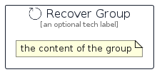

# Recover


```text
aws-q1-2025/Resource/GeneralIcons/Recover
```

```text
include('aws-q1-2025/Resource/GeneralIcons/Recover')
```


| Illustration | Recover | RecoverCard | RecoverGroup |
| :---: | :---: | :---: | :---: |
|  |  |  |  |


## Sprites
The item provides the following sriptes:

- `<$RecoverXs>`
- `<$RecoverSm>`
- `<$RecoverMd>`
- `<$RecoverLg>`


## Recover

### Load remotely
```plantuml
@startuml
' configures the library
!global $LIB_BASE_LOCATION="https://raw.githubusercontent.com/tmorin/plantuml-libs/master/distribution"

' loads the library's bootstrap
!include $LIB_BASE_LOCATION/bootstrap.puml

' loads the package bootstrap
include('aws-q1-2025/bootstrap')

' loads the Item which embeds the element Recover
include('aws-q1-2025/Resource/GeneralIcons/Recover')

' renders the element
Recover('Recover', 'Recover', 'an optional tech label', 'an optional description')
@enduml
```

### Load locally
```plantuml
@startuml
' configures the library
!global $INCLUSION_MODE="local"
!global $LIB_BASE_LOCATION="../../.."

' loads the library's bootstrap
!include $LIB_BASE_LOCATION/bootstrap.puml

' loads the package bootstrap
include('aws-q1-2025/bootstrap')

' loads the Item which embeds the element Recover
include('aws-q1-2025/Resource/GeneralIcons/Recover')

' renders the element
Recover('Recover', 'Recover', 'an optional tech label', 'an optional description')
@enduml
```

## RecoverCard

### Load remotely
```plantuml
@startuml
' configures the library
!global $LIB_BASE_LOCATION="https://raw.githubusercontent.com/tmorin/plantuml-libs/master/distribution"

' loads the library's bootstrap
!include $LIB_BASE_LOCATION/bootstrap.puml

' loads the package bootstrap
include('aws-q1-2025/bootstrap')

' loads the Item which embeds the element RecoverCard
include('aws-q1-2025/Resource/GeneralIcons/Recover')

' renders the element
RecoverCard('RecoverCard', 'Recover Card', 'an optional description')
@enduml
```

### Load locally
```plantuml
@startuml
' configures the library
!global $INCLUSION_MODE="local"
!global $LIB_BASE_LOCATION="../../.."

' loads the library's bootstrap
!include $LIB_BASE_LOCATION/bootstrap.puml

' loads the package bootstrap
include('aws-q1-2025/bootstrap')

' loads the Item which embeds the element RecoverCard
include('aws-q1-2025/Resource/GeneralIcons/Recover')

' renders the element
RecoverCard('RecoverCard', 'Recover Card', 'an optional description')
@enduml
```

## RecoverGroup

### Load remotely
```plantuml
@startuml
' configures the library
!global $LIB_BASE_LOCATION="https://raw.githubusercontent.com/tmorin/plantuml-libs/master/distribution"

' loads the library's bootstrap
!include $LIB_BASE_LOCATION/bootstrap.puml

' loads the package bootstrap
include('aws-q1-2025/bootstrap')

' loads the Item which embeds the element RecoverGroup
include('aws-q1-2025/Resource/GeneralIcons/Recover')

' renders the element
RecoverGroup('RecoverGroup', 'Recover Group', 'an optional tech label') {
    note as note
        the content of the group
    end note
}
@enduml
```

### Load locally
```plantuml
@startuml
' configures the library
!global $INCLUSION_MODE="local"
!global $LIB_BASE_LOCATION="../../.."

' loads the library's bootstrap
!include $LIB_BASE_LOCATION/bootstrap.puml

' loads the package bootstrap
include('aws-q1-2025/bootstrap')

' loads the Item which embeds the element RecoverGroup
include('aws-q1-2025/Resource/GeneralIcons/Recover')

' renders the element
RecoverGroup('RecoverGroup', 'Recover Group', 'an optional tech label') {
    note as note
        the content of the group
    end note
}
@enduml
```

