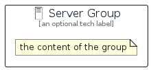

# Server


```text
aws-q1-2025/Resource/GeneralIcons/Server
```

```text
include('aws-q1-2025/Resource/GeneralIcons/Server')
```


| Illustration | Server | ServerCard | ServerGroup |
| :---: | :---: | :---: | :---: |
|  |  |  |  |


## Sprites
The item provides the following sriptes:

- `<$ServerXs>`
- `<$ServerSm>`
- `<$ServerMd>`
- `<$ServerLg>`


## Server

### Load remotely
```plantuml
@startuml
' configures the library
!global $LIB_BASE_LOCATION="https://raw.githubusercontent.com/tmorin/plantuml-libs/master/distribution"

' loads the library's bootstrap
!include $LIB_BASE_LOCATION/bootstrap.puml

' loads the package bootstrap
include('aws-q1-2025/bootstrap')

' loads the Item which embeds the element Server
include('aws-q1-2025/Resource/GeneralIcons/Server')

' renders the element
Server('Server', 'Server', 'an optional tech label', 'an optional description')
@enduml
```

### Load locally
```plantuml
@startuml
' configures the library
!global $INCLUSION_MODE="local"
!global $LIB_BASE_LOCATION="../../.."

' loads the library's bootstrap
!include $LIB_BASE_LOCATION/bootstrap.puml

' loads the package bootstrap
include('aws-q1-2025/bootstrap')

' loads the Item which embeds the element Server
include('aws-q1-2025/Resource/GeneralIcons/Server')

' renders the element
Server('Server', 'Server', 'an optional tech label', 'an optional description')
@enduml
```

## ServerCard

### Load remotely
```plantuml
@startuml
' configures the library
!global $LIB_BASE_LOCATION="https://raw.githubusercontent.com/tmorin/plantuml-libs/master/distribution"

' loads the library's bootstrap
!include $LIB_BASE_LOCATION/bootstrap.puml

' loads the package bootstrap
include('aws-q1-2025/bootstrap')

' loads the Item which embeds the element ServerCard
include('aws-q1-2025/Resource/GeneralIcons/Server')

' renders the element
ServerCard('ServerCard', 'Server Card', 'an optional description')
@enduml
```

### Load locally
```plantuml
@startuml
' configures the library
!global $INCLUSION_MODE="local"
!global $LIB_BASE_LOCATION="../../.."

' loads the library's bootstrap
!include $LIB_BASE_LOCATION/bootstrap.puml

' loads the package bootstrap
include('aws-q1-2025/bootstrap')

' loads the Item which embeds the element ServerCard
include('aws-q1-2025/Resource/GeneralIcons/Server')

' renders the element
ServerCard('ServerCard', 'Server Card', 'an optional description')
@enduml
```

## ServerGroup

### Load remotely
```plantuml
@startuml
' configures the library
!global $LIB_BASE_LOCATION="https://raw.githubusercontent.com/tmorin/plantuml-libs/master/distribution"

' loads the library's bootstrap
!include $LIB_BASE_LOCATION/bootstrap.puml

' loads the package bootstrap
include('aws-q1-2025/bootstrap')

' loads the Item which embeds the element ServerGroup
include('aws-q1-2025/Resource/GeneralIcons/Server')

' renders the element
ServerGroup('ServerGroup', 'Server Group', 'an optional tech label') {
    note as note
        the content of the group
    end note
}
@enduml
```

### Load locally
```plantuml
@startuml
' configures the library
!global $INCLUSION_MODE="local"
!global $LIB_BASE_LOCATION="../../.."

' loads the library's bootstrap
!include $LIB_BASE_LOCATION/bootstrap.puml

' loads the package bootstrap
include('aws-q1-2025/bootstrap')

' loads the Item which embeds the element ServerGroup
include('aws-q1-2025/Resource/GeneralIcons/Server')

' renders the element
ServerGroup('ServerGroup', 'Server Group', 'an optional tech label') {
    note as note
        the content of the group
    end note
}
@enduml
```

