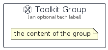

# Toolkit


```text
aws-q1-2025/Resource/GeneralIcons/Toolkit
```

```text
include('aws-q1-2025/Resource/GeneralIcons/Toolkit')
```


| Illustration | Toolkit | ToolkitCard | ToolkitGroup |
| :---: | :---: | :---: | :---: |
|  |  |  |  |


## Sprites
The item provides the following sriptes:

- `<$ToolkitXs>`
- `<$ToolkitSm>`
- `<$ToolkitMd>`
- `<$ToolkitLg>`


## Toolkit

### Load remotely
```plantuml
@startuml
' configures the library
!global $LIB_BASE_LOCATION="https://raw.githubusercontent.com/tmorin/plantuml-libs/master/distribution"

' loads the library's bootstrap
!include $LIB_BASE_LOCATION/bootstrap.puml

' loads the package bootstrap
include('aws-q1-2025/bootstrap')

' loads the Item which embeds the element Toolkit
include('aws-q1-2025/Resource/GeneralIcons/Toolkit')

' renders the element
Toolkit('Toolkit', 'Toolkit', 'an optional tech label', 'an optional description')
@enduml
```

### Load locally
```plantuml
@startuml
' configures the library
!global $INCLUSION_MODE="local"
!global $LIB_BASE_LOCATION="../../.."

' loads the library's bootstrap
!include $LIB_BASE_LOCATION/bootstrap.puml

' loads the package bootstrap
include('aws-q1-2025/bootstrap')

' loads the Item which embeds the element Toolkit
include('aws-q1-2025/Resource/GeneralIcons/Toolkit')

' renders the element
Toolkit('Toolkit', 'Toolkit', 'an optional tech label', 'an optional description')
@enduml
```

## ToolkitCard

### Load remotely
```plantuml
@startuml
' configures the library
!global $LIB_BASE_LOCATION="https://raw.githubusercontent.com/tmorin/plantuml-libs/master/distribution"

' loads the library's bootstrap
!include $LIB_BASE_LOCATION/bootstrap.puml

' loads the package bootstrap
include('aws-q1-2025/bootstrap')

' loads the Item which embeds the element ToolkitCard
include('aws-q1-2025/Resource/GeneralIcons/Toolkit')

' renders the element
ToolkitCard('ToolkitCard', 'Toolkit Card', 'an optional description')
@enduml
```

### Load locally
```plantuml
@startuml
' configures the library
!global $INCLUSION_MODE="local"
!global $LIB_BASE_LOCATION="../../.."

' loads the library's bootstrap
!include $LIB_BASE_LOCATION/bootstrap.puml

' loads the package bootstrap
include('aws-q1-2025/bootstrap')

' loads the Item which embeds the element ToolkitCard
include('aws-q1-2025/Resource/GeneralIcons/Toolkit')

' renders the element
ToolkitCard('ToolkitCard', 'Toolkit Card', 'an optional description')
@enduml
```

## ToolkitGroup

### Load remotely
```plantuml
@startuml
' configures the library
!global $LIB_BASE_LOCATION="https://raw.githubusercontent.com/tmorin/plantuml-libs/master/distribution"

' loads the library's bootstrap
!include $LIB_BASE_LOCATION/bootstrap.puml

' loads the package bootstrap
include('aws-q1-2025/bootstrap')

' loads the Item which embeds the element ToolkitGroup
include('aws-q1-2025/Resource/GeneralIcons/Toolkit')

' renders the element
ToolkitGroup('ToolkitGroup', 'Toolkit Group', 'an optional tech label') {
    note as note
        the content of the group
    end note
}
@enduml
```

### Load locally
```plantuml
@startuml
' configures the library
!global $INCLUSION_MODE="local"
!global $LIB_BASE_LOCATION="../../.."

' loads the library's bootstrap
!include $LIB_BASE_LOCATION/bootstrap.puml

' loads the package bootstrap
include('aws-q1-2025/bootstrap')

' loads the Item which embeds the element ToolkitGroup
include('aws-q1-2025/Resource/GeneralIcons/Toolkit')

' renders the element
ToolkitGroup('ToolkitGroup', 'Toolkit Group', 'an optional tech label') {
    note as note
        the content of the group
    end note
}
@enduml
```

