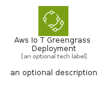
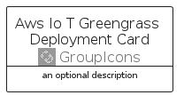

# AwsIoTGreengrassDeployment


```text
aws-q1-2025/Resource/GroupIcons/AwsIoTGreengrassDeployment
```

```text
include('aws-q1-2025/Resource/GroupIcons/AwsIoTGreengrassDeployment')
```


| Illustration | AwsIoTGreengrassDeployment | AwsIoTGreengrassDeploymentCard | AwsIoTGreengrassDeploymentGroup |
| :---: | :---: | :---: | :---: |
|  |  |  |  |


## Sprites
The item provides the following sriptes:

- `<$AwsIoTGreengrassDeploymentXs>`
- `<$AwsIoTGreengrassDeploymentSm>`
- `<$AwsIoTGreengrassDeploymentMd>`
- `<$AwsIoTGreengrassDeploymentLg>`


## AwsIoTGreengrassDeployment

### Load remotely
```plantuml
@startuml
' configures the library
!global $LIB_BASE_LOCATION="https://raw.githubusercontent.com/tmorin/plantuml-libs/master/distribution"

' loads the library's bootstrap
!include $LIB_BASE_LOCATION/bootstrap.puml

' loads the package bootstrap
include('aws-q1-2025/bootstrap')

' loads the Item which embeds the element AwsIoTGreengrassDeployment
include('aws-q1-2025/Resource/GroupIcons/AwsIoTGreengrassDeployment')

' renders the element
AwsIoTGreengrassDeployment('AwsIoTGreengrassDeployment', 'Aws Io T Greengrass Deployment', 'an optional tech label', 'an optional description')
@enduml
```

### Load locally
```plantuml
@startuml
' configures the library
!global $INCLUSION_MODE="local"
!global $LIB_BASE_LOCATION="../../.."

' loads the library's bootstrap
!include $LIB_BASE_LOCATION/bootstrap.puml

' loads the package bootstrap
include('aws-q1-2025/bootstrap')

' loads the Item which embeds the element AwsIoTGreengrassDeployment
include('aws-q1-2025/Resource/GroupIcons/AwsIoTGreengrassDeployment')

' renders the element
AwsIoTGreengrassDeployment('AwsIoTGreengrassDeployment', 'Aws Io T Greengrass Deployment', 'an optional tech label', 'an optional description')
@enduml
```

## AwsIoTGreengrassDeploymentCard

### Load remotely
```plantuml
@startuml
' configures the library
!global $LIB_BASE_LOCATION="https://raw.githubusercontent.com/tmorin/plantuml-libs/master/distribution"

' loads the library's bootstrap
!include $LIB_BASE_LOCATION/bootstrap.puml

' loads the package bootstrap
include('aws-q1-2025/bootstrap')

' loads the Item which embeds the element AwsIoTGreengrassDeploymentCard
include('aws-q1-2025/Resource/GroupIcons/AwsIoTGreengrassDeployment')

' renders the element
AwsIoTGreengrassDeploymentCard('AwsIoTGreengrassDeploymentCard', 'Aws Io T Greengrass Deployment Card', 'an optional description')
@enduml
```

### Load locally
```plantuml
@startuml
' configures the library
!global $INCLUSION_MODE="local"
!global $LIB_BASE_LOCATION="../../.."

' loads the library's bootstrap
!include $LIB_BASE_LOCATION/bootstrap.puml

' loads the package bootstrap
include('aws-q1-2025/bootstrap')

' loads the Item which embeds the element AwsIoTGreengrassDeploymentCard
include('aws-q1-2025/Resource/GroupIcons/AwsIoTGreengrassDeployment')

' renders the element
AwsIoTGreengrassDeploymentCard('AwsIoTGreengrassDeploymentCard', 'Aws Io T Greengrass Deployment Card', 'an optional description')
@enduml
```

## AwsIoTGreengrassDeploymentGroup

### Load remotely
```plantuml
@startuml
' configures the library
!global $LIB_BASE_LOCATION="https://raw.githubusercontent.com/tmorin/plantuml-libs/master/distribution"

' loads the library's bootstrap
!include $LIB_BASE_LOCATION/bootstrap.puml

' loads the package bootstrap
include('aws-q1-2025/bootstrap')

' loads the Item which embeds the element AwsIoTGreengrassDeploymentGroup
include('aws-q1-2025/Resource/GroupIcons/AwsIoTGreengrassDeployment')

' renders the element
AwsIoTGreengrassDeploymentGroup('AwsIoTGreengrassDeploymentGroup', 'Aws Io T Greengrass Deployment Group', 'an optional tech label') {
    note as note
        the content of the group
    end note
}
@enduml
```

### Load locally
```plantuml
@startuml
' configures the library
!global $INCLUSION_MODE="local"
!global $LIB_BASE_LOCATION="../../.."

' loads the library's bootstrap
!include $LIB_BASE_LOCATION/bootstrap.puml

' loads the package bootstrap
include('aws-q1-2025/bootstrap')

' loads the Item which embeds the element AwsIoTGreengrassDeploymentGroup
include('aws-q1-2025/Resource/GroupIcons/AwsIoTGreengrassDeployment')

' renders the element
AwsIoTGreengrassDeploymentGroup('AwsIoTGreengrassDeploymentGroup', 'Aws Io T Greengrass Deployment Group', 'an optional tech label') {
    note as note
        the content of the group
    end note
}
@enduml
```

