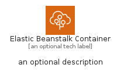
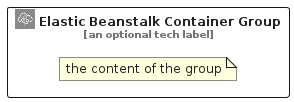

# ElasticBeanstalkContainer


```text
aws-q1-2025/Resource/GroupIcons/ElasticBeanstalkContainer
```

```text
include('aws-q1-2025/Resource/GroupIcons/ElasticBeanstalkContainer')
```


| Illustration | ElasticBeanstalkContainer | ElasticBeanstalkContainerCard | ElasticBeanstalkContainerGroup |
| :---: | :---: | :---: | :---: |
|  |  |  |  |


## Sprites
The item provides the following sriptes:

- `<$ElasticBeanstalkContainerXs>`
- `<$ElasticBeanstalkContainerSm>`
- `<$ElasticBeanstalkContainerMd>`
- `<$ElasticBeanstalkContainerLg>`


## ElasticBeanstalkContainer

### Load remotely
```plantuml
@startuml
' configures the library
!global $LIB_BASE_LOCATION="https://raw.githubusercontent.com/tmorin/plantuml-libs/master/distribution"

' loads the library's bootstrap
!include $LIB_BASE_LOCATION/bootstrap.puml

' loads the package bootstrap
include('aws-q1-2025/bootstrap')

' loads the Item which embeds the element ElasticBeanstalkContainer
include('aws-q1-2025/Resource/GroupIcons/ElasticBeanstalkContainer')

' renders the element
ElasticBeanstalkContainer('ElasticBeanstalkContainer', 'Elastic Beanstalk Container', 'an optional tech label', 'an optional description')
@enduml
```

### Load locally
```plantuml
@startuml
' configures the library
!global $INCLUSION_MODE="local"
!global $LIB_BASE_LOCATION="../../.."

' loads the library's bootstrap
!include $LIB_BASE_LOCATION/bootstrap.puml

' loads the package bootstrap
include('aws-q1-2025/bootstrap')

' loads the Item which embeds the element ElasticBeanstalkContainer
include('aws-q1-2025/Resource/GroupIcons/ElasticBeanstalkContainer')

' renders the element
ElasticBeanstalkContainer('ElasticBeanstalkContainer', 'Elastic Beanstalk Container', 'an optional tech label', 'an optional description')
@enduml
```

## ElasticBeanstalkContainerCard

### Load remotely
```plantuml
@startuml
' configures the library
!global $LIB_BASE_LOCATION="https://raw.githubusercontent.com/tmorin/plantuml-libs/master/distribution"

' loads the library's bootstrap
!include $LIB_BASE_LOCATION/bootstrap.puml

' loads the package bootstrap
include('aws-q1-2025/bootstrap')

' loads the Item which embeds the element ElasticBeanstalkContainerCard
include('aws-q1-2025/Resource/GroupIcons/ElasticBeanstalkContainer')

' renders the element
ElasticBeanstalkContainerCard('ElasticBeanstalkContainerCard', 'Elastic Beanstalk Container Card', 'an optional description')
@enduml
```

### Load locally
```plantuml
@startuml
' configures the library
!global $INCLUSION_MODE="local"
!global $LIB_BASE_LOCATION="../../.."

' loads the library's bootstrap
!include $LIB_BASE_LOCATION/bootstrap.puml

' loads the package bootstrap
include('aws-q1-2025/bootstrap')

' loads the Item which embeds the element ElasticBeanstalkContainerCard
include('aws-q1-2025/Resource/GroupIcons/ElasticBeanstalkContainer')

' renders the element
ElasticBeanstalkContainerCard('ElasticBeanstalkContainerCard', 'Elastic Beanstalk Container Card', 'an optional description')
@enduml
```

## ElasticBeanstalkContainerGroup

### Load remotely
```plantuml
@startuml
' configures the library
!global $LIB_BASE_LOCATION="https://raw.githubusercontent.com/tmorin/plantuml-libs/master/distribution"

' loads the library's bootstrap
!include $LIB_BASE_LOCATION/bootstrap.puml

' loads the package bootstrap
include('aws-q1-2025/bootstrap')

' loads the Item which embeds the element ElasticBeanstalkContainerGroup
include('aws-q1-2025/Resource/GroupIcons/ElasticBeanstalkContainer')

' renders the element
ElasticBeanstalkContainerGroup('ElasticBeanstalkContainerGroup', 'Elastic Beanstalk Container Group', 'an optional tech label') {
    note as note
        the content of the group
    end note
}
@enduml
```

### Load locally
```plantuml
@startuml
' configures the library
!global $INCLUSION_MODE="local"
!global $LIB_BASE_LOCATION="../../.."

' loads the library's bootstrap
!include $LIB_BASE_LOCATION/bootstrap.puml

' loads the package bootstrap
include('aws-q1-2025/bootstrap')

' loads the Item which embeds the element ElasticBeanstalkContainerGroup
include('aws-q1-2025/Resource/GroupIcons/ElasticBeanstalkContainer')

' renders the element
ElasticBeanstalkContainerGroup('ElasticBeanstalkContainerGroup', 'Elastic Beanstalk Container Group', 'an optional tech label') {
    note as note
        the content of the group
    end note
}
@enduml
```

