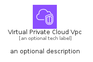
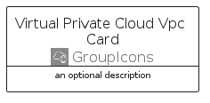
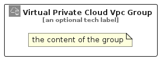

# VirtualPrivateCloudVpc


```text
aws-q1-2025/Resource/GroupIcons/VirtualPrivateCloudVpc
```

```text
include('aws-q1-2025/Resource/GroupIcons/VirtualPrivateCloudVpc')
```


| Illustration | VirtualPrivateCloudVpc | VirtualPrivateCloudVpcCard | VirtualPrivateCloudVpcGroup |
| :---: | :---: | :---: | :---: |
|  |  |  |  |


## Sprites
The item provides the following sriptes:

- `<$VirtualPrivateCloudVpcXs>`
- `<$VirtualPrivateCloudVpcSm>`
- `<$VirtualPrivateCloudVpcMd>`
- `<$VirtualPrivateCloudVpcLg>`


## VirtualPrivateCloudVpc

### Load remotely
```plantuml
@startuml
' configures the library
!global $LIB_BASE_LOCATION="https://raw.githubusercontent.com/tmorin/plantuml-libs/master/distribution"

' loads the library's bootstrap
!include $LIB_BASE_LOCATION/bootstrap.puml

' loads the package bootstrap
include('aws-q1-2025/bootstrap')

' loads the Item which embeds the element VirtualPrivateCloudVpc
include('aws-q1-2025/Resource/GroupIcons/VirtualPrivateCloudVpc')

' renders the element
VirtualPrivateCloudVpc('VirtualPrivateCloudVpc', 'Virtual Private Cloud Vpc', 'an optional tech label', 'an optional description')
@enduml
```

### Load locally
```plantuml
@startuml
' configures the library
!global $INCLUSION_MODE="local"
!global $LIB_BASE_LOCATION="../../.."

' loads the library's bootstrap
!include $LIB_BASE_LOCATION/bootstrap.puml

' loads the package bootstrap
include('aws-q1-2025/bootstrap')

' loads the Item which embeds the element VirtualPrivateCloudVpc
include('aws-q1-2025/Resource/GroupIcons/VirtualPrivateCloudVpc')

' renders the element
VirtualPrivateCloudVpc('VirtualPrivateCloudVpc', 'Virtual Private Cloud Vpc', 'an optional tech label', 'an optional description')
@enduml
```

## VirtualPrivateCloudVpcCard

### Load remotely
```plantuml
@startuml
' configures the library
!global $LIB_BASE_LOCATION="https://raw.githubusercontent.com/tmorin/plantuml-libs/master/distribution"

' loads the library's bootstrap
!include $LIB_BASE_LOCATION/bootstrap.puml

' loads the package bootstrap
include('aws-q1-2025/bootstrap')

' loads the Item which embeds the element VirtualPrivateCloudVpcCard
include('aws-q1-2025/Resource/GroupIcons/VirtualPrivateCloudVpc')

' renders the element
VirtualPrivateCloudVpcCard('VirtualPrivateCloudVpcCard', 'Virtual Private Cloud Vpc Card', 'an optional description')
@enduml
```

### Load locally
```plantuml
@startuml
' configures the library
!global $INCLUSION_MODE="local"
!global $LIB_BASE_LOCATION="../../.."

' loads the library's bootstrap
!include $LIB_BASE_LOCATION/bootstrap.puml

' loads the package bootstrap
include('aws-q1-2025/bootstrap')

' loads the Item which embeds the element VirtualPrivateCloudVpcCard
include('aws-q1-2025/Resource/GroupIcons/VirtualPrivateCloudVpc')

' renders the element
VirtualPrivateCloudVpcCard('VirtualPrivateCloudVpcCard', 'Virtual Private Cloud Vpc Card', 'an optional description')
@enduml
```

## VirtualPrivateCloudVpcGroup

### Load remotely
```plantuml
@startuml
' configures the library
!global $LIB_BASE_LOCATION="https://raw.githubusercontent.com/tmorin/plantuml-libs/master/distribution"

' loads the library's bootstrap
!include $LIB_BASE_LOCATION/bootstrap.puml

' loads the package bootstrap
include('aws-q1-2025/bootstrap')

' loads the Item which embeds the element VirtualPrivateCloudVpcGroup
include('aws-q1-2025/Resource/GroupIcons/VirtualPrivateCloudVpc')

' renders the element
VirtualPrivateCloudVpcGroup('VirtualPrivateCloudVpcGroup', 'Virtual Private Cloud Vpc Group', 'an optional tech label') {
    note as note
        the content of the group
    end note
}
@enduml
```

### Load locally
```plantuml
@startuml
' configures the library
!global $INCLUSION_MODE="local"
!global $LIB_BASE_LOCATION="../../.."

' loads the library's bootstrap
!include $LIB_BASE_LOCATION/bootstrap.puml

' loads the package bootstrap
include('aws-q1-2025/bootstrap')

' loads the Item which embeds the element VirtualPrivateCloudVpcGroup
include('aws-q1-2025/Resource/GroupIcons/VirtualPrivateCloudVpc')

' renders the element
VirtualPrivateCloudVpcGroup('VirtualPrivateCloudVpcGroup', 'Virtual Private Cloud Vpc Group', 'an optional tech label') {
    note as note
        the content of the group
    end note
}
@enduml
```

