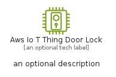

# AwsIoTThingDoorLock


```text
aws-q1-2025/Resource/IoT/AwsIoTThingDoorLock
```

```text
include('aws-q1-2025/Resource/IoT/AwsIoTThingDoorLock')
```


| Illustration | AwsIoTThingDoorLock | AwsIoTThingDoorLockCard | AwsIoTThingDoorLockGroup |
| :---: | :---: | :---: | :---: |
|  |  |  |  |


## Sprites
The item provides the following sriptes:

- `<$AwsIoTThingDoorLockXs>`
- `<$AwsIoTThingDoorLockSm>`
- `<$AwsIoTThingDoorLockMd>`
- `<$AwsIoTThingDoorLockLg>`


## AwsIoTThingDoorLock

### Load remotely
```plantuml
@startuml
' configures the library
!global $LIB_BASE_LOCATION="https://raw.githubusercontent.com/tmorin/plantuml-libs/master/distribution"

' loads the library's bootstrap
!include $LIB_BASE_LOCATION/bootstrap.puml

' loads the package bootstrap
include('aws-q1-2025/bootstrap')

' loads the Item which embeds the element AwsIoTThingDoorLock
include('aws-q1-2025/Resource/IoT/AwsIoTThingDoorLock')

' renders the element
AwsIoTThingDoorLock('AwsIoTThingDoorLock', 'Aws Io T Thing Door Lock', 'an optional tech label', 'an optional description')
@enduml
```

### Load locally
```plantuml
@startuml
' configures the library
!global $INCLUSION_MODE="local"
!global $LIB_BASE_LOCATION="../../.."

' loads the library's bootstrap
!include $LIB_BASE_LOCATION/bootstrap.puml

' loads the package bootstrap
include('aws-q1-2025/bootstrap')

' loads the Item which embeds the element AwsIoTThingDoorLock
include('aws-q1-2025/Resource/IoT/AwsIoTThingDoorLock')

' renders the element
AwsIoTThingDoorLock('AwsIoTThingDoorLock', 'Aws Io T Thing Door Lock', 'an optional tech label', 'an optional description')
@enduml
```

## AwsIoTThingDoorLockCard

### Load remotely
```plantuml
@startuml
' configures the library
!global $LIB_BASE_LOCATION="https://raw.githubusercontent.com/tmorin/plantuml-libs/master/distribution"

' loads the library's bootstrap
!include $LIB_BASE_LOCATION/bootstrap.puml

' loads the package bootstrap
include('aws-q1-2025/bootstrap')

' loads the Item which embeds the element AwsIoTThingDoorLockCard
include('aws-q1-2025/Resource/IoT/AwsIoTThingDoorLock')

' renders the element
AwsIoTThingDoorLockCard('AwsIoTThingDoorLockCard', 'Aws Io T Thing Door Lock Card', 'an optional description')
@enduml
```

### Load locally
```plantuml
@startuml
' configures the library
!global $INCLUSION_MODE="local"
!global $LIB_BASE_LOCATION="../../.."

' loads the library's bootstrap
!include $LIB_BASE_LOCATION/bootstrap.puml

' loads the package bootstrap
include('aws-q1-2025/bootstrap')

' loads the Item which embeds the element AwsIoTThingDoorLockCard
include('aws-q1-2025/Resource/IoT/AwsIoTThingDoorLock')

' renders the element
AwsIoTThingDoorLockCard('AwsIoTThingDoorLockCard', 'Aws Io T Thing Door Lock Card', 'an optional description')
@enduml
```

## AwsIoTThingDoorLockGroup

### Load remotely
```plantuml
@startuml
' configures the library
!global $LIB_BASE_LOCATION="https://raw.githubusercontent.com/tmorin/plantuml-libs/master/distribution"

' loads the library's bootstrap
!include $LIB_BASE_LOCATION/bootstrap.puml

' loads the package bootstrap
include('aws-q1-2025/bootstrap')

' loads the Item which embeds the element AwsIoTThingDoorLockGroup
include('aws-q1-2025/Resource/IoT/AwsIoTThingDoorLock')

' renders the element
AwsIoTThingDoorLockGroup('AwsIoTThingDoorLockGroup', 'Aws Io T Thing Door Lock Group', 'an optional tech label') {
    note as note
        the content of the group
    end note
}
@enduml
```

### Load locally
```plantuml
@startuml
' configures the library
!global $INCLUSION_MODE="local"
!global $LIB_BASE_LOCATION="../../.."

' loads the library's bootstrap
!include $LIB_BASE_LOCATION/bootstrap.puml

' loads the package bootstrap
include('aws-q1-2025/bootstrap')

' loads the Item which embeds the element AwsIoTThingDoorLockGroup
include('aws-q1-2025/Resource/IoT/AwsIoTThingDoorLock')

' renders the element
AwsIoTThingDoorLockGroup('AwsIoTThingDoorLockGroup', 'Aws Io T Thing Door Lock Group', 'an optional tech label') {
    note as note
        the content of the group
    end note
}
@enduml
```

