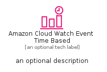

# AmazonCloudWatchEventTimeBased


```text
aws-q1-2025/Resource/ManagementGovernance/AmazonCloudWatchEventTimeBased
```

```text
include('aws-q1-2025/Resource/ManagementGovernance/AmazonCloudWatchEventTimeBased')
```


| Illustration | AmazonCloudWatchEventTimeBased | AmazonCloudWatchEventTimeBasedCard | AmazonCloudWatchEventTimeBasedGroup |
| :---: | :---: | :---: | :---: |
|  |  |  |  |


## Sprites
The item provides the following sriptes:

- `<$AmazonCloudWatchEventTimeBasedXs>`
- `<$AmazonCloudWatchEventTimeBasedSm>`
- `<$AmazonCloudWatchEventTimeBasedMd>`
- `<$AmazonCloudWatchEventTimeBasedLg>`


## AmazonCloudWatchEventTimeBased

### Load remotely
```plantuml
@startuml
' configures the library
!global $LIB_BASE_LOCATION="https://raw.githubusercontent.com/tmorin/plantuml-libs/master/distribution"

' loads the library's bootstrap
!include $LIB_BASE_LOCATION/bootstrap.puml

' loads the package bootstrap
include('aws-q1-2025/bootstrap')

' loads the Item which embeds the element AmazonCloudWatchEventTimeBased
include('aws-q1-2025/Resource/ManagementGovernance/AmazonCloudWatchEventTimeBased')

' renders the element
AmazonCloudWatchEventTimeBased('AmazonCloudWatchEventTimeBased', 'Amazon Cloud Watch Event Time Based', 'an optional tech label', 'an optional description')
@enduml
```

### Load locally
```plantuml
@startuml
' configures the library
!global $INCLUSION_MODE="local"
!global $LIB_BASE_LOCATION="../../.."

' loads the library's bootstrap
!include $LIB_BASE_LOCATION/bootstrap.puml

' loads the package bootstrap
include('aws-q1-2025/bootstrap')

' loads the Item which embeds the element AmazonCloudWatchEventTimeBased
include('aws-q1-2025/Resource/ManagementGovernance/AmazonCloudWatchEventTimeBased')

' renders the element
AmazonCloudWatchEventTimeBased('AmazonCloudWatchEventTimeBased', 'Amazon Cloud Watch Event Time Based', 'an optional tech label', 'an optional description')
@enduml
```

## AmazonCloudWatchEventTimeBasedCard

### Load remotely
```plantuml
@startuml
' configures the library
!global $LIB_BASE_LOCATION="https://raw.githubusercontent.com/tmorin/plantuml-libs/master/distribution"

' loads the library's bootstrap
!include $LIB_BASE_LOCATION/bootstrap.puml

' loads the package bootstrap
include('aws-q1-2025/bootstrap')

' loads the Item which embeds the element AmazonCloudWatchEventTimeBasedCard
include('aws-q1-2025/Resource/ManagementGovernance/AmazonCloudWatchEventTimeBased')

' renders the element
AmazonCloudWatchEventTimeBasedCard('AmazonCloudWatchEventTimeBasedCard', 'Amazon Cloud Watch Event Time Based Card', 'an optional description')
@enduml
```

### Load locally
```plantuml
@startuml
' configures the library
!global $INCLUSION_MODE="local"
!global $LIB_BASE_LOCATION="../../.."

' loads the library's bootstrap
!include $LIB_BASE_LOCATION/bootstrap.puml

' loads the package bootstrap
include('aws-q1-2025/bootstrap')

' loads the Item which embeds the element AmazonCloudWatchEventTimeBasedCard
include('aws-q1-2025/Resource/ManagementGovernance/AmazonCloudWatchEventTimeBased')

' renders the element
AmazonCloudWatchEventTimeBasedCard('AmazonCloudWatchEventTimeBasedCard', 'Amazon Cloud Watch Event Time Based Card', 'an optional description')
@enduml
```

## AmazonCloudWatchEventTimeBasedGroup

### Load remotely
```plantuml
@startuml
' configures the library
!global $LIB_BASE_LOCATION="https://raw.githubusercontent.com/tmorin/plantuml-libs/master/distribution"

' loads the library's bootstrap
!include $LIB_BASE_LOCATION/bootstrap.puml

' loads the package bootstrap
include('aws-q1-2025/bootstrap')

' loads the Item which embeds the element AmazonCloudWatchEventTimeBasedGroup
include('aws-q1-2025/Resource/ManagementGovernance/AmazonCloudWatchEventTimeBased')

' renders the element
AmazonCloudWatchEventTimeBasedGroup('AmazonCloudWatchEventTimeBasedGroup', 'Amazon Cloud Watch Event Time Based Group', 'an optional tech label') {
    note as note
        the content of the group
    end note
}
@enduml
```

### Load locally
```plantuml
@startuml
' configures the library
!global $INCLUSION_MODE="local"
!global $LIB_BASE_LOCATION="../../.."

' loads the library's bootstrap
!include $LIB_BASE_LOCATION/bootstrap.puml

' loads the package bootstrap
include('aws-q1-2025/bootstrap')

' loads the Item which embeds the element AmazonCloudWatchEventTimeBasedGroup
include('aws-q1-2025/Resource/ManagementGovernance/AmazonCloudWatchEventTimeBased')

' renders the element
AmazonCloudWatchEventTimeBasedGroup('AmazonCloudWatchEventTimeBasedGroup', 'Amazon Cloud Watch Event Time Based Group', 'an optional tech label') {
    note as note
        the content of the group
    end note
}
@enduml
```

