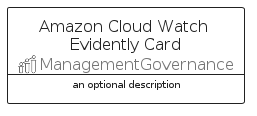
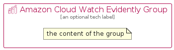

# AmazonCloudWatchEvidently


```text
aws-q1-2025/Resource/ManagementGovernance/AmazonCloudWatchEvidently
```

```text
include('aws-q1-2025/Resource/ManagementGovernance/AmazonCloudWatchEvidently')
```


| Illustration | AmazonCloudWatchEvidently | AmazonCloudWatchEvidentlyCard | AmazonCloudWatchEvidentlyGroup |
| :---: | :---: | :---: | :---: |
|  |  |  |  |


## Sprites
The item provides the following sriptes:

- `<$AmazonCloudWatchEvidentlyXs>`
- `<$AmazonCloudWatchEvidentlySm>`
- `<$AmazonCloudWatchEvidentlyMd>`
- `<$AmazonCloudWatchEvidentlyLg>`


## AmazonCloudWatchEvidently

### Load remotely
```plantuml
@startuml
' configures the library
!global $LIB_BASE_LOCATION="https://raw.githubusercontent.com/tmorin/plantuml-libs/master/distribution"

' loads the library's bootstrap
!include $LIB_BASE_LOCATION/bootstrap.puml

' loads the package bootstrap
include('aws-q1-2025/bootstrap')

' loads the Item which embeds the element AmazonCloudWatchEvidently
include('aws-q1-2025/Resource/ManagementGovernance/AmazonCloudWatchEvidently')

' renders the element
AmazonCloudWatchEvidently('AmazonCloudWatchEvidently', 'Amazon Cloud Watch Evidently', 'an optional tech label', 'an optional description')
@enduml
```

### Load locally
```plantuml
@startuml
' configures the library
!global $INCLUSION_MODE="local"
!global $LIB_BASE_LOCATION="../../.."

' loads the library's bootstrap
!include $LIB_BASE_LOCATION/bootstrap.puml

' loads the package bootstrap
include('aws-q1-2025/bootstrap')

' loads the Item which embeds the element AmazonCloudWatchEvidently
include('aws-q1-2025/Resource/ManagementGovernance/AmazonCloudWatchEvidently')

' renders the element
AmazonCloudWatchEvidently('AmazonCloudWatchEvidently', 'Amazon Cloud Watch Evidently', 'an optional tech label', 'an optional description')
@enduml
```

## AmazonCloudWatchEvidentlyCard

### Load remotely
```plantuml
@startuml
' configures the library
!global $LIB_BASE_LOCATION="https://raw.githubusercontent.com/tmorin/plantuml-libs/master/distribution"

' loads the library's bootstrap
!include $LIB_BASE_LOCATION/bootstrap.puml

' loads the package bootstrap
include('aws-q1-2025/bootstrap')

' loads the Item which embeds the element AmazonCloudWatchEvidentlyCard
include('aws-q1-2025/Resource/ManagementGovernance/AmazonCloudWatchEvidently')

' renders the element
AmazonCloudWatchEvidentlyCard('AmazonCloudWatchEvidentlyCard', 'Amazon Cloud Watch Evidently Card', 'an optional description')
@enduml
```

### Load locally
```plantuml
@startuml
' configures the library
!global $INCLUSION_MODE="local"
!global $LIB_BASE_LOCATION="../../.."

' loads the library's bootstrap
!include $LIB_BASE_LOCATION/bootstrap.puml

' loads the package bootstrap
include('aws-q1-2025/bootstrap')

' loads the Item which embeds the element AmazonCloudWatchEvidentlyCard
include('aws-q1-2025/Resource/ManagementGovernance/AmazonCloudWatchEvidently')

' renders the element
AmazonCloudWatchEvidentlyCard('AmazonCloudWatchEvidentlyCard', 'Amazon Cloud Watch Evidently Card', 'an optional description')
@enduml
```

## AmazonCloudWatchEvidentlyGroup

### Load remotely
```plantuml
@startuml
' configures the library
!global $LIB_BASE_LOCATION="https://raw.githubusercontent.com/tmorin/plantuml-libs/master/distribution"

' loads the library's bootstrap
!include $LIB_BASE_LOCATION/bootstrap.puml

' loads the package bootstrap
include('aws-q1-2025/bootstrap')

' loads the Item which embeds the element AmazonCloudWatchEvidentlyGroup
include('aws-q1-2025/Resource/ManagementGovernance/AmazonCloudWatchEvidently')

' renders the element
AmazonCloudWatchEvidentlyGroup('AmazonCloudWatchEvidentlyGroup', 'Amazon Cloud Watch Evidently Group', 'an optional tech label') {
    note as note
        the content of the group
    end note
}
@enduml
```

### Load locally
```plantuml
@startuml
' configures the library
!global $INCLUSION_MODE="local"
!global $LIB_BASE_LOCATION="../../.."

' loads the library's bootstrap
!include $LIB_BASE_LOCATION/bootstrap.puml

' loads the package bootstrap
include('aws-q1-2025/bootstrap')

' loads the Item which embeds the element AmazonCloudWatchEvidentlyGroup
include('aws-q1-2025/Resource/ManagementGovernance/AmazonCloudWatchEvidently')

' renders the element
AmazonCloudWatchEvidentlyGroup('AmazonCloudWatchEvidentlyGroup', 'Amazon Cloud Watch Evidently Group', 'an optional tech label') {
    note as note
        the content of the group
    end note
}
@enduml
```

