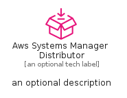

# AwsSystemsManagerDistributor


```text
aws-q1-2025/Resource/ManagementGovernance/AwsSystemsManagerDistributor
```

```text
include('aws-q1-2025/Resource/ManagementGovernance/AwsSystemsManagerDistributor')
```


| Illustration | AwsSystemsManagerDistributor | AwsSystemsManagerDistributorCard | AwsSystemsManagerDistributorGroup |
| :---: | :---: | :---: | :---: |
|  |  |  |  |


## Sprites
The item provides the following sriptes:

- `<$AwsSystemsManagerDistributorXs>`
- `<$AwsSystemsManagerDistributorSm>`
- `<$AwsSystemsManagerDistributorMd>`
- `<$AwsSystemsManagerDistributorLg>`


## AwsSystemsManagerDistributor

### Load remotely
```plantuml
@startuml
' configures the library
!global $LIB_BASE_LOCATION="https://raw.githubusercontent.com/tmorin/plantuml-libs/master/distribution"

' loads the library's bootstrap
!include $LIB_BASE_LOCATION/bootstrap.puml

' loads the package bootstrap
include('aws-q1-2025/bootstrap')

' loads the Item which embeds the element AwsSystemsManagerDistributor
include('aws-q1-2025/Resource/ManagementGovernance/AwsSystemsManagerDistributor')

' renders the element
AwsSystemsManagerDistributor('AwsSystemsManagerDistributor', 'Aws Systems Manager Distributor', 'an optional tech label', 'an optional description')
@enduml
```

### Load locally
```plantuml
@startuml
' configures the library
!global $INCLUSION_MODE="local"
!global $LIB_BASE_LOCATION="../../.."

' loads the library's bootstrap
!include $LIB_BASE_LOCATION/bootstrap.puml

' loads the package bootstrap
include('aws-q1-2025/bootstrap')

' loads the Item which embeds the element AwsSystemsManagerDistributor
include('aws-q1-2025/Resource/ManagementGovernance/AwsSystemsManagerDistributor')

' renders the element
AwsSystemsManagerDistributor('AwsSystemsManagerDistributor', 'Aws Systems Manager Distributor', 'an optional tech label', 'an optional description')
@enduml
```

## AwsSystemsManagerDistributorCard

### Load remotely
```plantuml
@startuml
' configures the library
!global $LIB_BASE_LOCATION="https://raw.githubusercontent.com/tmorin/plantuml-libs/master/distribution"

' loads the library's bootstrap
!include $LIB_BASE_LOCATION/bootstrap.puml

' loads the package bootstrap
include('aws-q1-2025/bootstrap')

' loads the Item which embeds the element AwsSystemsManagerDistributorCard
include('aws-q1-2025/Resource/ManagementGovernance/AwsSystemsManagerDistributor')

' renders the element
AwsSystemsManagerDistributorCard('AwsSystemsManagerDistributorCard', 'Aws Systems Manager Distributor Card', 'an optional description')
@enduml
```

### Load locally
```plantuml
@startuml
' configures the library
!global $INCLUSION_MODE="local"
!global $LIB_BASE_LOCATION="../../.."

' loads the library's bootstrap
!include $LIB_BASE_LOCATION/bootstrap.puml

' loads the package bootstrap
include('aws-q1-2025/bootstrap')

' loads the Item which embeds the element AwsSystemsManagerDistributorCard
include('aws-q1-2025/Resource/ManagementGovernance/AwsSystemsManagerDistributor')

' renders the element
AwsSystemsManagerDistributorCard('AwsSystemsManagerDistributorCard', 'Aws Systems Manager Distributor Card', 'an optional description')
@enduml
```

## AwsSystemsManagerDistributorGroup

### Load remotely
```plantuml
@startuml
' configures the library
!global $LIB_BASE_LOCATION="https://raw.githubusercontent.com/tmorin/plantuml-libs/master/distribution"

' loads the library's bootstrap
!include $LIB_BASE_LOCATION/bootstrap.puml

' loads the package bootstrap
include('aws-q1-2025/bootstrap')

' loads the Item which embeds the element AwsSystemsManagerDistributorGroup
include('aws-q1-2025/Resource/ManagementGovernance/AwsSystemsManagerDistributor')

' renders the element
AwsSystemsManagerDistributorGroup('AwsSystemsManagerDistributorGroup', 'Aws Systems Manager Distributor Group', 'an optional tech label') {
    note as note
        the content of the group
    end note
}
@enduml
```

### Load locally
```plantuml
@startuml
' configures the library
!global $INCLUSION_MODE="local"
!global $LIB_BASE_LOCATION="../../.."

' loads the library's bootstrap
!include $LIB_BASE_LOCATION/bootstrap.puml

' loads the package bootstrap
include('aws-q1-2025/bootstrap')

' loads the Item which embeds the element AwsSystemsManagerDistributorGroup
include('aws-q1-2025/Resource/ManagementGovernance/AwsSystemsManagerDistributor')

' renders the element
AwsSystemsManagerDistributorGroup('AwsSystemsManagerDistributorGroup', 'Aws Systems Manager Distributor Group', 'an optional tech label') {
    note as note
        the content of the group
    end note
}
@enduml
```

