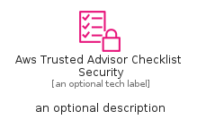
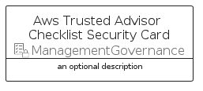

# AwsTrustedAdvisorChecklistSecurity


```text
aws-q1-2025/Resource/ManagementGovernance/AwsTrustedAdvisorChecklistSecurity
```

```text
include('aws-q1-2025/Resource/ManagementGovernance/AwsTrustedAdvisorChecklistSecurity')
```


| Illustration | AwsTrustedAdvisorChecklistSecurity | AwsTrustedAdvisorChecklistSecurityCard | AwsTrustedAdvisorChecklistSecurityGroup |
| :---: | :---: | :---: | :---: |
|  |  |  |  |


## Sprites
The item provides the following sriptes:

- `<$AwsTrustedAdvisorChecklistSecurityXs>`
- `<$AwsTrustedAdvisorChecklistSecuritySm>`
- `<$AwsTrustedAdvisorChecklistSecurityMd>`
- `<$AwsTrustedAdvisorChecklistSecurityLg>`


## AwsTrustedAdvisorChecklistSecurity

### Load remotely
```plantuml
@startuml
' configures the library
!global $LIB_BASE_LOCATION="https://raw.githubusercontent.com/tmorin/plantuml-libs/master/distribution"

' loads the library's bootstrap
!include $LIB_BASE_LOCATION/bootstrap.puml

' loads the package bootstrap
include('aws-q1-2025/bootstrap')

' loads the Item which embeds the element AwsTrustedAdvisorChecklistSecurity
include('aws-q1-2025/Resource/ManagementGovernance/AwsTrustedAdvisorChecklistSecurity')

' renders the element
AwsTrustedAdvisorChecklistSecurity('AwsTrustedAdvisorChecklistSecurity', 'Aws Trusted Advisor Checklist Security', 'an optional tech label', 'an optional description')
@enduml
```

### Load locally
```plantuml
@startuml
' configures the library
!global $INCLUSION_MODE="local"
!global $LIB_BASE_LOCATION="../../.."

' loads the library's bootstrap
!include $LIB_BASE_LOCATION/bootstrap.puml

' loads the package bootstrap
include('aws-q1-2025/bootstrap')

' loads the Item which embeds the element AwsTrustedAdvisorChecklistSecurity
include('aws-q1-2025/Resource/ManagementGovernance/AwsTrustedAdvisorChecklistSecurity')

' renders the element
AwsTrustedAdvisorChecklistSecurity('AwsTrustedAdvisorChecklistSecurity', 'Aws Trusted Advisor Checklist Security', 'an optional tech label', 'an optional description')
@enduml
```

## AwsTrustedAdvisorChecklistSecurityCard

### Load remotely
```plantuml
@startuml
' configures the library
!global $LIB_BASE_LOCATION="https://raw.githubusercontent.com/tmorin/plantuml-libs/master/distribution"

' loads the library's bootstrap
!include $LIB_BASE_LOCATION/bootstrap.puml

' loads the package bootstrap
include('aws-q1-2025/bootstrap')

' loads the Item which embeds the element AwsTrustedAdvisorChecklistSecurityCard
include('aws-q1-2025/Resource/ManagementGovernance/AwsTrustedAdvisorChecklistSecurity')

' renders the element
AwsTrustedAdvisorChecklistSecurityCard('AwsTrustedAdvisorChecklistSecurityCard', 'Aws Trusted Advisor Checklist Security Card', 'an optional description')
@enduml
```

### Load locally
```plantuml
@startuml
' configures the library
!global $INCLUSION_MODE="local"
!global $LIB_BASE_LOCATION="../../.."

' loads the library's bootstrap
!include $LIB_BASE_LOCATION/bootstrap.puml

' loads the package bootstrap
include('aws-q1-2025/bootstrap')

' loads the Item which embeds the element AwsTrustedAdvisorChecklistSecurityCard
include('aws-q1-2025/Resource/ManagementGovernance/AwsTrustedAdvisorChecklistSecurity')

' renders the element
AwsTrustedAdvisorChecklistSecurityCard('AwsTrustedAdvisorChecklistSecurityCard', 'Aws Trusted Advisor Checklist Security Card', 'an optional description')
@enduml
```

## AwsTrustedAdvisorChecklistSecurityGroup

### Load remotely
```plantuml
@startuml
' configures the library
!global $LIB_BASE_LOCATION="https://raw.githubusercontent.com/tmorin/plantuml-libs/master/distribution"

' loads the library's bootstrap
!include $LIB_BASE_LOCATION/bootstrap.puml

' loads the package bootstrap
include('aws-q1-2025/bootstrap')

' loads the Item which embeds the element AwsTrustedAdvisorChecklistSecurityGroup
include('aws-q1-2025/Resource/ManagementGovernance/AwsTrustedAdvisorChecklistSecurity')

' renders the element
AwsTrustedAdvisorChecklistSecurityGroup('AwsTrustedAdvisorChecklistSecurityGroup', 'Aws Trusted Advisor Checklist Security Group', 'an optional tech label') {
    note as note
        the content of the group
    end note
}
@enduml
```

### Load locally
```plantuml
@startuml
' configures the library
!global $INCLUSION_MODE="local"
!global $LIB_BASE_LOCATION="../../.."

' loads the library's bootstrap
!include $LIB_BASE_LOCATION/bootstrap.puml

' loads the package bootstrap
include('aws-q1-2025/bootstrap')

' loads the Item which embeds the element AwsTrustedAdvisorChecklistSecurityGroup
include('aws-q1-2025/Resource/ManagementGovernance/AwsTrustedAdvisorChecklistSecurity')

' renders the element
AwsTrustedAdvisorChecklistSecurityGroup('AwsTrustedAdvisorChecklistSecurityGroup', 'Aws Trusted Advisor Checklist Security Group', 'an optional tech label') {
    note as note
        the content of the group
    end note
}
@enduml
```

