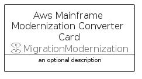

# AwsMainframeModernizationConverter


```text
aws-q1-2025/Resource/MigrationModernization/AwsMainframeModernizationConverter
```

```text
include('aws-q1-2025/Resource/MigrationModernization/AwsMainframeModernizationConverter')
```


| Illustration | AwsMainframeModernizationConverter | AwsMainframeModernizationConverterCard | AwsMainframeModernizationConverterGroup |
| :---: | :---: | :---: | :---: |
|  |  |  |  |


## Sprites
The item provides the following sriptes:

- `<$AwsMainframeModernizationConverterXs>`
- `<$AwsMainframeModernizationConverterSm>`
- `<$AwsMainframeModernizationConverterMd>`
- `<$AwsMainframeModernizationConverterLg>`


## AwsMainframeModernizationConverter

### Load remotely
```plantuml
@startuml
' configures the library
!global $LIB_BASE_LOCATION="https://raw.githubusercontent.com/tmorin/plantuml-libs/master/distribution"

' loads the library's bootstrap
!include $LIB_BASE_LOCATION/bootstrap.puml

' loads the package bootstrap
include('aws-q1-2025/bootstrap')

' loads the Item which embeds the element AwsMainframeModernizationConverter
include('aws-q1-2025/Resource/MigrationModernization/AwsMainframeModernizationConverter')

' renders the element
AwsMainframeModernizationConverter('AwsMainframeModernizationConverter', 'Aws Mainframe Modernization Converter', 'an optional tech label', 'an optional description')
@enduml
```

### Load locally
```plantuml
@startuml
' configures the library
!global $INCLUSION_MODE="local"
!global $LIB_BASE_LOCATION="../../.."

' loads the library's bootstrap
!include $LIB_BASE_LOCATION/bootstrap.puml

' loads the package bootstrap
include('aws-q1-2025/bootstrap')

' loads the Item which embeds the element AwsMainframeModernizationConverter
include('aws-q1-2025/Resource/MigrationModernization/AwsMainframeModernizationConverter')

' renders the element
AwsMainframeModernizationConverter('AwsMainframeModernizationConverter', 'Aws Mainframe Modernization Converter', 'an optional tech label', 'an optional description')
@enduml
```

## AwsMainframeModernizationConverterCard

### Load remotely
```plantuml
@startuml
' configures the library
!global $LIB_BASE_LOCATION="https://raw.githubusercontent.com/tmorin/plantuml-libs/master/distribution"

' loads the library's bootstrap
!include $LIB_BASE_LOCATION/bootstrap.puml

' loads the package bootstrap
include('aws-q1-2025/bootstrap')

' loads the Item which embeds the element AwsMainframeModernizationConverterCard
include('aws-q1-2025/Resource/MigrationModernization/AwsMainframeModernizationConverter')

' renders the element
AwsMainframeModernizationConverterCard('AwsMainframeModernizationConverterCard', 'Aws Mainframe Modernization Converter Card', 'an optional description')
@enduml
```

### Load locally
```plantuml
@startuml
' configures the library
!global $INCLUSION_MODE="local"
!global $LIB_BASE_LOCATION="../../.."

' loads the library's bootstrap
!include $LIB_BASE_LOCATION/bootstrap.puml

' loads the package bootstrap
include('aws-q1-2025/bootstrap')

' loads the Item which embeds the element AwsMainframeModernizationConverterCard
include('aws-q1-2025/Resource/MigrationModernization/AwsMainframeModernizationConverter')

' renders the element
AwsMainframeModernizationConverterCard('AwsMainframeModernizationConverterCard', 'Aws Mainframe Modernization Converter Card', 'an optional description')
@enduml
```

## AwsMainframeModernizationConverterGroup

### Load remotely
```plantuml
@startuml
' configures the library
!global $LIB_BASE_LOCATION="https://raw.githubusercontent.com/tmorin/plantuml-libs/master/distribution"

' loads the library's bootstrap
!include $LIB_BASE_LOCATION/bootstrap.puml

' loads the package bootstrap
include('aws-q1-2025/bootstrap')

' loads the Item which embeds the element AwsMainframeModernizationConverterGroup
include('aws-q1-2025/Resource/MigrationModernization/AwsMainframeModernizationConverter')

' renders the element
AwsMainframeModernizationConverterGroup('AwsMainframeModernizationConverterGroup', 'Aws Mainframe Modernization Converter Group', 'an optional tech label') {
    note as note
        the content of the group
    end note
}
@enduml
```

### Load locally
```plantuml
@startuml
' configures the library
!global $INCLUSION_MODE="local"
!global $LIB_BASE_LOCATION="../../.."

' loads the library's bootstrap
!include $LIB_BASE_LOCATION/bootstrap.puml

' loads the package bootstrap
include('aws-q1-2025/bootstrap')

' loads the Item which embeds the element AwsMainframeModernizationConverterGroup
include('aws-q1-2025/Resource/MigrationModernization/AwsMainframeModernizationConverter')

' renders the element
AwsMainframeModernizationConverterGroup('AwsMainframeModernizationConverterGroup', 'Aws Mainframe Modernization Converter Group', 'an optional tech label') {
    note as note
        the content of the group
    end note
}
@enduml
```

