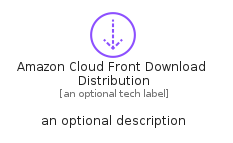
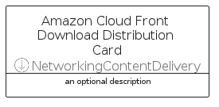

# AmazonCloudFrontDownloadDistribution


```text
aws-q1-2025/Resource/NetworkingContentDelivery/AmazonCloudFrontDownloadDistribution
```

```text
include('aws-q1-2025/Resource/NetworkingContentDelivery/AmazonCloudFrontDownloadDistribution')
```


| Illustration | AmazonCloudFrontDownloadDistribution | AmazonCloudFrontDownloadDistributionCard | AmazonCloudFrontDownloadDistributionGroup |
| :---: | :---: | :---: | :---: |
|  |  |  |  |


## Sprites
The item provides the following sriptes:

- `<$AmazonCloudFrontDownloadDistributionXs>`
- `<$AmazonCloudFrontDownloadDistributionSm>`
- `<$AmazonCloudFrontDownloadDistributionMd>`
- `<$AmazonCloudFrontDownloadDistributionLg>`


## AmazonCloudFrontDownloadDistribution

### Load remotely
```plantuml
@startuml
' configures the library
!global $LIB_BASE_LOCATION="https://raw.githubusercontent.com/tmorin/plantuml-libs/master/distribution"

' loads the library's bootstrap
!include $LIB_BASE_LOCATION/bootstrap.puml

' loads the package bootstrap
include('aws-q1-2025/bootstrap')

' loads the Item which embeds the element AmazonCloudFrontDownloadDistribution
include('aws-q1-2025/Resource/NetworkingContentDelivery/AmazonCloudFrontDownloadDistribution')

' renders the element
AmazonCloudFrontDownloadDistribution('AmazonCloudFrontDownloadDistribution', 'Amazon Cloud Front Download Distribution', 'an optional tech label', 'an optional description')
@enduml
```

### Load locally
```plantuml
@startuml
' configures the library
!global $INCLUSION_MODE="local"
!global $LIB_BASE_LOCATION="../../.."

' loads the library's bootstrap
!include $LIB_BASE_LOCATION/bootstrap.puml

' loads the package bootstrap
include('aws-q1-2025/bootstrap')

' loads the Item which embeds the element AmazonCloudFrontDownloadDistribution
include('aws-q1-2025/Resource/NetworkingContentDelivery/AmazonCloudFrontDownloadDistribution')

' renders the element
AmazonCloudFrontDownloadDistribution('AmazonCloudFrontDownloadDistribution', 'Amazon Cloud Front Download Distribution', 'an optional tech label', 'an optional description')
@enduml
```

## AmazonCloudFrontDownloadDistributionCard

### Load remotely
```plantuml
@startuml
' configures the library
!global $LIB_BASE_LOCATION="https://raw.githubusercontent.com/tmorin/plantuml-libs/master/distribution"

' loads the library's bootstrap
!include $LIB_BASE_LOCATION/bootstrap.puml

' loads the package bootstrap
include('aws-q1-2025/bootstrap')

' loads the Item which embeds the element AmazonCloudFrontDownloadDistributionCard
include('aws-q1-2025/Resource/NetworkingContentDelivery/AmazonCloudFrontDownloadDistribution')

' renders the element
AmazonCloudFrontDownloadDistributionCard('AmazonCloudFrontDownloadDistributionCard', 'Amazon Cloud Front Download Distribution Card', 'an optional description')
@enduml
```

### Load locally
```plantuml
@startuml
' configures the library
!global $INCLUSION_MODE="local"
!global $LIB_BASE_LOCATION="../../.."

' loads the library's bootstrap
!include $LIB_BASE_LOCATION/bootstrap.puml

' loads the package bootstrap
include('aws-q1-2025/bootstrap')

' loads the Item which embeds the element AmazonCloudFrontDownloadDistributionCard
include('aws-q1-2025/Resource/NetworkingContentDelivery/AmazonCloudFrontDownloadDistribution')

' renders the element
AmazonCloudFrontDownloadDistributionCard('AmazonCloudFrontDownloadDistributionCard', 'Amazon Cloud Front Download Distribution Card', 'an optional description')
@enduml
```

## AmazonCloudFrontDownloadDistributionGroup

### Load remotely
```plantuml
@startuml
' configures the library
!global $LIB_BASE_LOCATION="https://raw.githubusercontent.com/tmorin/plantuml-libs/master/distribution"

' loads the library's bootstrap
!include $LIB_BASE_LOCATION/bootstrap.puml

' loads the package bootstrap
include('aws-q1-2025/bootstrap')

' loads the Item which embeds the element AmazonCloudFrontDownloadDistributionGroup
include('aws-q1-2025/Resource/NetworkingContentDelivery/AmazonCloudFrontDownloadDistribution')

' renders the element
AmazonCloudFrontDownloadDistributionGroup('AmazonCloudFrontDownloadDistributionGroup', 'Amazon Cloud Front Download Distribution Group', 'an optional tech label') {
    note as note
        the content of the group
    end note
}
@enduml
```

### Load locally
```plantuml
@startuml
' configures the library
!global $INCLUSION_MODE="local"
!global $LIB_BASE_LOCATION="../../.."

' loads the library's bootstrap
!include $LIB_BASE_LOCATION/bootstrap.puml

' loads the package bootstrap
include('aws-q1-2025/bootstrap')

' loads the Item which embeds the element AmazonCloudFrontDownloadDistributionGroup
include('aws-q1-2025/Resource/NetworkingContentDelivery/AmazonCloudFrontDownloadDistribution')

' renders the element
AmazonCloudFrontDownloadDistributionGroup('AmazonCloudFrontDownloadDistributionGroup', 'Amazon Cloud Front Download Distribution Group', 'an optional tech label') {
    note as note
        the content of the group
    end note
}
@enduml
```

