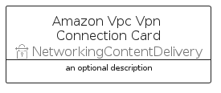

# AmazonVpcVpnConnection


```text
aws-q1-2025/Resource/NetworkingContentDelivery/AmazonVpcVpnConnection
```

```text
include('aws-q1-2025/Resource/NetworkingContentDelivery/AmazonVpcVpnConnection')
```


| Illustration | AmazonVpcVpnConnection | AmazonVpcVpnConnectionCard | AmazonVpcVpnConnectionGroup |
| :---: | :---: | :---: | :---: |
|  |  |  |  |


## Sprites
The item provides the following sriptes:

- `<$AmazonVpcVpnConnectionXs>`
- `<$AmazonVpcVpnConnectionSm>`
- `<$AmazonVpcVpnConnectionMd>`
- `<$AmazonVpcVpnConnectionLg>`


## AmazonVpcVpnConnection

### Load remotely
```plantuml
@startuml
' configures the library
!global $LIB_BASE_LOCATION="https://raw.githubusercontent.com/tmorin/plantuml-libs/master/distribution"

' loads the library's bootstrap
!include $LIB_BASE_LOCATION/bootstrap.puml

' loads the package bootstrap
include('aws-q1-2025/bootstrap')

' loads the Item which embeds the element AmazonVpcVpnConnection
include('aws-q1-2025/Resource/NetworkingContentDelivery/AmazonVpcVpnConnection')

' renders the element
AmazonVpcVpnConnection('AmazonVpcVpnConnection', 'Amazon Vpc Vpn Connection', 'an optional tech label', 'an optional description')
@enduml
```

### Load locally
```plantuml
@startuml
' configures the library
!global $INCLUSION_MODE="local"
!global $LIB_BASE_LOCATION="../../.."

' loads the library's bootstrap
!include $LIB_BASE_LOCATION/bootstrap.puml

' loads the package bootstrap
include('aws-q1-2025/bootstrap')

' loads the Item which embeds the element AmazonVpcVpnConnection
include('aws-q1-2025/Resource/NetworkingContentDelivery/AmazonVpcVpnConnection')

' renders the element
AmazonVpcVpnConnection('AmazonVpcVpnConnection', 'Amazon Vpc Vpn Connection', 'an optional tech label', 'an optional description')
@enduml
```

## AmazonVpcVpnConnectionCard

### Load remotely
```plantuml
@startuml
' configures the library
!global $LIB_BASE_LOCATION="https://raw.githubusercontent.com/tmorin/plantuml-libs/master/distribution"

' loads the library's bootstrap
!include $LIB_BASE_LOCATION/bootstrap.puml

' loads the package bootstrap
include('aws-q1-2025/bootstrap')

' loads the Item which embeds the element AmazonVpcVpnConnectionCard
include('aws-q1-2025/Resource/NetworkingContentDelivery/AmazonVpcVpnConnection')

' renders the element
AmazonVpcVpnConnectionCard('AmazonVpcVpnConnectionCard', 'Amazon Vpc Vpn Connection Card', 'an optional description')
@enduml
```

### Load locally
```plantuml
@startuml
' configures the library
!global $INCLUSION_MODE="local"
!global $LIB_BASE_LOCATION="../../.."

' loads the library's bootstrap
!include $LIB_BASE_LOCATION/bootstrap.puml

' loads the package bootstrap
include('aws-q1-2025/bootstrap')

' loads the Item which embeds the element AmazonVpcVpnConnectionCard
include('aws-q1-2025/Resource/NetworkingContentDelivery/AmazonVpcVpnConnection')

' renders the element
AmazonVpcVpnConnectionCard('AmazonVpcVpnConnectionCard', 'Amazon Vpc Vpn Connection Card', 'an optional description')
@enduml
```

## AmazonVpcVpnConnectionGroup

### Load remotely
```plantuml
@startuml
' configures the library
!global $LIB_BASE_LOCATION="https://raw.githubusercontent.com/tmorin/plantuml-libs/master/distribution"

' loads the library's bootstrap
!include $LIB_BASE_LOCATION/bootstrap.puml

' loads the package bootstrap
include('aws-q1-2025/bootstrap')

' loads the Item which embeds the element AmazonVpcVpnConnectionGroup
include('aws-q1-2025/Resource/NetworkingContentDelivery/AmazonVpcVpnConnection')

' renders the element
AmazonVpcVpnConnectionGroup('AmazonVpcVpnConnectionGroup', 'Amazon Vpc Vpn Connection Group', 'an optional tech label') {
    note as note
        the content of the group
    end note
}
@enduml
```

### Load locally
```plantuml
@startuml
' configures the library
!global $INCLUSION_MODE="local"
!global $LIB_BASE_LOCATION="../../.."

' loads the library's bootstrap
!include $LIB_BASE_LOCATION/bootstrap.puml

' loads the package bootstrap
include('aws-q1-2025/bootstrap')

' loads the Item which embeds the element AmazonVpcVpnConnectionGroup
include('aws-q1-2025/Resource/NetworkingContentDelivery/AmazonVpcVpnConnection')

' renders the element
AmazonVpcVpnConnectionGroup('AmazonVpcVpnConnectionGroup', 'Amazon Vpc Vpn Connection Group', 'an optional tech label') {
    note as note
        the content of the group
    end note
}
@enduml
```

