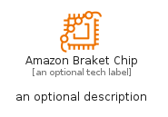
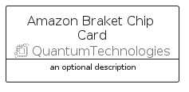

# AmazonBraketChip


```text
aws-q1-2025/Resource/QuantumTechnologies/AmazonBraketChip
```

```text
include('aws-q1-2025/Resource/QuantumTechnologies/AmazonBraketChip')
```


| Illustration | AmazonBraketChip | AmazonBraketChipCard | AmazonBraketChipGroup |
| :---: | :---: | :---: | :---: |
|  |  |  |  |


## Sprites
The item provides the following sriptes:

- `<$AmazonBraketChipXs>`
- `<$AmazonBraketChipSm>`
- `<$AmazonBraketChipMd>`
- `<$AmazonBraketChipLg>`


## AmazonBraketChip

### Load remotely
```plantuml
@startuml
' configures the library
!global $LIB_BASE_LOCATION="https://raw.githubusercontent.com/tmorin/plantuml-libs/master/distribution"

' loads the library's bootstrap
!include $LIB_BASE_LOCATION/bootstrap.puml

' loads the package bootstrap
include('aws-q1-2025/bootstrap')

' loads the Item which embeds the element AmazonBraketChip
include('aws-q1-2025/Resource/QuantumTechnologies/AmazonBraketChip')

' renders the element
AmazonBraketChip('AmazonBraketChip', 'Amazon Braket Chip', 'an optional tech label', 'an optional description')
@enduml
```

### Load locally
```plantuml
@startuml
' configures the library
!global $INCLUSION_MODE="local"
!global $LIB_BASE_LOCATION="../../.."

' loads the library's bootstrap
!include $LIB_BASE_LOCATION/bootstrap.puml

' loads the package bootstrap
include('aws-q1-2025/bootstrap')

' loads the Item which embeds the element AmazonBraketChip
include('aws-q1-2025/Resource/QuantumTechnologies/AmazonBraketChip')

' renders the element
AmazonBraketChip('AmazonBraketChip', 'Amazon Braket Chip', 'an optional tech label', 'an optional description')
@enduml
```

## AmazonBraketChipCard

### Load remotely
```plantuml
@startuml
' configures the library
!global $LIB_BASE_LOCATION="https://raw.githubusercontent.com/tmorin/plantuml-libs/master/distribution"

' loads the library's bootstrap
!include $LIB_BASE_LOCATION/bootstrap.puml

' loads the package bootstrap
include('aws-q1-2025/bootstrap')

' loads the Item which embeds the element AmazonBraketChipCard
include('aws-q1-2025/Resource/QuantumTechnologies/AmazonBraketChip')

' renders the element
AmazonBraketChipCard('AmazonBraketChipCard', 'Amazon Braket Chip Card', 'an optional description')
@enduml
```

### Load locally
```plantuml
@startuml
' configures the library
!global $INCLUSION_MODE="local"
!global $LIB_BASE_LOCATION="../../.."

' loads the library's bootstrap
!include $LIB_BASE_LOCATION/bootstrap.puml

' loads the package bootstrap
include('aws-q1-2025/bootstrap')

' loads the Item which embeds the element AmazonBraketChipCard
include('aws-q1-2025/Resource/QuantumTechnologies/AmazonBraketChip')

' renders the element
AmazonBraketChipCard('AmazonBraketChipCard', 'Amazon Braket Chip Card', 'an optional description')
@enduml
```

## AmazonBraketChipGroup

### Load remotely
```plantuml
@startuml
' configures the library
!global $LIB_BASE_LOCATION="https://raw.githubusercontent.com/tmorin/plantuml-libs/master/distribution"

' loads the library's bootstrap
!include $LIB_BASE_LOCATION/bootstrap.puml

' loads the package bootstrap
include('aws-q1-2025/bootstrap')

' loads the Item which embeds the element AmazonBraketChipGroup
include('aws-q1-2025/Resource/QuantumTechnologies/AmazonBraketChip')

' renders the element
AmazonBraketChipGroup('AmazonBraketChipGroup', 'Amazon Braket Chip Group', 'an optional tech label') {
    note as note
        the content of the group
    end note
}
@enduml
```

### Load locally
```plantuml
@startuml
' configures the library
!global $INCLUSION_MODE="local"
!global $LIB_BASE_LOCATION="../../.."

' loads the library's bootstrap
!include $LIB_BASE_LOCATION/bootstrap.puml

' loads the package bootstrap
include('aws-q1-2025/bootstrap')

' loads the Item which embeds the element AmazonBraketChipGroup
include('aws-q1-2025/Resource/QuantumTechnologies/AmazonBraketChip')

' renders the element
AmazonBraketChipGroup('AmazonBraketChipGroup', 'Amazon Braket Chip Group', 'an optional tech label') {
    note as note
        the content of the group
    end note
}
@enduml
```

