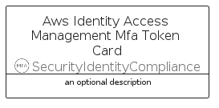

# AwsIdentityAccessManagementMfaToken


```text
aws-q1-2025/Resource/SecurityIdentityCompliance/AwsIdentityAccessManagementMfaToken
```

```text
include('aws-q1-2025/Resource/SecurityIdentityCompliance/AwsIdentityAccessManagementMfaToken')
```


| Illustration | AwsIdentityAccessManagementMfaToken | AwsIdentityAccessManagementMfaTokenCard | AwsIdentityAccessManagementMfaTokenGroup |
| :---: | :---: | :---: | :---: |
|  |  |  |  |


## Sprites
The item provides the following sriptes:

- `<$AwsIdentityAccessManagementMfaTokenXs>`
- `<$AwsIdentityAccessManagementMfaTokenSm>`
- `<$AwsIdentityAccessManagementMfaTokenMd>`
- `<$AwsIdentityAccessManagementMfaTokenLg>`


## AwsIdentityAccessManagementMfaToken

### Load remotely
```plantuml
@startuml
' configures the library
!global $LIB_BASE_LOCATION="https://raw.githubusercontent.com/tmorin/plantuml-libs/master/distribution"

' loads the library's bootstrap
!include $LIB_BASE_LOCATION/bootstrap.puml

' loads the package bootstrap
include('aws-q1-2025/bootstrap')

' loads the Item which embeds the element AwsIdentityAccessManagementMfaToken
include('aws-q1-2025/Resource/SecurityIdentityCompliance/AwsIdentityAccessManagementMfaToken')

' renders the element
AwsIdentityAccessManagementMfaToken('AwsIdentityAccessManagementMfaToken', 'Aws Identity Access Management Mfa Token', 'an optional tech label', 'an optional description')
@enduml
```

### Load locally
```plantuml
@startuml
' configures the library
!global $INCLUSION_MODE="local"
!global $LIB_BASE_LOCATION="../../.."

' loads the library's bootstrap
!include $LIB_BASE_LOCATION/bootstrap.puml

' loads the package bootstrap
include('aws-q1-2025/bootstrap')

' loads the Item which embeds the element AwsIdentityAccessManagementMfaToken
include('aws-q1-2025/Resource/SecurityIdentityCompliance/AwsIdentityAccessManagementMfaToken')

' renders the element
AwsIdentityAccessManagementMfaToken('AwsIdentityAccessManagementMfaToken', 'Aws Identity Access Management Mfa Token', 'an optional tech label', 'an optional description')
@enduml
```

## AwsIdentityAccessManagementMfaTokenCard

### Load remotely
```plantuml
@startuml
' configures the library
!global $LIB_BASE_LOCATION="https://raw.githubusercontent.com/tmorin/plantuml-libs/master/distribution"

' loads the library's bootstrap
!include $LIB_BASE_LOCATION/bootstrap.puml

' loads the package bootstrap
include('aws-q1-2025/bootstrap')

' loads the Item which embeds the element AwsIdentityAccessManagementMfaTokenCard
include('aws-q1-2025/Resource/SecurityIdentityCompliance/AwsIdentityAccessManagementMfaToken')

' renders the element
AwsIdentityAccessManagementMfaTokenCard('AwsIdentityAccessManagementMfaTokenCard', 'Aws Identity Access Management Mfa Token Card', 'an optional description')
@enduml
```

### Load locally
```plantuml
@startuml
' configures the library
!global $INCLUSION_MODE="local"
!global $LIB_BASE_LOCATION="../../.."

' loads the library's bootstrap
!include $LIB_BASE_LOCATION/bootstrap.puml

' loads the package bootstrap
include('aws-q1-2025/bootstrap')

' loads the Item which embeds the element AwsIdentityAccessManagementMfaTokenCard
include('aws-q1-2025/Resource/SecurityIdentityCompliance/AwsIdentityAccessManagementMfaToken')

' renders the element
AwsIdentityAccessManagementMfaTokenCard('AwsIdentityAccessManagementMfaTokenCard', 'Aws Identity Access Management Mfa Token Card', 'an optional description')
@enduml
```

## AwsIdentityAccessManagementMfaTokenGroup

### Load remotely
```plantuml
@startuml
' configures the library
!global $LIB_BASE_LOCATION="https://raw.githubusercontent.com/tmorin/plantuml-libs/master/distribution"

' loads the library's bootstrap
!include $LIB_BASE_LOCATION/bootstrap.puml

' loads the package bootstrap
include('aws-q1-2025/bootstrap')

' loads the Item which embeds the element AwsIdentityAccessManagementMfaTokenGroup
include('aws-q1-2025/Resource/SecurityIdentityCompliance/AwsIdentityAccessManagementMfaToken')

' renders the element
AwsIdentityAccessManagementMfaTokenGroup('AwsIdentityAccessManagementMfaTokenGroup', 'Aws Identity Access Management Mfa Token Group', 'an optional tech label') {
    note as note
        the content of the group
    end note
}
@enduml
```

### Load locally
```plantuml
@startuml
' configures the library
!global $INCLUSION_MODE="local"
!global $LIB_BASE_LOCATION="../../.."

' loads the library's bootstrap
!include $LIB_BASE_LOCATION/bootstrap.puml

' loads the package bootstrap
include('aws-q1-2025/bootstrap')

' loads the Item which embeds the element AwsIdentityAccessManagementMfaTokenGroup
include('aws-q1-2025/Resource/SecurityIdentityCompliance/AwsIdentityAccessManagementMfaToken')

' renders the element
AwsIdentityAccessManagementMfaTokenGroup('AwsIdentityAccessManagementMfaTokenGroup', 'Aws Identity Access Management Mfa Token Group', 'an optional tech label') {
    note as note
        the content of the group
    end note
}
@enduml
```

