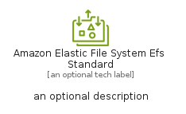
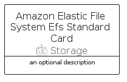

# AmazonElasticFileSystemEfsStandard


```text
aws-q1-2025/Resource/Storage/AmazonElasticFileSystemEfsStandard
```

```text
include('aws-q1-2025/Resource/Storage/AmazonElasticFileSystemEfsStandard')
```


| Illustration | AmazonElasticFileSystemEfsStandard | AmazonElasticFileSystemEfsStandardCard | AmazonElasticFileSystemEfsStandardGroup |
| :---: | :---: | :---: | :---: |
|  |  |  |  |


## Sprites
The item provides the following sriptes:

- `<$AmazonElasticFileSystemEfsStandardXs>`
- `<$AmazonElasticFileSystemEfsStandardSm>`
- `<$AmazonElasticFileSystemEfsStandardMd>`
- `<$AmazonElasticFileSystemEfsStandardLg>`


## AmazonElasticFileSystemEfsStandard

### Load remotely
```plantuml
@startuml
' configures the library
!global $LIB_BASE_LOCATION="https://raw.githubusercontent.com/tmorin/plantuml-libs/master/distribution"

' loads the library's bootstrap
!include $LIB_BASE_LOCATION/bootstrap.puml

' loads the package bootstrap
include('aws-q1-2025/bootstrap')

' loads the Item which embeds the element AmazonElasticFileSystemEfsStandard
include('aws-q1-2025/Resource/Storage/AmazonElasticFileSystemEfsStandard')

' renders the element
AmazonElasticFileSystemEfsStandard('AmazonElasticFileSystemEfsStandard', 'Amazon Elastic File System Efs Standard', 'an optional tech label', 'an optional description')
@enduml
```

### Load locally
```plantuml
@startuml
' configures the library
!global $INCLUSION_MODE="local"
!global $LIB_BASE_LOCATION="../../.."

' loads the library's bootstrap
!include $LIB_BASE_LOCATION/bootstrap.puml

' loads the package bootstrap
include('aws-q1-2025/bootstrap')

' loads the Item which embeds the element AmazonElasticFileSystemEfsStandard
include('aws-q1-2025/Resource/Storage/AmazonElasticFileSystemEfsStandard')

' renders the element
AmazonElasticFileSystemEfsStandard('AmazonElasticFileSystemEfsStandard', 'Amazon Elastic File System Efs Standard', 'an optional tech label', 'an optional description')
@enduml
```

## AmazonElasticFileSystemEfsStandardCard

### Load remotely
```plantuml
@startuml
' configures the library
!global $LIB_BASE_LOCATION="https://raw.githubusercontent.com/tmorin/plantuml-libs/master/distribution"

' loads the library's bootstrap
!include $LIB_BASE_LOCATION/bootstrap.puml

' loads the package bootstrap
include('aws-q1-2025/bootstrap')

' loads the Item which embeds the element AmazonElasticFileSystemEfsStandardCard
include('aws-q1-2025/Resource/Storage/AmazonElasticFileSystemEfsStandard')

' renders the element
AmazonElasticFileSystemEfsStandardCard('AmazonElasticFileSystemEfsStandardCard', 'Amazon Elastic File System Efs Standard Card', 'an optional description')
@enduml
```

### Load locally
```plantuml
@startuml
' configures the library
!global $INCLUSION_MODE="local"
!global $LIB_BASE_LOCATION="../../.."

' loads the library's bootstrap
!include $LIB_BASE_LOCATION/bootstrap.puml

' loads the package bootstrap
include('aws-q1-2025/bootstrap')

' loads the Item which embeds the element AmazonElasticFileSystemEfsStandardCard
include('aws-q1-2025/Resource/Storage/AmazonElasticFileSystemEfsStandard')

' renders the element
AmazonElasticFileSystemEfsStandardCard('AmazonElasticFileSystemEfsStandardCard', 'Amazon Elastic File System Efs Standard Card', 'an optional description')
@enduml
```

## AmazonElasticFileSystemEfsStandardGroup

### Load remotely
```plantuml
@startuml
' configures the library
!global $LIB_BASE_LOCATION="https://raw.githubusercontent.com/tmorin/plantuml-libs/master/distribution"

' loads the library's bootstrap
!include $LIB_BASE_LOCATION/bootstrap.puml

' loads the package bootstrap
include('aws-q1-2025/bootstrap')

' loads the Item which embeds the element AmazonElasticFileSystemEfsStandardGroup
include('aws-q1-2025/Resource/Storage/AmazonElasticFileSystemEfsStandard')

' renders the element
AmazonElasticFileSystemEfsStandardGroup('AmazonElasticFileSystemEfsStandardGroup', 'Amazon Elastic File System Efs Standard Group', 'an optional tech label') {
    note as note
        the content of the group
    end note
}
@enduml
```

### Load locally
```plantuml
@startuml
' configures the library
!global $INCLUSION_MODE="local"
!global $LIB_BASE_LOCATION="../../.."

' loads the library's bootstrap
!include $LIB_BASE_LOCATION/bootstrap.puml

' loads the package bootstrap
include('aws-q1-2025/bootstrap')

' loads the Item which embeds the element AmazonElasticFileSystemEfsStandardGroup
include('aws-q1-2025/Resource/Storage/AmazonElasticFileSystemEfsStandard')

' renders the element
AmazonElasticFileSystemEfsStandardGroup('AmazonElasticFileSystemEfsStandardGroup', 'Amazon Elastic File System Efs Standard Group', 'an optional tech label') {
    note as note
        the content of the group
    end note
}
@enduml
```

