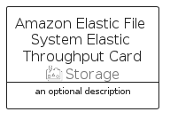

# AmazonElasticFileSystemElasticThroughput


```text
aws-q1-2025/Resource/Storage/AmazonElasticFileSystemElasticThroughput
```

```text
include('aws-q1-2025/Resource/Storage/AmazonElasticFileSystemElasticThroughput')
```


| Illustration | AmazonElasticFileSystemElasticThroughput | AmazonElasticFileSystemElasticThroughputCard | AmazonElasticFileSystemElasticThroughputGroup |
| :---: | :---: | :---: | :---: |
|  |  |  |  |


## Sprites
The item provides the following sriptes:

- `<$AmazonElasticFileSystemElasticThroughputXs>`
- `<$AmazonElasticFileSystemElasticThroughputSm>`
- `<$AmazonElasticFileSystemElasticThroughputMd>`
- `<$AmazonElasticFileSystemElasticThroughputLg>`


## AmazonElasticFileSystemElasticThroughput

### Load remotely
```plantuml
@startuml
' configures the library
!global $LIB_BASE_LOCATION="https://raw.githubusercontent.com/tmorin/plantuml-libs/master/distribution"

' loads the library's bootstrap
!include $LIB_BASE_LOCATION/bootstrap.puml

' loads the package bootstrap
include('aws-q1-2025/bootstrap')

' loads the Item which embeds the element AmazonElasticFileSystemElasticThroughput
include('aws-q1-2025/Resource/Storage/AmazonElasticFileSystemElasticThroughput')

' renders the element
AmazonElasticFileSystemElasticThroughput('AmazonElasticFileSystemElasticThroughput', 'Amazon Elastic File System Elastic Throughput', 'an optional tech label', 'an optional description')
@enduml
```

### Load locally
```plantuml
@startuml
' configures the library
!global $INCLUSION_MODE="local"
!global $LIB_BASE_LOCATION="../../.."

' loads the library's bootstrap
!include $LIB_BASE_LOCATION/bootstrap.puml

' loads the package bootstrap
include('aws-q1-2025/bootstrap')

' loads the Item which embeds the element AmazonElasticFileSystemElasticThroughput
include('aws-q1-2025/Resource/Storage/AmazonElasticFileSystemElasticThroughput')

' renders the element
AmazonElasticFileSystemElasticThroughput('AmazonElasticFileSystemElasticThroughput', 'Amazon Elastic File System Elastic Throughput', 'an optional tech label', 'an optional description')
@enduml
```

## AmazonElasticFileSystemElasticThroughputCard

### Load remotely
```plantuml
@startuml
' configures the library
!global $LIB_BASE_LOCATION="https://raw.githubusercontent.com/tmorin/plantuml-libs/master/distribution"

' loads the library's bootstrap
!include $LIB_BASE_LOCATION/bootstrap.puml

' loads the package bootstrap
include('aws-q1-2025/bootstrap')

' loads the Item which embeds the element AmazonElasticFileSystemElasticThroughputCard
include('aws-q1-2025/Resource/Storage/AmazonElasticFileSystemElasticThroughput')

' renders the element
AmazonElasticFileSystemElasticThroughputCard('AmazonElasticFileSystemElasticThroughputCard', 'Amazon Elastic File System Elastic Throughput Card', 'an optional description')
@enduml
```

### Load locally
```plantuml
@startuml
' configures the library
!global $INCLUSION_MODE="local"
!global $LIB_BASE_LOCATION="../../.."

' loads the library's bootstrap
!include $LIB_BASE_LOCATION/bootstrap.puml

' loads the package bootstrap
include('aws-q1-2025/bootstrap')

' loads the Item which embeds the element AmazonElasticFileSystemElasticThroughputCard
include('aws-q1-2025/Resource/Storage/AmazonElasticFileSystemElasticThroughput')

' renders the element
AmazonElasticFileSystemElasticThroughputCard('AmazonElasticFileSystemElasticThroughputCard', 'Amazon Elastic File System Elastic Throughput Card', 'an optional description')
@enduml
```

## AmazonElasticFileSystemElasticThroughputGroup

### Load remotely
```plantuml
@startuml
' configures the library
!global $LIB_BASE_LOCATION="https://raw.githubusercontent.com/tmorin/plantuml-libs/master/distribution"

' loads the library's bootstrap
!include $LIB_BASE_LOCATION/bootstrap.puml

' loads the package bootstrap
include('aws-q1-2025/bootstrap')

' loads the Item which embeds the element AmazonElasticFileSystemElasticThroughputGroup
include('aws-q1-2025/Resource/Storage/AmazonElasticFileSystemElasticThroughput')

' renders the element
AmazonElasticFileSystemElasticThroughputGroup('AmazonElasticFileSystemElasticThroughputGroup', 'Amazon Elastic File System Elastic Throughput Group', 'an optional tech label') {
    note as note
        the content of the group
    end note
}
@enduml
```

### Load locally
```plantuml
@startuml
' configures the library
!global $INCLUSION_MODE="local"
!global $LIB_BASE_LOCATION="../../.."

' loads the library's bootstrap
!include $LIB_BASE_LOCATION/bootstrap.puml

' loads the package bootstrap
include('aws-q1-2025/bootstrap')

' loads the Item which embeds the element AmazonElasticFileSystemElasticThroughputGroup
include('aws-q1-2025/Resource/Storage/AmazonElasticFileSystemElasticThroughput')

' renders the element
AmazonElasticFileSystemElasticThroughputGroup('AmazonElasticFileSystemElasticThroughputGroup', 'Amazon Elastic File System Elastic Throughput Group', 'an optional tech label') {
    note as note
        the content of the group
    end note
}
@enduml
```

